# Zapier Inbound Integration

[Zapier](https://zapier.com/) is built for the automation of tasks between different web apps. Through its platform, users can create automated workflows by triggering a specific action in one app based on a defined trigger in another app.

## In ilert: Create a Zapier alert source (optional) 


You can connect Zapier with an existing alert source of any integration type. Skip this step, if you'd like to connect Zapier with an existing alert source.


1.  Go to **Alert sources** --> **Alert sources** and click on **Create new alert source**

    <figure><figcaption></figcaption></figure>
2.  Search for **Amazon Cloudwatch** in the search field, click on the Amazon Cloudwatch tile and click on **Next**.&#x20;

    <figure><figcaption></figcaption></figure>
3. Give your alert source a name, optionally assign teams and click **Next**.
4.  Select an **escalation policy** by creating a new one or assigning an existing one.

    <figure><figcaption></figcaption></figure>
5.  Select you [Alert grouping](../../alerting/alert-sources.md#alert-grouping) preference and click **Continue setup**. You may click **Do not group alerts** for now and change it later.&#x20;

    <figure><figcaption></figcaption></figure>
6. The next page show additional settings such as customer alert templates or notification prioritiy. Click on **Finish setup** for now.
7.  On the final page, an API key and / or webhook URL will be generated that you will need later in this guide.

    <figure><figcaption></figcaption></figure>

## In Zapier: Connect Zapier with ilert 

1. In the sidebar, click on **Apps**

<figure>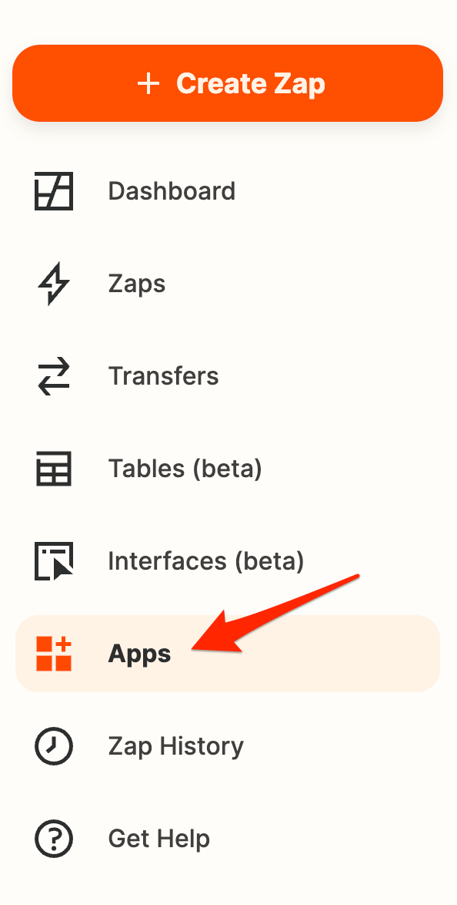<figcaption></figcaption></figure>

2. Search for ilert in the search field and click on **Connect**

<figure>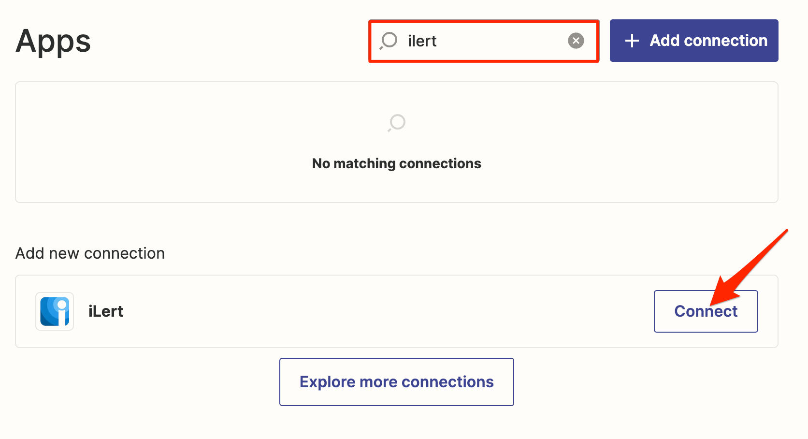<figcaption></figcaption></figure>

3. A pop up window will open and asks for an ilert **API Key**
4. To create an ilert API Key, switch back to ilert and click on the **user icon -> Manage API keys**

<figure>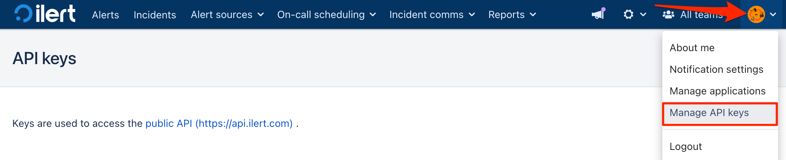<figcaption></figcaption></figure>

5. Now click on **Add API key**

<figure>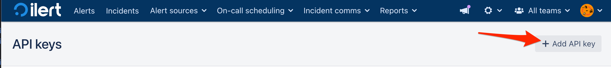<figcaption></figcaption></figure>

6. Enter a **Name** for the API key and click on **Save**

<figure>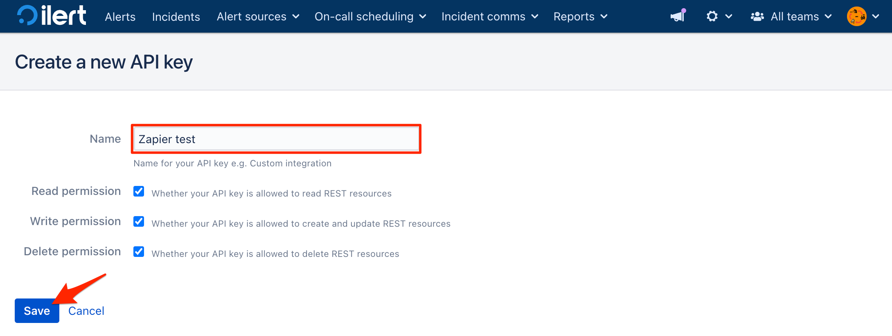<figcaption></figcaption></figure>

7. A pop up window will now appear, containing the API key. Copy the key

<figure>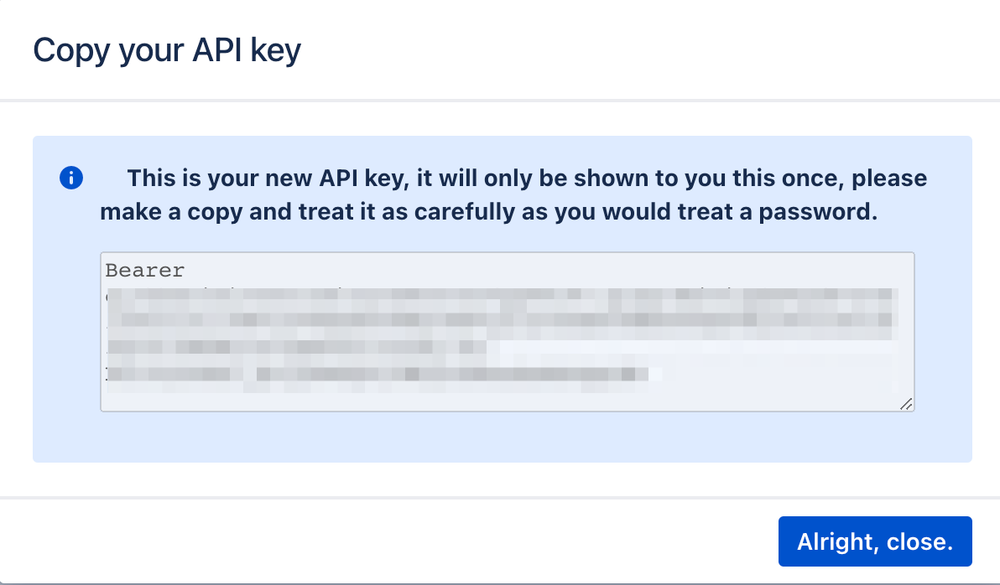<figcaption></figcaption></figure>

8. Paste the new generated API key into Zapier pop up window and click **Yes, Continue to iLert**

<figure>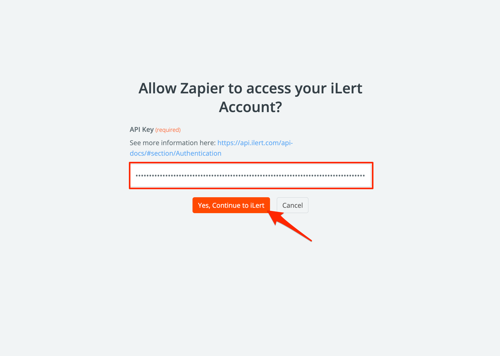<figcaption></figcaption></figure>

### Create a Zap 

1. Go to Zapier and click on **Make a Zap**

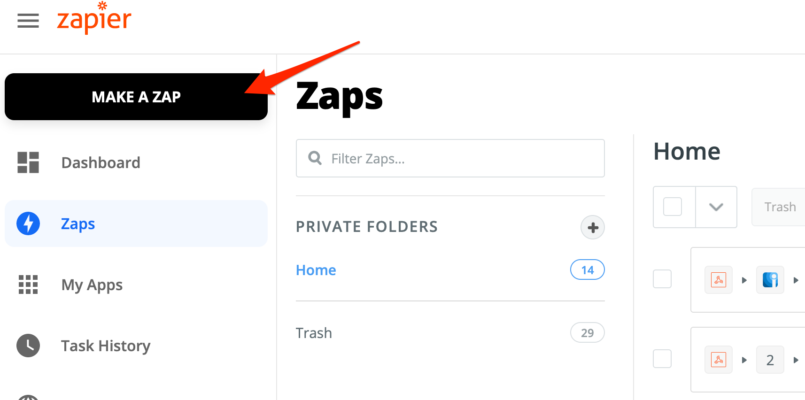

2. On the next page, search for a trigger source, e.g. Jira

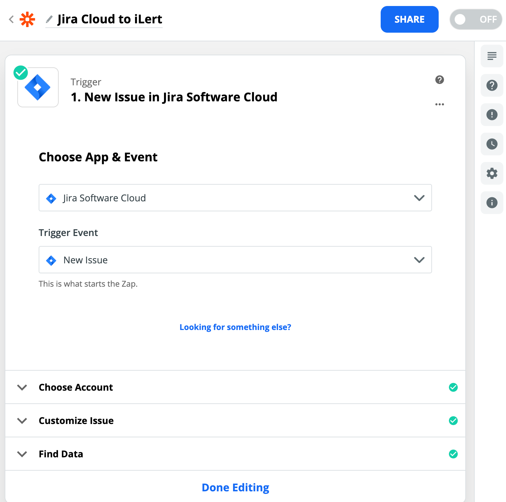

3. Choose your account and customize the settings of you trigger source, then click on the **Done Editing** button
4. Click on the **Choose an Action** button to add ilert action

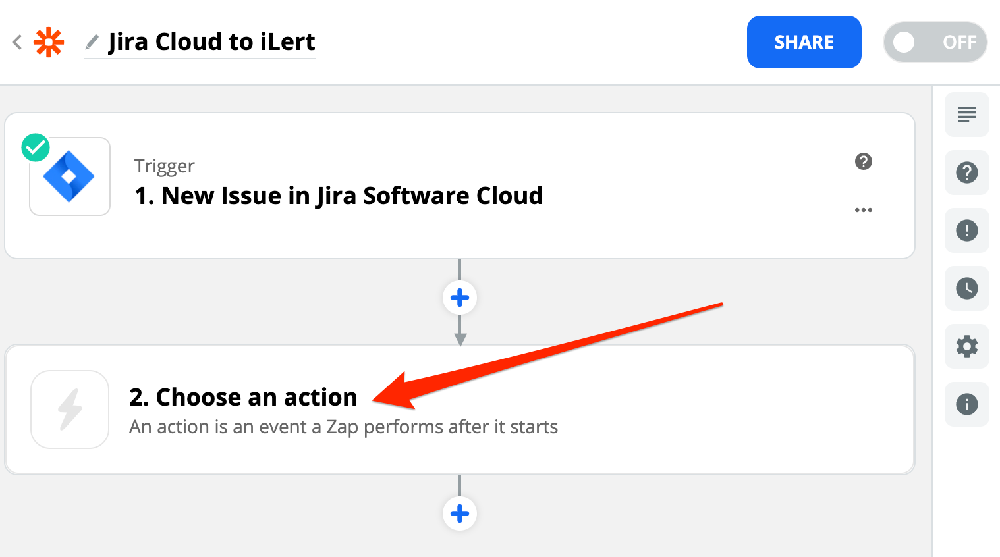

5. Enter **iLert** into the search field and click on the **ilert app**

.png>)

6. In the **Action Event** section choose the **Create Alert** action **\*\*to create an alert when a Jira issue is created. Then click on the** Continue\*\* button.

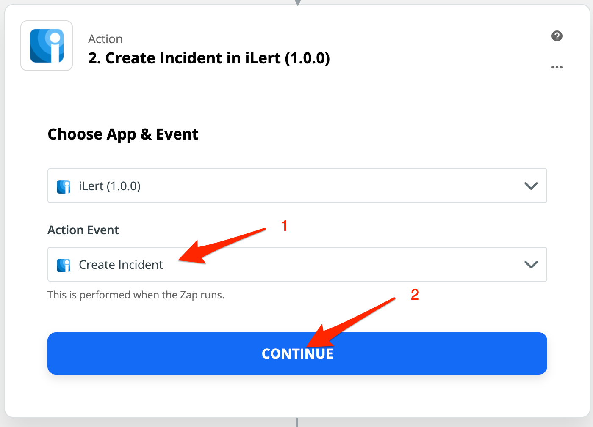

7. On the next slide, choose your ilert account. Then click on the **Continue** button.

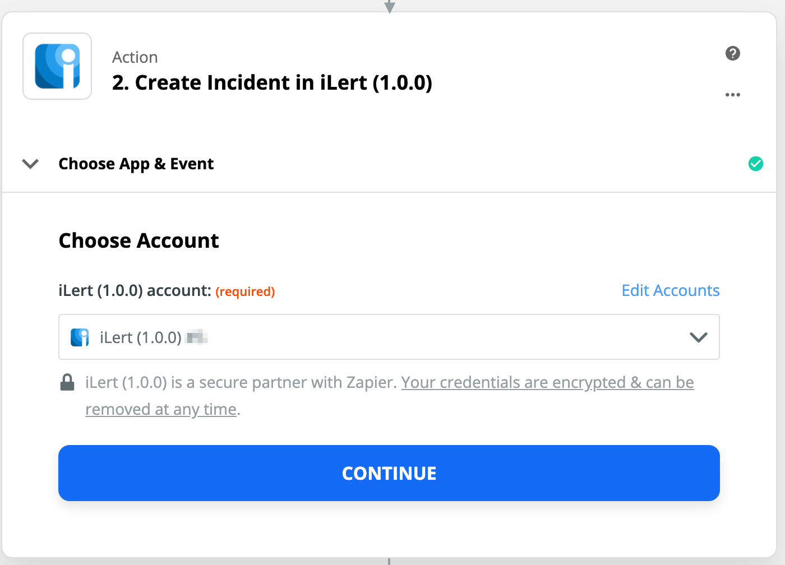

8. On the next slide, in the **Integration Key** section, choose the Alert Source that you created before. In the **Alert key** section, we recommend to enter an alert key, so you can accept or resolve an alert in other Zaps. In the **Summary** section, enter or insert an alert summary. You can optionally enter or insert **Details**, **Priority** and **URL**. Then click on the **Continue** button.

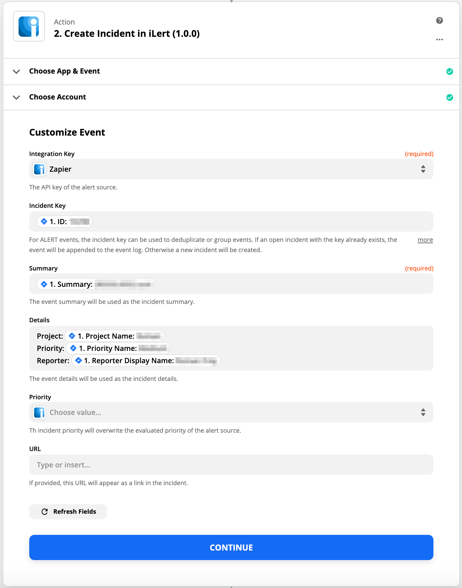

9. On the next slide, click on **Test & Continue** to test alert creation.

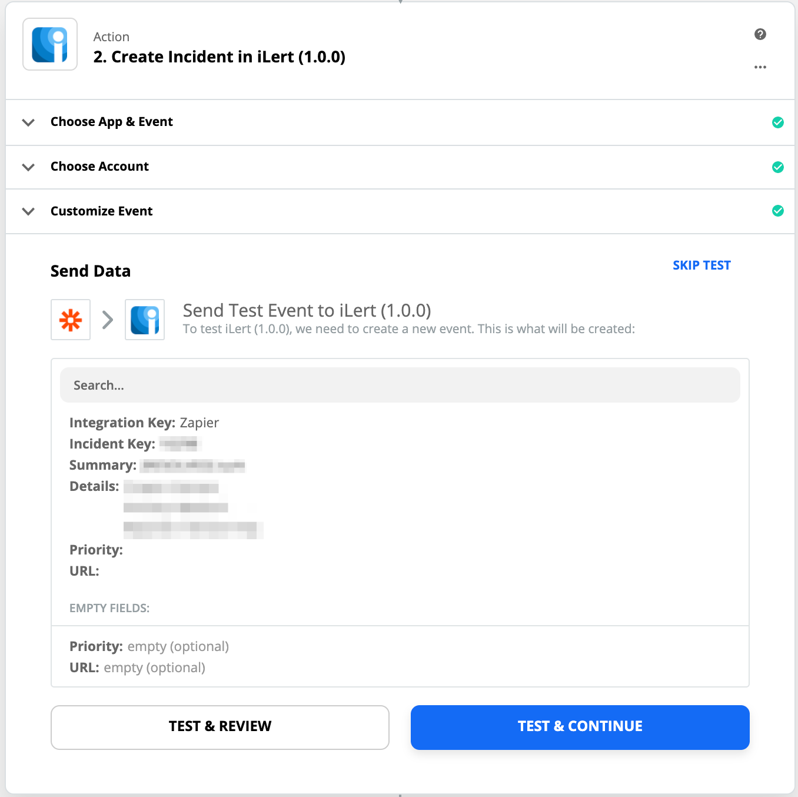

10. &#x20;On the next slide, click on **Turn On Zap** to activate your confugation.

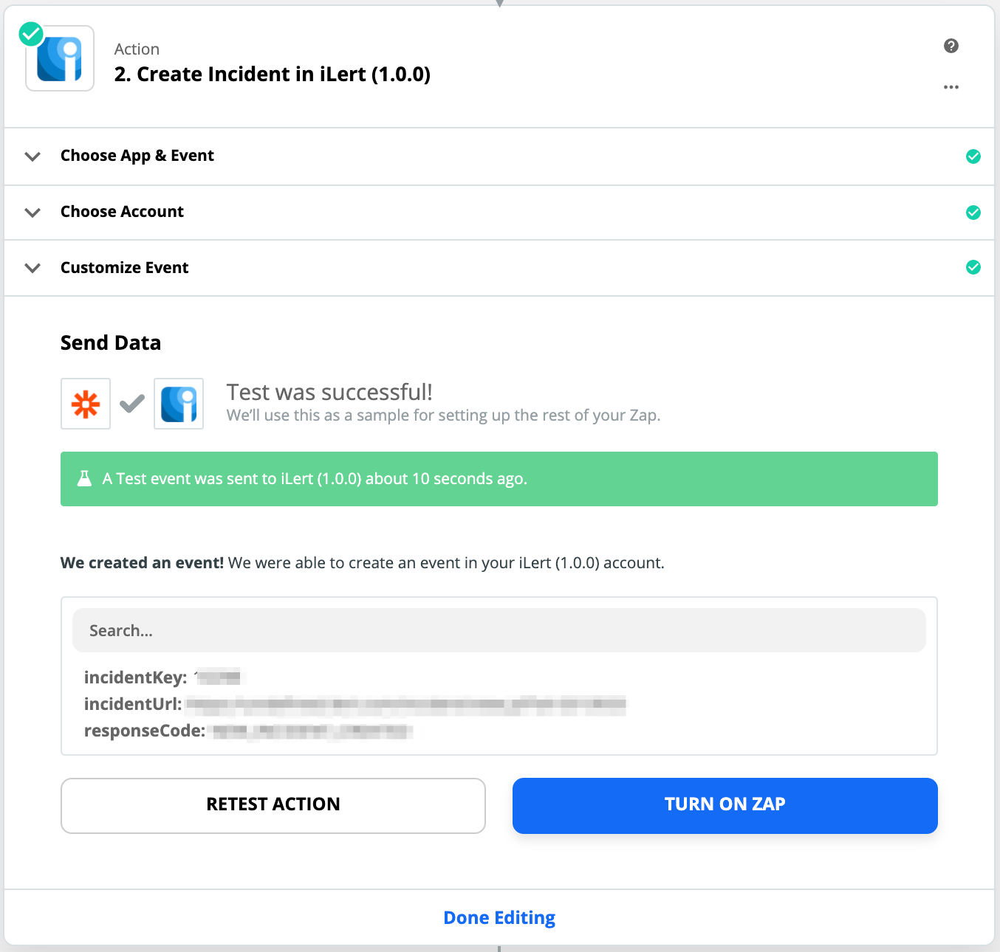

## FAQ 

**Will alerts in ilert be resolved automatically?**

Yes, you need to configure an **Accept Alert** action with **Alert Key** for this in your Zap

**Will alerts in ilert be accepted automatically?**

Yes, you need to configure an **Resolve Alert** action with **Alert Key** for this in your Zap

**Can I connect Zapier with multiple alert sources from ilert?**

Yes, simply create more Zaps in Zapier.

## Related articles


[zapier.md](../outbound-integrations/zapier.md)

