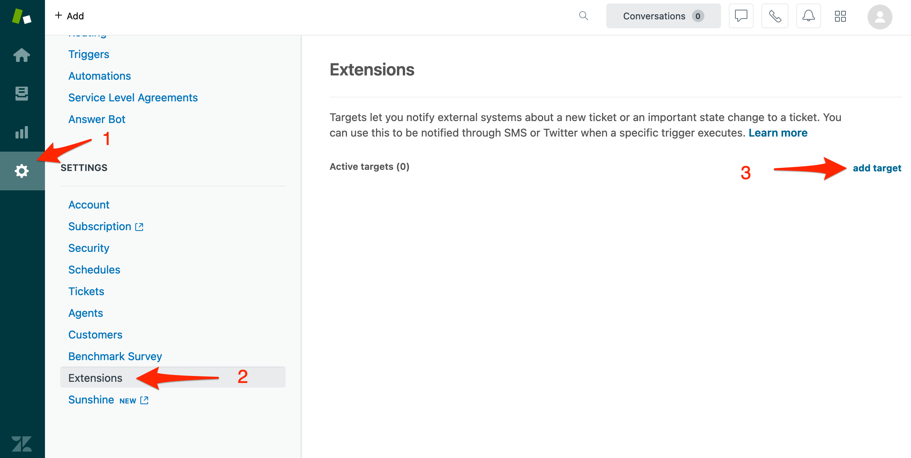

# Zendesk Inbound Integration

[Zendesk](https://www.zendesk.com/) offers a range of products that streamline processes and enhance productivity for support teams, enabling them to provide more effective and personalized service experiences. The platform allows businesses to manage customer interactions across various communication channels, such as email, chat, and social media, consolidating them into a single, unified interface.

## In ilert: Create a Zendesk alert source <a href="#create-alert-source" id="create-alert-source"></a>

1.  Go to **Alert sources** --> **Alert sources** and click on **Create new alert source**

    <figure><figcaption></figcaption></figure>
2.  Search for **Zendesk** in the search field, click on the Zendesk tile and click on **Next**.&#x20;

    <figure><figcaption></figcaption></figure>
3. Give your alert source a name, optionally assign teams and click **Next**.
4.  Select an **escalation policy** by creating a new one or assigning an existing one.

    <figure><figcaption></figcaption></figure>
5.  Select you [Alert grouping](../../alerting/alert-sources.md#alert-grouping) preference and click **Continue setup**. You may click **Do not group alerts** for now and change it later.&#x20;

    <figure><figcaption></figcaption></figure>
6. The next page show additional settings such as customer alert templates or notification prioritiy. Click on **Finish setup** for now.
7.  On the final page, an API key and / or webhook URL will be generated that you will need later in this guide.

    <figure><figcaption></figcaption></figure>

## In Zendesk: Create a Target <a href="#in-topdesk" id="in-topdesk"></a>

1. Go to Zendesk and then to **Settings -> Extensions** and click on the **Add target** button



2. On the next page click the **HTTP target** link

.png>)

3. On the next page:
4. In the **Title** section, enter a name eg. ilert
5. In the **URL** section, paste the **Webhook URL** that you generated in ilert
6. In the **Method** section, choose **POST**
7. In the **Content type** section, choose **JSON**
8. In the bottom section choose **Create target**
9. Click the **Submit** button

.png>)

### Create a Trigger

1. Go to Zendesk and then to **Business Rules -> Triggers** and click on the **Add trigger** button

.png>)

2. On the next page:
3. In the **Trigger name** section, enter a name eg. ilert
4. In the **Category** section, choose a category, e.g. Notifications
5. In the **Meet ANY of following conditions** section, add **Ticket is created** and **Ticket is updated** rules

.png>)

6. Scroll down to the **Actions** panel and choose the **ilert Notify target** that you created above
7. In the **JSON body** sections, paste the following object:

```javascript
{
  "id": "{{ticket.id}}",
  "title": "{{ticket.title}}",
  "description": "{{ticket.description}}",
  "via": "{{ticket.via}}",
  "status": "{{ticket.status}}",
  "priority": "{{ticket.priority}}",
  "requester_name": "{{ticket.requester.name}}",
  "group_name": "{{ticket.group.name}}",
  "assignee_name": "{{ticket.assignee.name}}",
  "account": "{{ticket.account}}",
  "link": "{{ticket.link}}",
  "latest_comment": "{{ticket.latest_comment}}",
  "latest_comment_author_name": "

{{comment.author.name}}
"
}
```

8. Click on the **Create** button

.png>)

## Zendesk Incident Lifecycle

| When I create an Zendesk ticket with status... | ...then an ilert Alert...                                             |
| ---------------------------------------------- | --------------------------------------------------------------------- |
| **New** or **Open**                            | is created                                                            |
| **Pending**                                    | is created                                                            |
| **Solved** or **Closed**                       | <p>will not be created and a</p><p>400 (bad request) error occurs</p> |

| When I update an Zendesk ticket with status... | ...and the ilert alert... | ...then the/an ilert Alert...                                         |
| ---------------------------------------------- | ------------------------- | --------------------------------------------------------------------- |
| **New** or **Open**                            | does not exist            | is created                                                            |
| **Solved** or **Closed**                       | does not exist            | <p>will not be created and a</p><p>400 (bad request) error occurs</p> |
| **Pending**                                    | does not exist            | is created                                                            |
| **New** or **Open**                            | exists                    | doesn't change                                                        |
| **Solved** or **Closed**                       | exists                    | change status to **Resolved** if not already resolved                 |
| **Pending**                                    | exists                    | change status to **Accepted** if not already accepted                 |

## Additional Custom Ticket Details <a href="#faq" id="faq"></a>

You may provide an additional field for the Zendesk trigger template to render additional information into ilert alert details.

```javascript
{
  "additional_ticket_details": {
        "test": "{{ticket.title}}",
        "two": 3,
        "three": ["one", "two", "three"]
    }
}
```

The `additional_ticket_details` map's values will be displayed in a human readable format in the alert's detail section.

## FAQ <a href="#faq" id="faq"></a>

### **Will alerts in ilert be resolved automatically?**

Yes, as soon as an Zendesk Ticket is completed, the alert in ilert will be resolved automatically.

### **Can I connect Zendesk with multiple alert sources from ilert?**

Yes, simply create more Webhooks in Zendesk.

### **Can I customize the alert messages?**

No.

### Are Zendesk comments synced with ilert alerts?

Yes, if the variables `latest_comment` and `latest_comment_author_name` are provided in your Zendesk trigger JSON template the comments will be synced to ilert alerts.

## Related articles


[zendesk.md](../outbound-integrations/zendesk.md)

