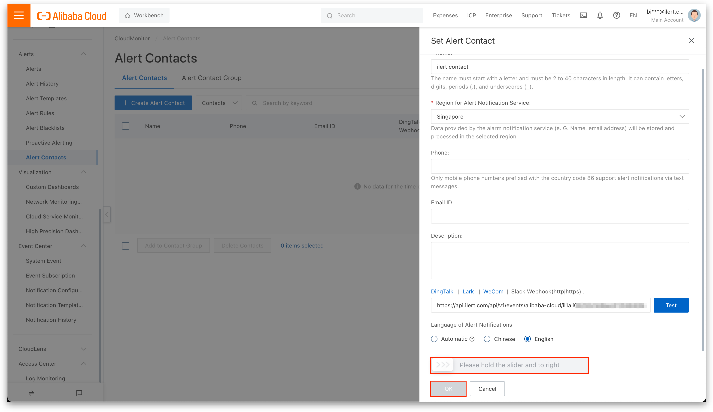
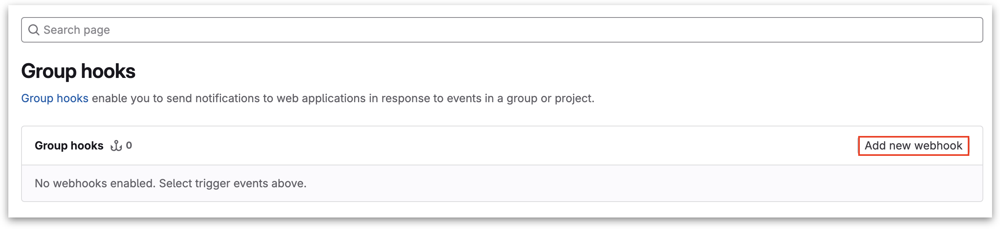

# InfluxDB Integration

## In ilert: Create an InfluxDB alert source 

1.  Go to **Alert sources** --> **Alert sources** and click on **Create new alert source**

    <figure><figcaption></figcaption></figure>
2.  Search for **InfluxDB** in the search field, click on the InfluxDB tile and click on **Next**.&#x20;

    <figure><figcaption></figcaption></figure>
3. Give your alert source a name, optionally assign teams and click **Next**.
4.  Select an **escalation policy** by creating a new one or assigning an existing one.

    <figure><figcaption></figcaption></figure>
5.  Select you [Alert grouping](../alerting/alert-sources.md#alert-grouping) preference and click **Continue setup**. You may click **Do not group alerts** for now and change it later.&#x20;

    <figure><figcaption></figcaption></figure>
6. The next page show additional settings such as customer alert templates or notification prioritiy. Click on **Finish setup** for now.
7.  On the final page, an API key and / or webhook URL will be generated that you will need later in this guide.

    <figure><figcaption></figcaption></figure>

## In InfluxDB: Add ilert Webhook as Notification Endpoint

1. On the sidebar click on **Alerts**.

<figure><figcaption></figcaption></figure>

2. Click on **Notification Endpoints -> Create**.

<figure><figcaption></figcaption></figure>

3. Set HTTP as Destination and enter a Name.
4. Under **HTTP Options** set **HTTP Method** to POST and enter the in ilert previous generated alert source url into **URL**.
5. Click on **Create Notification Endpoint** to save.

<figure><figcaption></figcaption></figure>

6. Navigate to **Checks -> Create** (this documentation uses threshold checks).

<figure><figcaption></figcaption></figure>

7. Set a **Name** for your check.
8. Now select a metric you want to create a check for.
9. Click on **2. Configure Check** to set up the threshold.

<figure><figcaption></figcaption></figure>

10. Set up some thresholds.


We recommend that you create a threshold for setting the check status to '**OK'** as it is necessary for resolving corresponding alerts in ilert.


<figure><figcaption></figcaption></figure>

11. Click on the blue tick on the top right corner to save the check.
12. Now navigate to **Notification Rules -> Create**.

<figure><figcaption></figcaption></figure>

13. Add following Notification Rules:



<figure><figcaption></figcaption></figure>



<figure><figcaption></figcaption></figure>



<figure><figcaption></figcaption></figure>



14. Save the Notification Rule(s).

## FAQ 

**Will alerts in ilert be resolved automatically?**

Yes, if you created a threshold and a notification rule for the 'OK' status, corresponding alerts will be resolved automatically.
