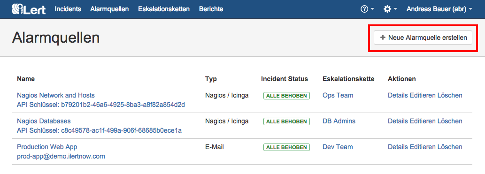
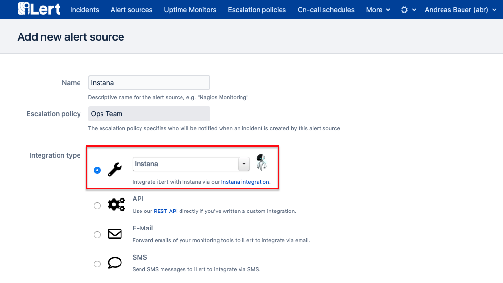
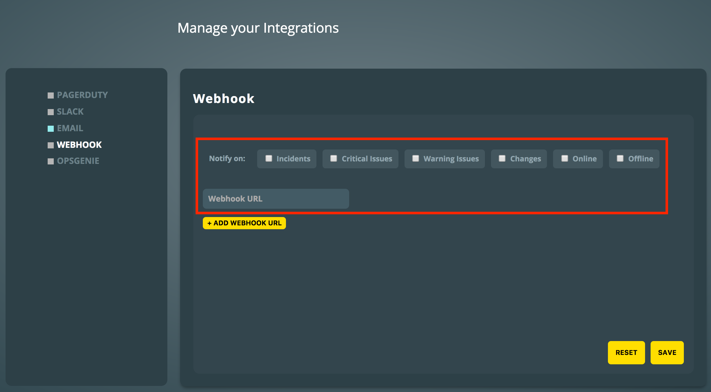

# Instana Integration

[Instana](https://www.instana.com/) is an application performance monitoring software for microservice applications. With the iLert Instana Integration, you can receive Instana alerts through iLert and easily extend Instana with SMS, Push, Voice, and iLert on-call-scheduling.

## In iLert: Create Instana alert source 

1. Go to the **Alert sources** tab and click on **Create new alert source**
2. Enter a name and select your desired escalation policy
3. Select "Instana" as the **Integration type**

1. The URL shown on the next page is the HTTP endpoint for the Webhook in Instana and will be needed below.

## In Instana: Create webhook integration 

1. _\*\*_Open the Management Portal by clicking on Profile → Management Portal
2. Go to the **Integration** tab and click on **WEBHOOK**.

1. In the **Notify on** field, select the event types for which you want alerts from iLert.
2. In the **Webhook URL** field, copy the URL from the alert source set up in iLert and click on **Save**.

## FAQ 

**Will alerts in iLert be resolved automatically?**

For alerts and issues in Instana: Yes, as soon as the state of an alert or issue is CLOSED in Instana, the alert in iLert will be resolved.

For Change and On / Offline Events: Every Change and On / Offline event generates a new Alert in iLert.

