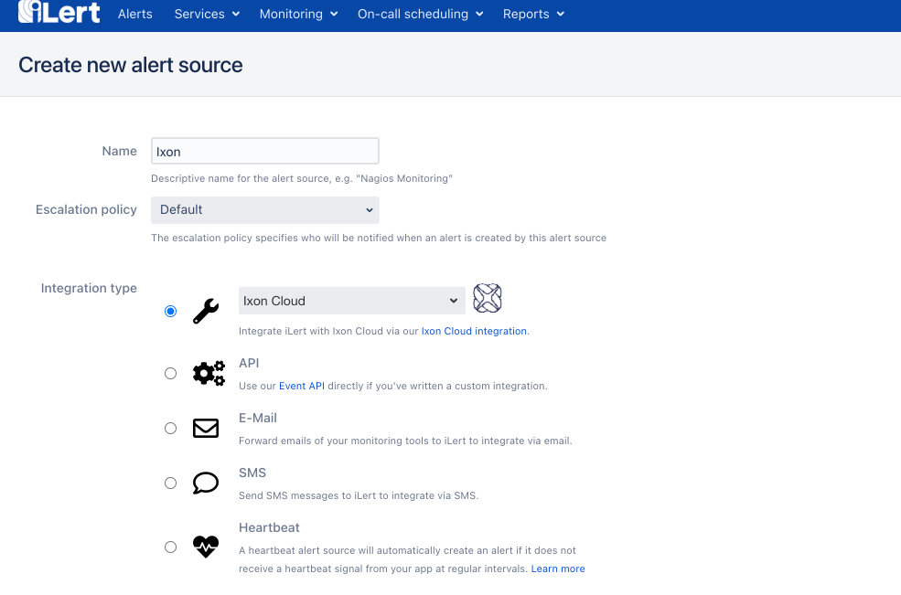
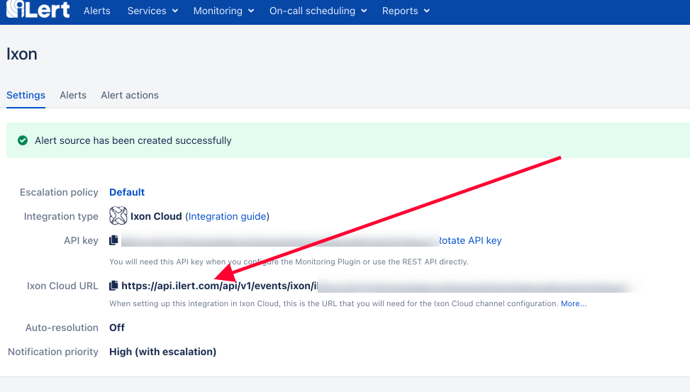

# Ixon Cloud Integration

## In iLert

1. Go to the "**Alert sources**" tab and click "**Create new alert source**"

1. Enter a name and select your desired escalation policy.   

   Select "**Ixon Cloud**" as the **Integration Type** and click **Save**.

1. On the next page, an **Ixon Cloud URL** is generated. You will need the URL for the webhook configuration

## In Ixon Cloud

1. Navigate and login to Ixon Cloud Portal at [https://portal.ixon.cloud/](https://portal.ixon.cloud/) 

2. Click the **Envelope Icon** on the top right of the dashboard to navigate to message screen

3. On the message screen, Click the **Gear Icon** on the top right of the dashboard

4. Add the name of the webhook and the webhook url of the iLert alert source from above.

5. In order to add the trigger, navigate to **Fleet Manager** by clicking the top right dots menu icon

6. Click on the Device that you need to add the iLert alarm trigger

7. If you haven't added any Data Source, add a **Data Source.** In the screenshot below,  we chose **Modbus**

8. If you haven't added any variables, add them by clicking on the **Variable** under **Data Source**

9. Add Alarms by clicking on the **Alarm Triggers** and based on the alarm trigger, a message will be sent through Webhook and alerts will be created in iLert

For more information on Ixon please refer to [https://support.ixon.cloud/hc/en-us](https://support.ixon.cloud/hc/en-us)

