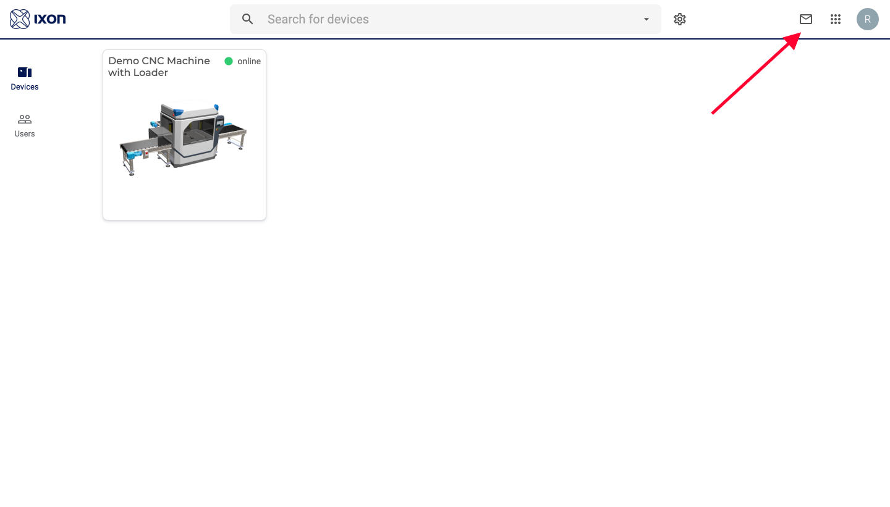
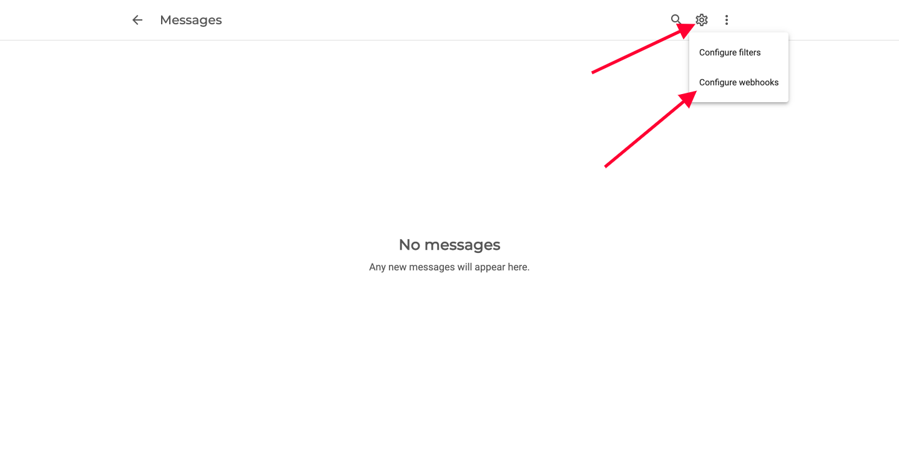
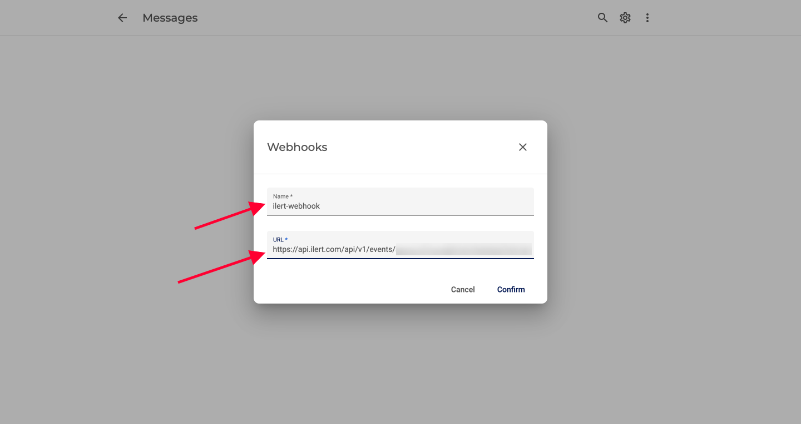
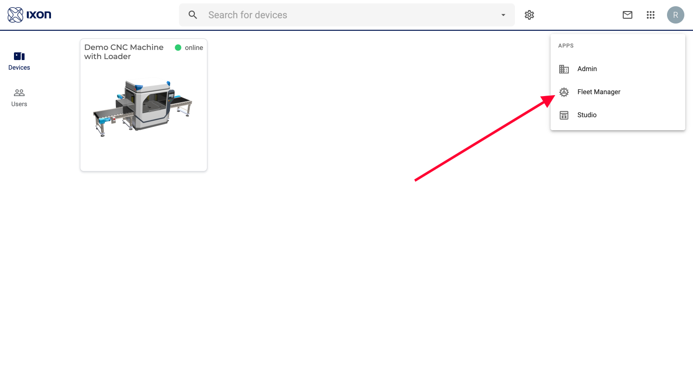
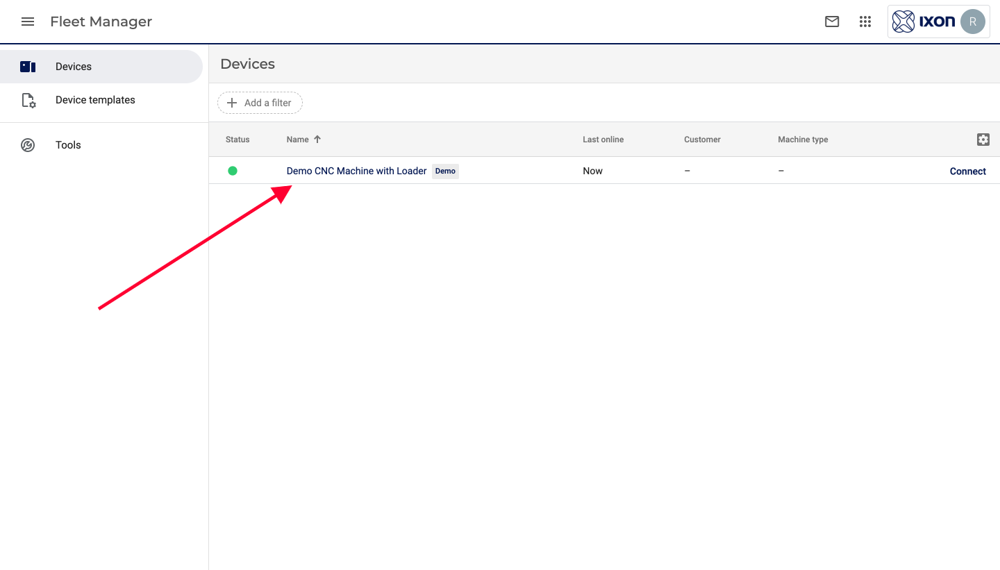
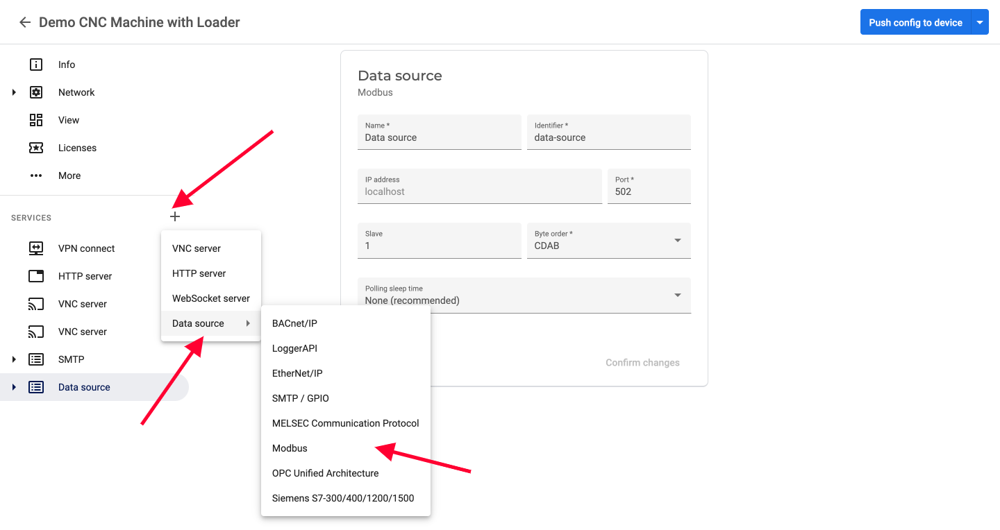
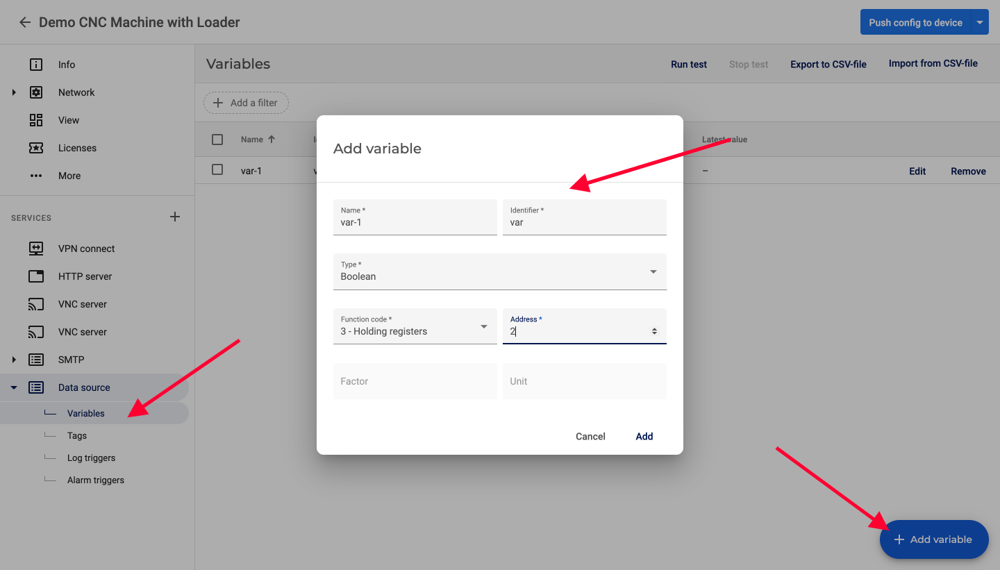
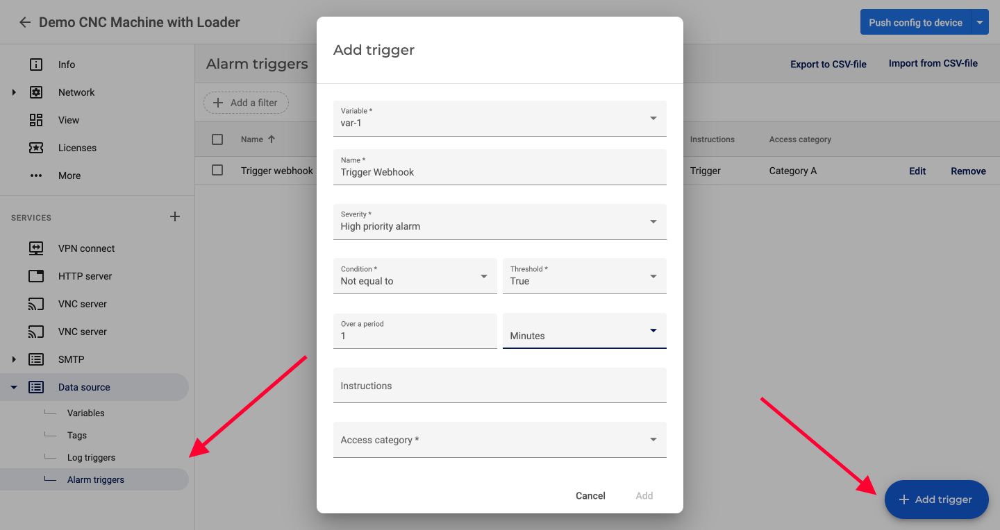

# IXON Cloud Integration

This integration uses IXON's [Cloud Notify](https://support.ixon.cloud/hc/en-us/articles/360016840620) to dispatch real-time notifiations from your machine(s) to ilert. That way, you can leverage ilert's alerting, scheduling and escalation capabiltites to send critical alerts from your machines to the right personnel and take immediate action.

### In ilert: Create IXON Cloud alert source

1.  Go to **Alert sources** --> **Alert sources** and click on **Create new alert source**

    <figure><figcaption></figcaption></figure>
2.  Search for **IXON Cloud** in the search field, click on the IXON Cloud tile and click on **Next**.&#x20;

    <figure><figcaption></figcaption></figure>
3. Give your alert source a name, optionally assign teams and click **Next**.
4.  Select an **escalation policy** by creating a new one or assigning an existing one.

    <figure><figcaption></figcaption></figure>
5.  Select you [Alert grouping](../alerting/alert-sources.md#alert-grouping) preference and click **Continue setup**. You may click **Do not group alerts** for now and change it later.&#x20;

    <figure><figcaption></figcaption></figure>
6. The next page show additional settings such as customer alert templates or notification prioritiy. Click on **Finish setup** for now.
7.  On the final page, an API key and / or webhook URL will be generated that you will need later in this guide.

    <figure><figcaption></figcaption></figure>

### Advanced routing configuration

By default ilert will route the alerts of your IXON alert source to the configured escalation policy.\
However if you need a more flexible routing for your IXON use cases you may use our advanced routing options.

.png>)

You may choose the fields **user id, system label or company id** as dynamic routing fields.\
ilert will then extract the given value e.g. user id from the IXON event and search for an escalation policy that has a matching routing key.

Navigate to the escalation policy that you wish to route to and set its routing key to the IXON value:

.png>)

Note that if no match for the routing key is found, ilert will fall back to using the configured escalation policy.

### In IXON Cloud

#### Create ilert webhook

1\. Navigate and login to Ixon Cloud Portal at [https://portal.ixon.cloud/](https://portal.ixon.cloud/)

2\. Click on the  icon on the top right of the dashboard to navigate to **Messages**

3\. Click on the  icon on the top right of the dashboard and select **Configure webhooks**

4\. Add the name of the webhook and the webhook url of the ilert alert source from above.

#### Setup alarm and alarm trigger

Now that the ilert webhook is configured, we're going to setup an alarm and alarm trigger to test the integration. Refer to this [support article](https://support.ixon.cloud/hc/en-us/articles/360016805380) from the IXON documentation for information on how to setup alarms.

1\. Navigate to [**Fleet Manager**](https://portal.ixon.cloud/fleet-manager) \*\*\*\* by clicking on the  icon on the top right and selecting  **Fleet Manager**

2\. Go to **Devices**  and select the device that you need create an ilert alarm trigger for

3\. If you haven't added any Data Source, add a **Data Source.** In the screenshot below, we chose **Modbus**

4\. If you haven't added any variables, add them by clicking on the **Variable** under **Data Source**

5\. Add Alarms by clicking on the **Alarm Triggers** and based on the alarm trigger, a message will be sent through Webhook and alerts will be created in ilert

6\. Click **\[Push config to device]** in the top right corner for your changes to take effect.

For more information on IXON Cloud, please refer to [https://support.ixon.cloud/hc/en-us](https://support.ixon.cloud/hc/en-us).

### References

* [IXON support article: Expand on notifications: call, sms and more, using webhooks](https://support.ixon.cloud/hc/en-us/articles/360018158379-Expand-on-notifications-call-sms-and-more-using-webhooks)
