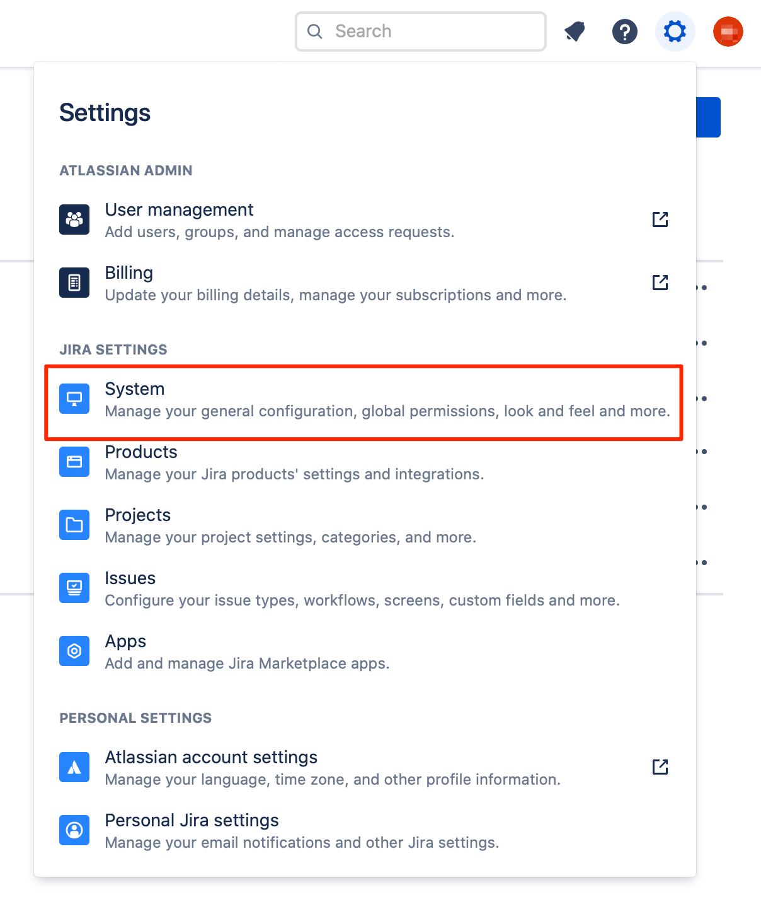
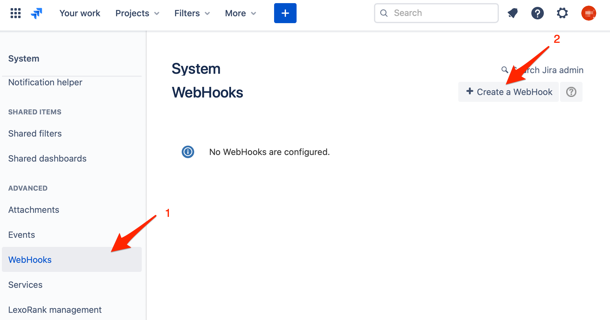

# Jira Inbound Integration

With the iLert Jira integration you can create incidents in iLert based on Jira events.

## In iLert 

### Create a Jira alert source 

1. Go to the "Alert sources" tab and click **Create new alert source**

2. Enter a name and select your desired escalation policy. Select "Jira" as the **Integration Type** and click on **Save**.

3. On the next page, a Webhook URL is generated. You will need this URL below when setting up the Webhook in Jira.

## In Jira 

### Create webhook 

> NOTE: You need admin permissions to manage Jira webhooks.

1. Go to Jira and then to **System** **Settings:**

2. Click on the **WebHooks** and then on the **Create a WebHook** button to add a new webhook for iLert

3. On the next page,  in the section **Name** field, enter a name \(e.g. iLert\). In the section **URL** field, paste the **Webhook URL** that you generated in iLert. In the section **Issue** choose **created**, **updated** and **deleted** events.

4. Scroll to bottom and click on the **Create** button

## FAQ 

**Will incidents in iLert be resolved automatically?**

Yes

**Will incidents in iLert be accepted automatically?**

No, unfortunately Jira events is not compatible with iLert accepted event.

**Can I connect Jira with multiple alert sources from iLert?**

Yes, simply create more webhooks in Jira.

