# Jira Outbound Integration

## In JIRA: Create iLert user and create API token 

1. Optional: create a dedicated iLert user in JIRA. This has the advantage that you can distinguish the JIRA tickets created by iLert.

2. Go to **Atlassian account settings**  **→** **Security** and click on **Create and Manage API Tokens**.

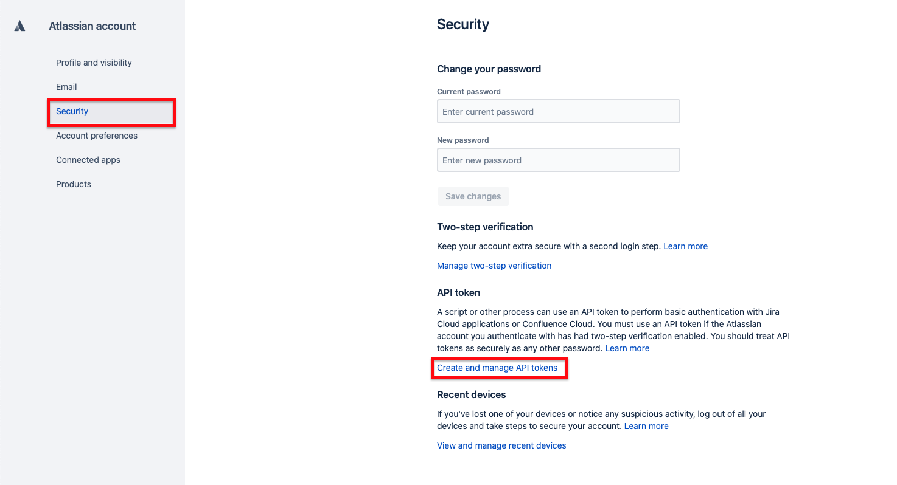

3. Click on the button **Create API token**  

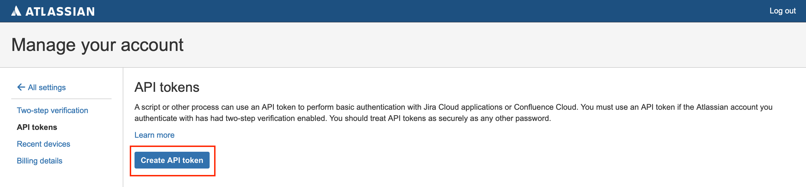

4. Give a name and click **Create**. Write down your API key. You will need it later in iLert.  

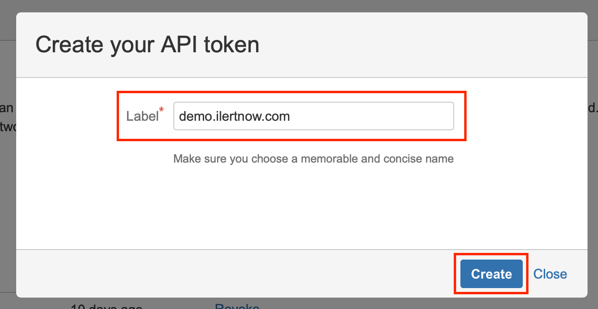

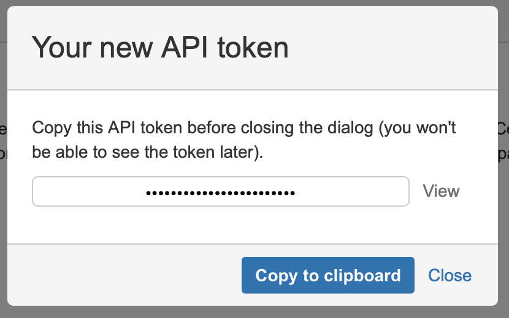

## In iLert: Create JIRA Connector and link to alert source 

1. Click the gear icon → **Connectors**

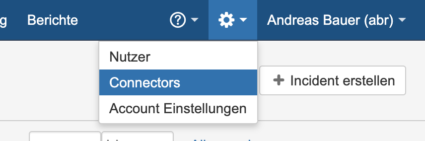

2. Click **Add Connector**

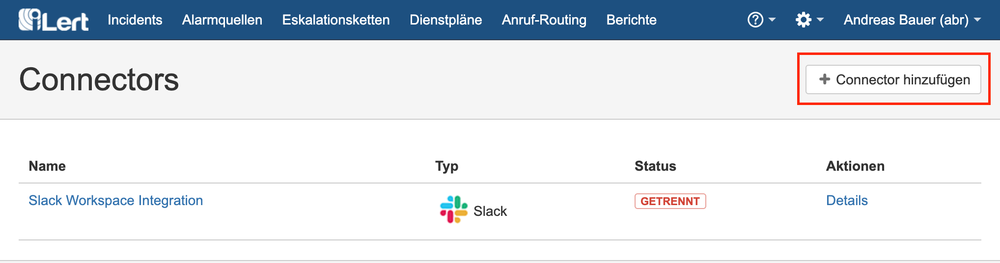

3. Select **JIRA** as **type** and fill in all fields. Enter as URL the URL of your JIRA instance and as password the API key above.

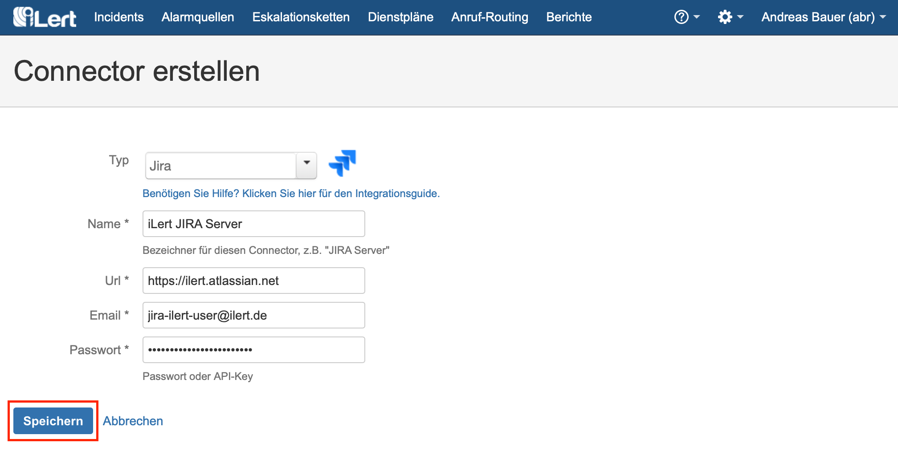

4. **Go to** the alert sources tab and open the alert source whose incidents you want to publish in JIRA. Click **Connections → Add New Connection**.

5. Select **JIRA** as the **type** and in the secondary dropdown select the connector created in step 3. iLert will now try to fetch the available Projects and Issue Types from your provided Jira instance.

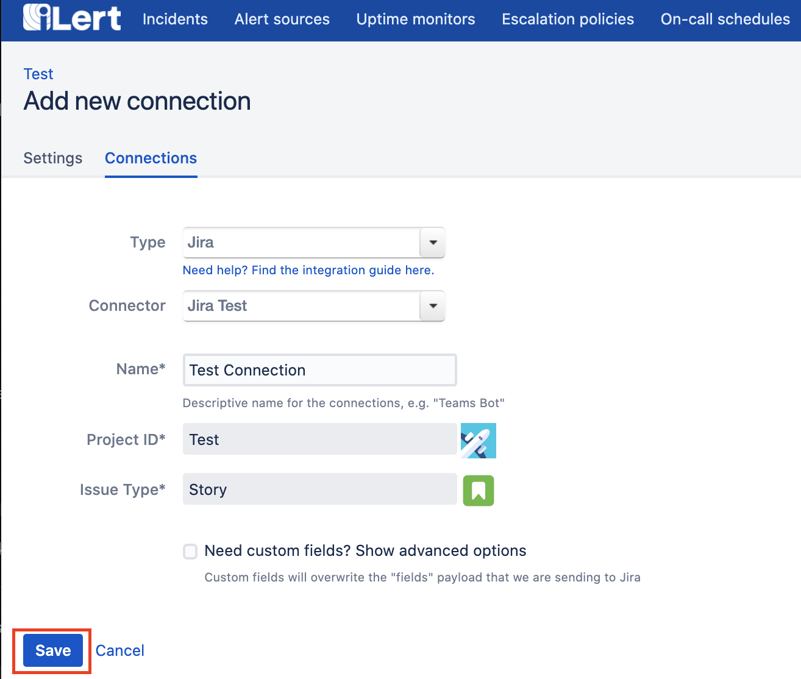

Select the desired Project and Issue Type that should be used to create issues and give the connection a name, before clicking on save.

## Custom Variables and request configuration 

Optionally you may choose to customize the request that will be made to your JIRA instance, by choosing the custom fields option. \(This will overwrite the HTTP request body content `fields` with your provided variables. Our template editor will help you to send a valid request\), you may also click on "Show me the available issue type fields" in case you do not have the keys handy.

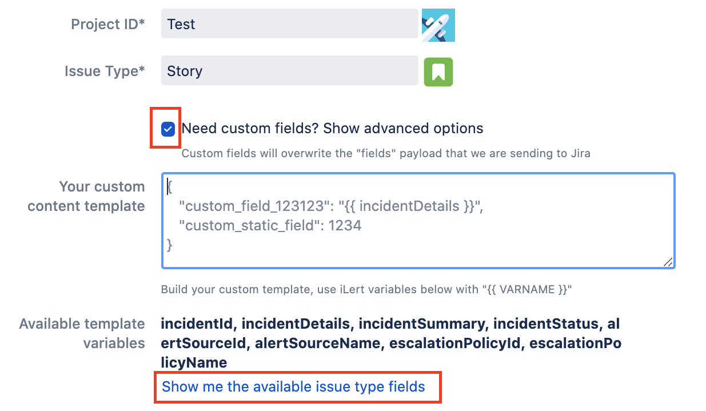

In case of an invalid template the border will become red.

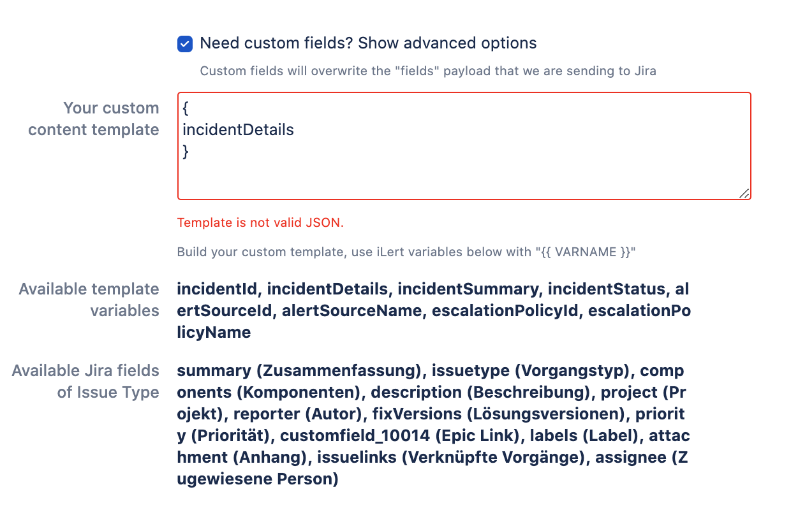

In case of a valid template the border will turn green. As you may have noticed we also offer to use iLert related variables that will be swapped with the corresponding event related data when the request is made. These work, as described under the template field in simple mustache sytnax `{{ VARNAME }}`. Again our editor will tell you if you are using the variables incorrectly.

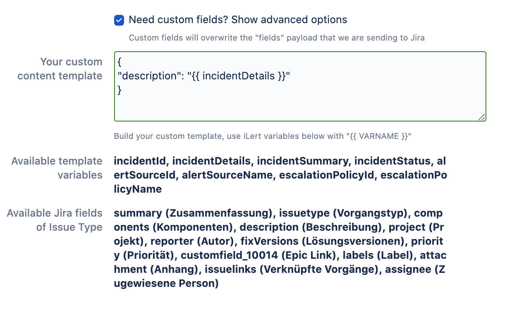

Just save the connector and your done. You can now test the connection by clicking on the button **Test this connection**. A test issue will be published in the respective JIRA project. In case of a bad request we will show the response of your JIRA instance, which makes it easier for you to understand what went wrong.

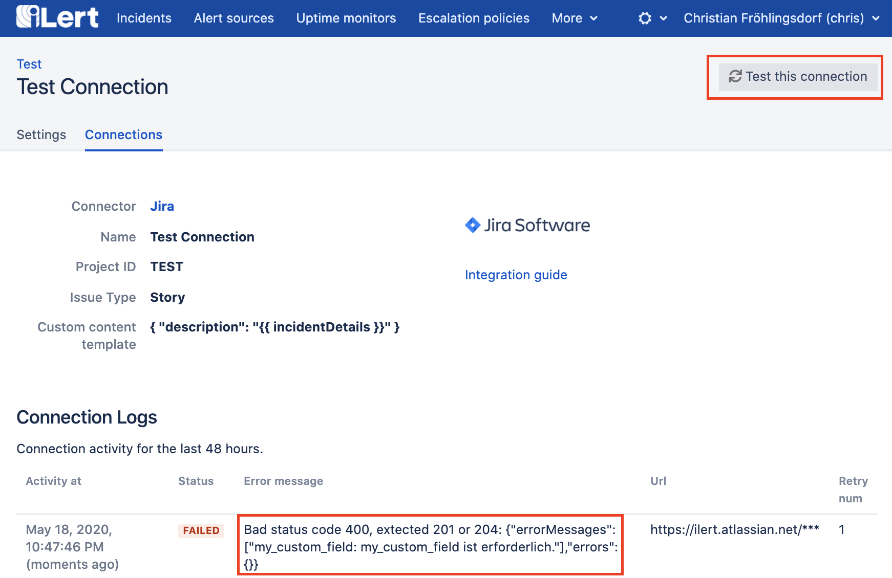

In case your connection has been setup correctly you will see a successful message.

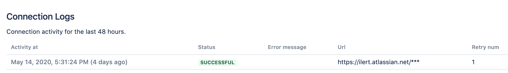

## FAQ 

**Are updates to an incident published in the JIRA Ticket?**

Yes, the state of the iLert Incident is reflected in the title of the JIRA ticket, eg \[RESOLVED\] Host compute.infra is DOWN.

**Can I choose which updates to publish to an incident in JIRA?**

Currently not. If you wish, we look forward to your feedback via chat or e-mail.

**I need to add more custom code to the template and the editor turns yellow**

Dont worry, you will still be able to save the connector, even if the hint is yellow or red, just click on the save button as soon as your template is ready.

