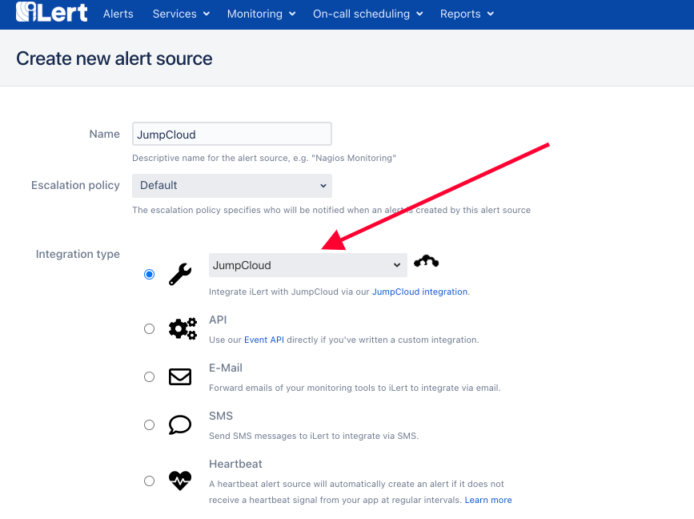
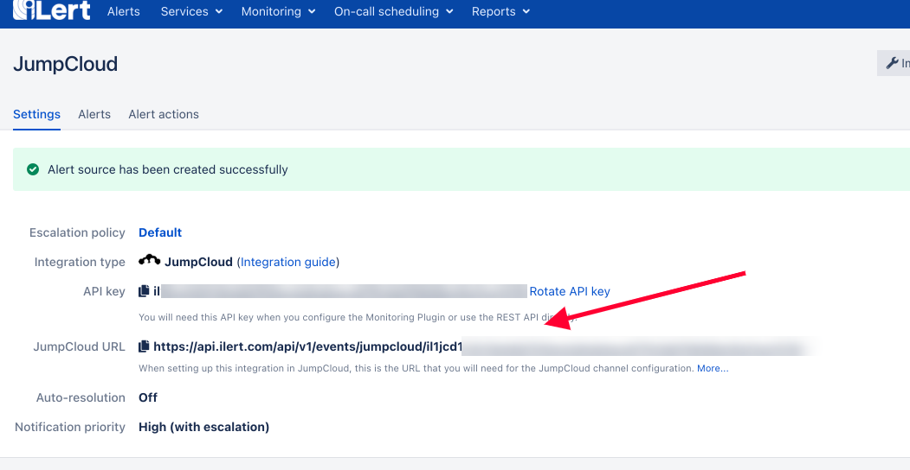

# JumpCloud Integration

## In iLert

1. Go to the "**Alert sources**" tab and click "**Create new alert source**"

.png>)

1.  Enter a name and select your desired escalation policy.  &#x20;

    Select "**JumpCloud**" as the **Integration Type** and click **Save**.



1. On the next page, an **JumpCloud URL** is generated. You will need the URL and the API Keys for the configuration from JumpCloud side



## In JumpCloud

1. Make sure you have Devices added in JumpCloud dashboard, if you haven't done so, navigate to **Devices** and **Add Device**


.png>)

1. Add **Command** to by clicking **Command** on the left side Menu and Add by clicking the plus Green Button


1. After that you need to enter the command manually, put the following in the **Command** field, make sure that you replace `API_KEY` and the URL that are received from iLert, and replace the Test Incident with the proper summary, you can also add more information to the incident based on the [Event creation API](https://api.ilert.com/api-docs/#tag/Events/paths/\~1events/post)&#x20;

```
curl -X POST \
-H "Accept: application/json" \
-H "Content-Type: application/json" \
-d '{"apiKey":"API_KEY", "eventType": "ALERT", "summary": "Test Incident"}' \
https://api.ilert.com/api/v1/events/sensu/API_KEY
```

1. In order to trigger the creation, make sure the Device is listed in the command, click the **Command** entry and click **Devices** and make sure the device is there.


1. In order to create Manually, we can choose **"Run Manually"** in the Launch Event > Event on the command entry property


