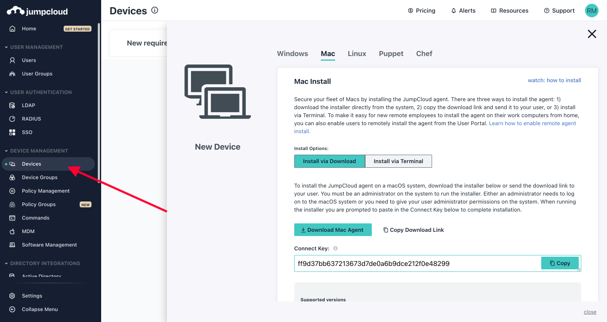
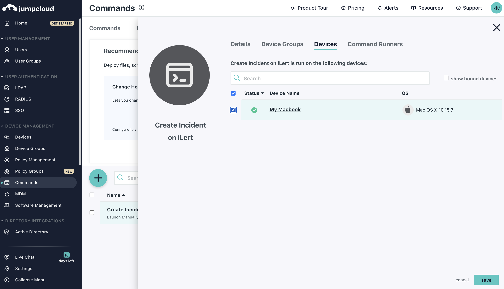
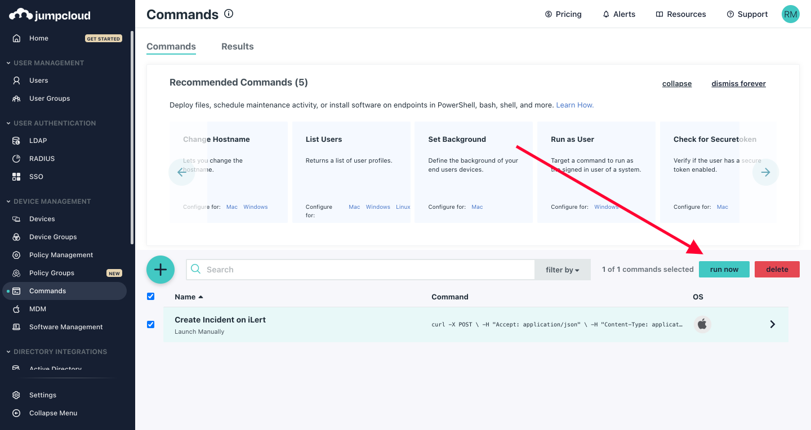

# JumpCloud Integration

## In ilert: Create a JumpCloud alert source

1.  Go to **Alert sources** --> **Alert sources** and click on **Create new alert source**

    <figure><figcaption></figcaption></figure>
2.  Search for **JumpCloud** in the search field, click on the JumpCloud tile and click on **Next**.&#x20;

    <figure><figcaption></figcaption></figure>
3. Give your alert source a name, optionally assign teams and click **Next**.
4.  Select an **escalation policy** by creating a new one or assigning an existing one.

    <figure><figcaption></figcaption></figure>
5.  Select you [Alert grouping](../alerting/alert-sources.md#alert-grouping) preference and click **Continue setup**. You may click **Do not group alerts** for now and change it later.&#x20;

    <figure><figcaption></figcaption></figure>
6. The next page show additional settings such as customer alert templates or notification prioritiy. Click on **Finish setup** for now.
7.  On the final page, an API key and / or webhook URL will be generated that you will need later in this guide.

    <figure><figcaption></figcaption></figure>

## In JumpCloud

1. Make sure you have Devices added in JumpCloud dashboard, if you haven't done so, navigate to **Devices** and **Add Device**



.png>)

2. Add **Command** to by clicking **Command** on the left side Menu and Add by clicking the plus Green Button


3. After that you need to enter the command manually, put the following in the **Command** field, make sure that you replace `API_KEY` and the URL that are received from ilert, and replace the Test Incident with the proper summary, you can also add more information to the incident based on the [Event creation API](https://api.ilert.com/api-docs/#tag/Events/paths/\~1events/post)

```
curl -X POST \
-H "Accept: application/json" \
-H "Content-Type: application/json" \
-d '{"apiKey":"API_KEY", "eventType": "ALERT", "summary": "Test Incident"}' \
https://api.ilert.com/api/v1/events/sensu/API_KEY
```

4. In order to trigger the creation, make sure the Device is listed in the command, click the **Command** entry and click **Devices** and make sure the device is there.



5. In order to create Manually, we can choose **"Run Manually"** in the Launch Event > Event on the command entry property


