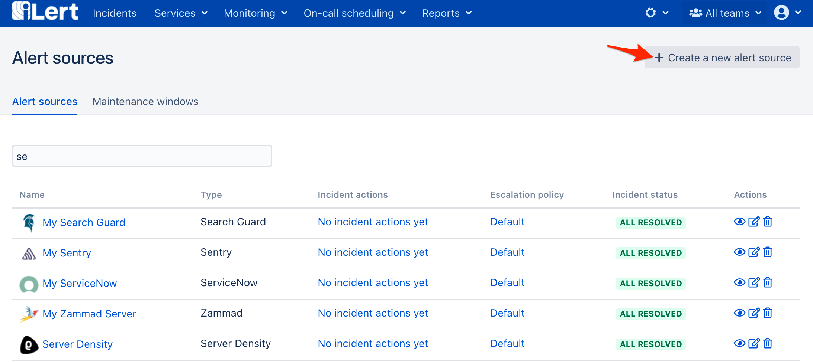
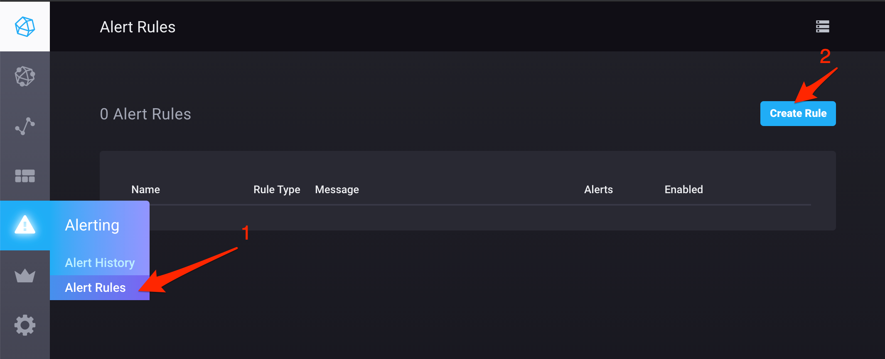
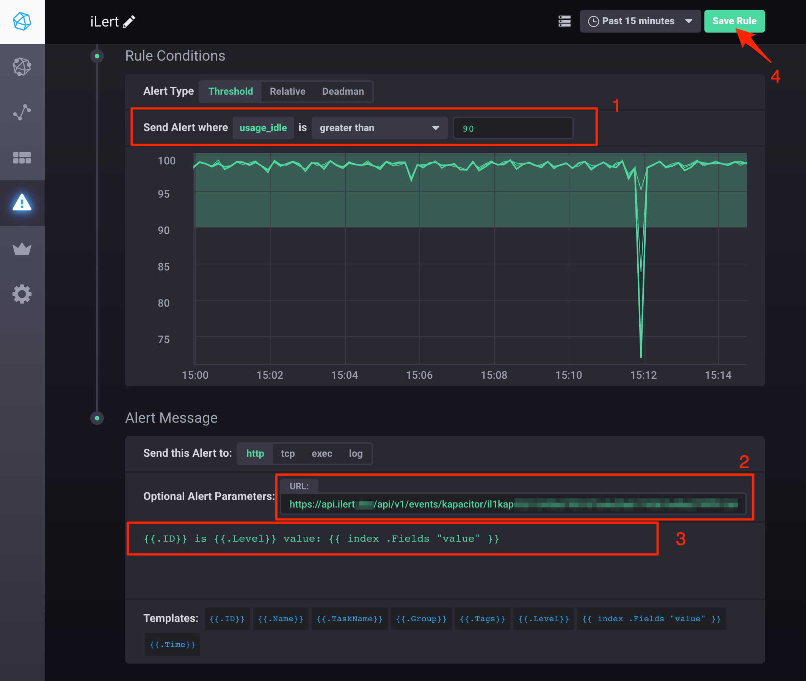

# Kapacitor Integration

[Kapacitor](https://docs.influxdata.com/kapacitor/) is an open source data processing framework that makes it easy to create alerts, run ETL jobs and detect anomalies. Kapacitor is the final piece of the [TICK stack](https://influxdata.com/time-series-platform/).

## In iLert 

### Create a Kapacitor alert source 

1. Go to the "Alert sources" tab and click **Create new alert source**

2. Enter a name and select your desired escalation policy. Select "Kapacitor" as the **Integration Type** and click on **Save**.

3. On the next page, a Webhook URL is generated. You will need this URL below when setting up the alert rule in Kapacitor.

## In Kapacitor 

### Create an alert rule 

1. Go to Chronograph dashboard, then to **Alert Rule** and click on the **Create Rule** button

2. On the next page,  define your alert conditions, paste the **Webhook URL** that you generated in iLert, define alert summary and click on the **Save Rule** button

Finished! Your Kapacitor alerts will now create incidents in iLert.

## FAQ 

**Will incidents in iLert be resolved automatically?**

Yes, as soon as an alert has been completed in Kapacitor, the associated incident in iLert will be resolved automatically.

**Can I connect Kapacitor with multiple alert sources from iLert?**

Yes, simply add more alert rules in Kapacitor.

