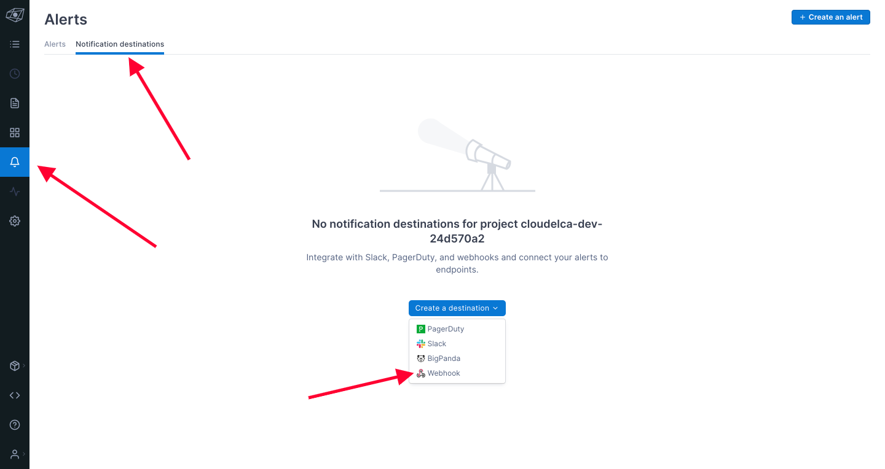
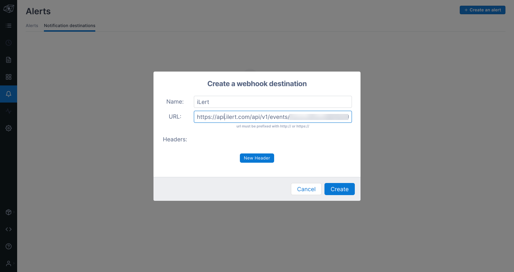
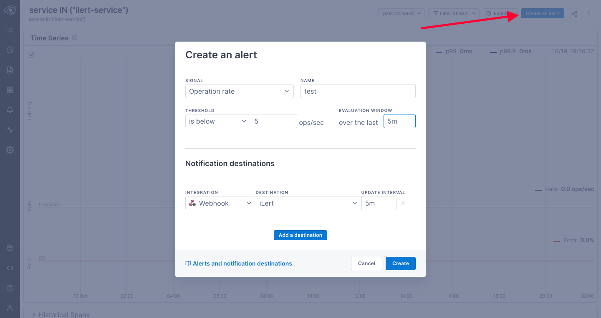
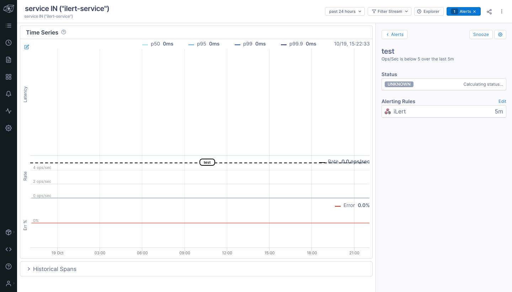

# Lightstep Integration

## In ilert

* Go to the "**Alert sources**" tab and click "**Create new alert source**"

.png>)

* Enter a name and select your desired escalation policy.  &#x20;
* Select "**Lightstep**" as the **Integration Type** and click **Save**.

* On the next page, an **Lighstep URL** is generated. You will need the URL for the webhook configuration

## In Lightstep

* Create a **Notification Destination** by clicking the **Bell Icon** on the left of Dashboard, and click "**Notification Destination**" tab and click "**Create a Destination**" and choose "**Webhook**"&#x20;

* Complete the webhook creation, by putting in the name and put the **Lighstep URL** that we got earlier in ilert dashboard on URL field

* You need to assign the webhook destination to an Alert, if you don't have an Alert, you can create a new one, by navigating to Stream (**Frequency Wave icon** on the left side of the dashboad) and click the stream that you want to assign to

* **Create an alert** by clicking the button on the top right of the stream dashboard, fill in the details, and assign the **Notifcation** **Destination** to the one that we created earlier

* Upon clicking "**Create**" button, the alert should be created and the Notification Destination should be assigned, and when the condition met, it will create an incident on ilert

