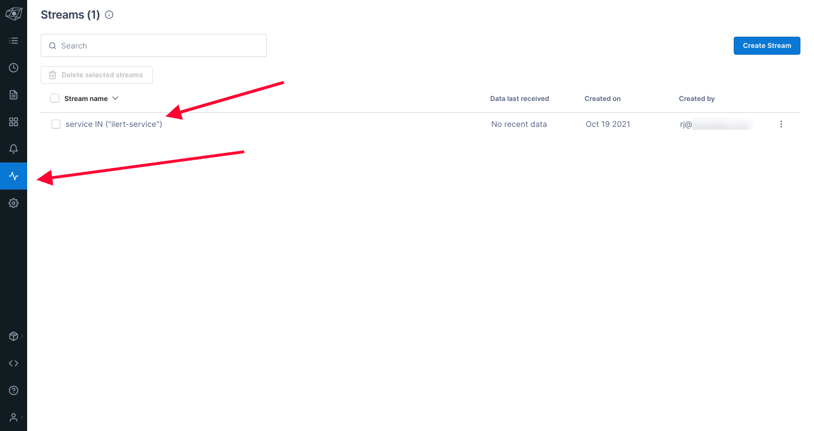

# Lightstep Integration

## In ilert: Create Lightstep alert source

1.  Go to **Alert sources** --> **Alert sources** and click on **Create new alert source**

    <figure><figcaption></figcaption></figure>
2.  Search for **Lightstep** in the search field, click on the Lightstep tile and click on **Next**.&#x20;

    <figure><figcaption></figcaption></figure>
3. Give your alert source a name, optionally assign teams and click **Next**.
4.  Select an **escalation policy** by creating a new one or assigning an existing one.

    <figure><figcaption></figcaption></figure>
5.  Select you [Alert grouping](../alerting/alert-sources.md#alert-grouping) preference and click **Continue setup**. You may click **Do not group alerts** for now and change it later.&#x20;

    <figure><figcaption></figcaption></figure>
6. The next page show additional settings such as customer alert templates or notification prioritiy. Click on **Finish setup** for now.
7.  On the final page, an API key and / or webhook URL will be generated that you will need later in this guide.

    <figure><figcaption></figcaption></figure>

## In Lightstep

1. Create a **Notification Destination** by clicking the **Bell Icon** on the left of Dashboard, and click "**Notification Destination**" tab and click "**Create a Destination**" and choose "**Webhook**"

2. Complete the webhook creation, by putting in the name and put the **Lighstep URL** that we got earlier in ilert dashboard on URL field

3. You need to assign the webhook destination to an Alert, if you don't have an Alert, you can create a new one, by navigating to Stream (**Frequency Wave icon** on the left side of the dashboad) and click the stream that you want to assign to

4. **Create an alert** by clicking the button on the top right of the stream dashboard, fill in the details, and assign the **Notifcation** **Destination** to the one that we created earlier

5. Upon clicking "**Create**" button, the alert should be created and the Notification Destination should be assigned, and when the condition met, it will create an incident on ilert

