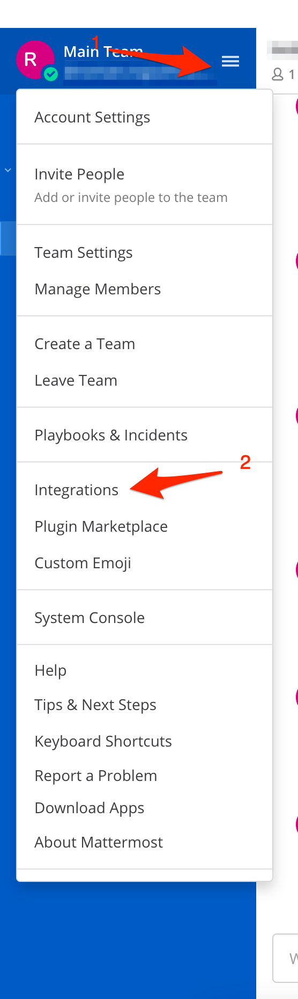
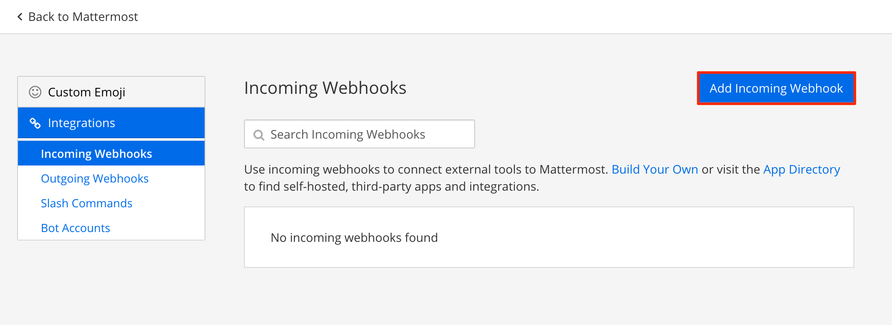
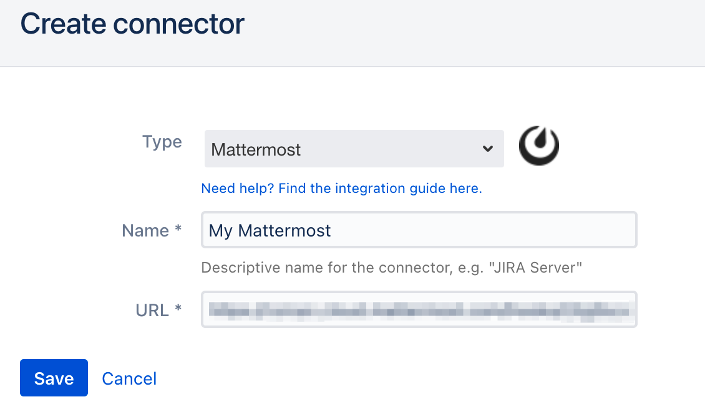
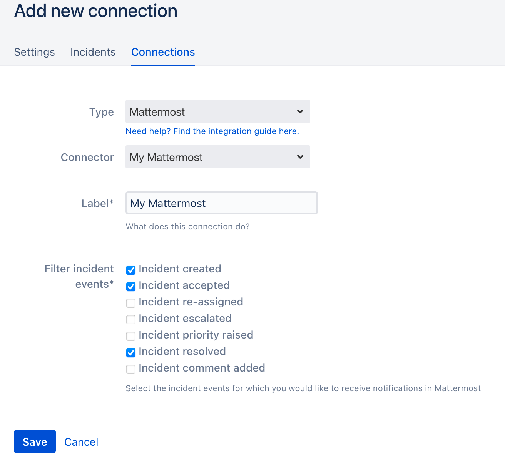
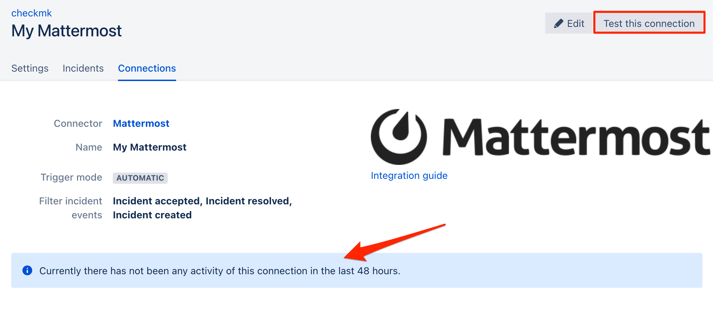

# Mattermost Intergration

**Admin permission required**

To set up the integration, you must have admin rights in iLert.

## In Mattermost 

### Create an incoming webhook

1. Go to main menu and click **Integrations**

2. Click on **Incommin Webhooks**

3. On the next page click on the **Add incoming Webhook** button

4. On the next page, name the webhook e.g. **iLert**, choose **a channel** and click on **Save** button.

5. Your webhook has now been set up. You will need the URL from step 4 in iLert.

## In iLert 

### Create the Mattermost Connector and link it to the alert source

1. Click the gear icon → **Connectors**

2. Click **Add Connector**

3. Select **Mattermost** as **Type**. Assign a name for the connector, enter the URL from above and save it.

4. **Go to** the alert sources tab and open the alert source whose incidents you want to publish to Mattermost. Click **Connections → Add New Connection**.

5. Select **Mattermost** as the **type**, select the connector created in step 3, and name it.

6. Finished! You can now test the connection by clicking on the button **Test this connection**. Thereafter, a test message will be posted on the Mattermost channel.

## FAQ 

**Can I link multiple Mattermost Spaces to an iLert account?**

Yes.

**Are updates to an incident published on the Mattermost channel?**

Yes, the following updates to an incident are currently being released:

* **Escalations** : An incident is assigned to another user through an automatic escalation.
* **Manual Assignments** : An incident is manually assigned to someone.
* **Actions** : An incident is accepted or resolved.

