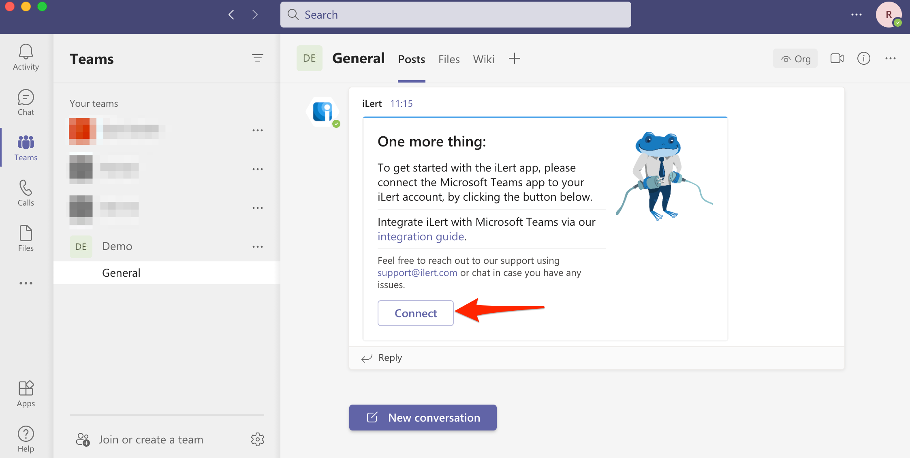

# Microsoft Teams Chat Integration

[Microsoft Teams](https://www.microsoft.com/en-ww/microsoft-teams/group-chat-software) is the hub for team collaboration in Microsoft 365 that integrates the people, content, and tools your team needs to be more engaged and effective.

## In Microsoft Teams 

### Install the iLert bot application


**Admin permission required**

To install the bot application, you must have admin rights in Microsoft Teams.


1. Open the application in Microsoft Teams: [https://teams.microsoft.com/l/app/8f3b287d-df09-44e2-93b3-35e0dfa90756](https://teams.microsoft.com/l/app/8f3b287d-df09-44e2-93b3-35e0dfa90756)

2. Add the iLert bot to a team

3. Choose a team and channel name and click on the **Set up a bot** button

4. On the welcome message click on the **Connect** button or use `@iLert connect` command to connect your iLert account with Microsoft Teams

5. Login to your iLert account and the Microsoft Teams connect will be created automatically

## In iLert 

### Link the Microsoft Teams Chat Connector to the alert source 


**Admin permission required**

To set up the integration, you must have admin rights in iLert.


1. ****Go to the alert sources tab and open the alert source whose incidents you want to post into Microsoft Teams channel. Click on the **Incident actions** tab and then on the **Add new incident action** button

2. On the next page choose **Microsoft Teams** as the type, choose the connector created before, name it**,** choose **Chat** as Teams Action, choose **Your team**, then choose **Your channel** and click on the **Save** button.

6. Finished! You can now test the connection by clicking on the button **Test this connection**. Thereafter, a test message will be posted on the Microsoft Teams channel.

## FAQ 

**Can I link multiple Microsoft Teams Accounts to an iLert account?**

Yes.

**Are updates to an incident published on the Microsoft Teams Chat channel?**

Yes, the following updates to an incident are currently being released:

* **Escalations** : An incident is assigned to another user through an automatic escalation.
* **Manual Assignments** : An incident is manually assigned to someone.
* **Actions** : An incident is accepted or resolved.

**Can I choose which updates to an incident will be published in Microsoft Teams Chat?**

Yes.

**How can I uninstall the iLert App from my Microsoft Teams account?**

1. Login to your Microsoft Teams Account and navigate to your team 
2. Click on the **More options** menu and then on the **Manage team** option
3. Click on the **Apps** tab
4. Find the **iLert** app
5. Click on the **Uninstall** button

