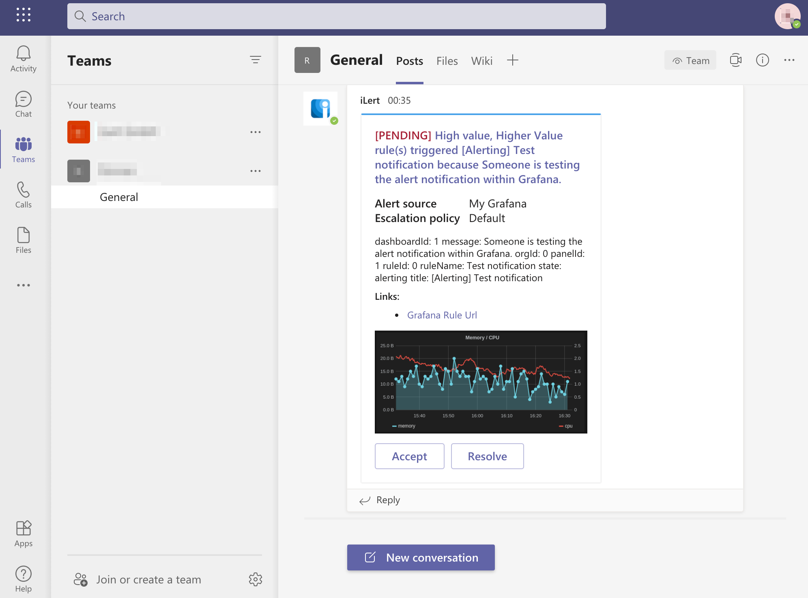

# Microsoft Teams Integration Chat

## In iLert 

### Create the Microsoft Teams Chat Connector and link it to the alert source


**Admin permission required**

To set up the integration, you must have admin rights in iLert.


1. ****Click the gear icon and then click on the **Connectors** link

2. Click the **Add Connector** button

3. On the next page, choose **Microsoft Teams Chat** as type, name the connector and click on the save button to authorize iLert App with your Microsoft Teams account.

4. On the next page, agree with the requested permissions and click on the **Authorize** button

5. Go to the alert sources tab and open the alert source whose incidents you want to post into Microsft Teams channel. Click on the **Incident actions** tab and then on the **Add new incident action** button

6. On the next page choose **Microsoft Teams Chat** as the type, choose the connector created in step 3, name it**,** choose **incident events** to publish, choose **Your team**, then choose **Your channel** and click on the **Save** button.

6. Finished! You can now test the connection by clicking on the button **Test this connection**. Thereafter, a test message will be posted on the Microsoft Teams channel.

## FAQ 

**Can I link multiple Microsoft Teams Accounts to an iLert account?**

Yes.

**Are updates to an incident published on the Microsoft Teams Chat channel?**

Yes, the following updates to an incident are currently being released:

* **Escalations** : An incident is assigned to another user through an automatic escalation.
* **Manual Assignments** : An incident is manually assigned to someone.
* **Actions** : An incident is accepted or resolved.

**Can I choose which updates to an incident will be published in Microsoft Teams Chat?**

Yes.

**How can I uninstall the iLert App from my Microsoft Teams account?**

1. Login to your Microsoft Teams Account and navigate to your team 
2. Click on the **More options** menu and then on the **Manage team** option
3. Click on the **Apps** tab
4. Find the **iLert** app
5. Click on the **Uninstall** button

