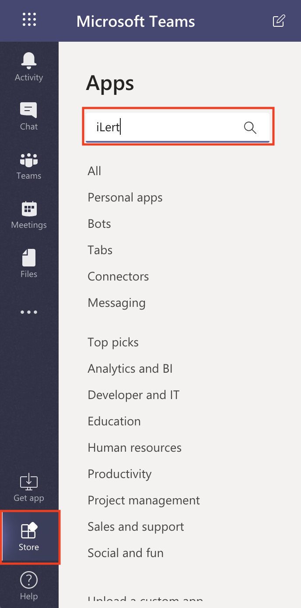
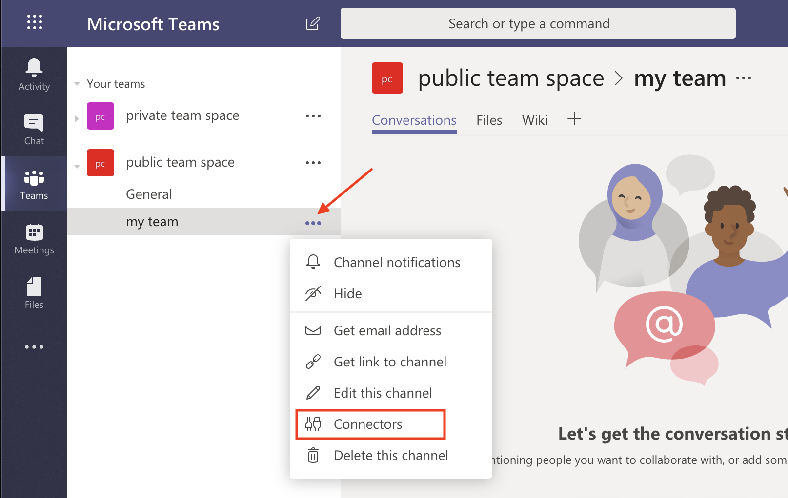
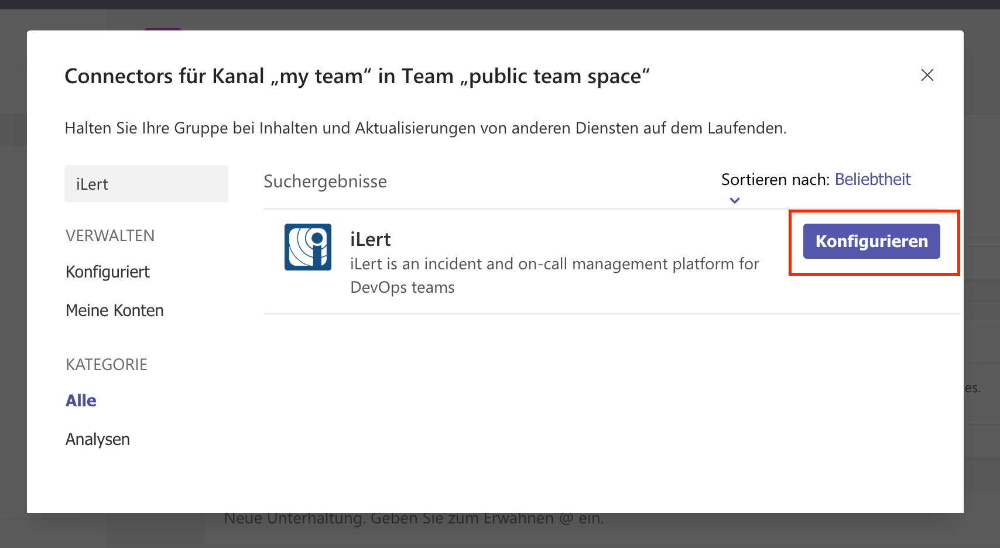
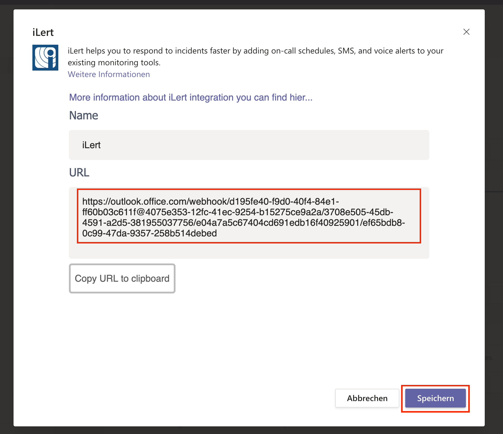
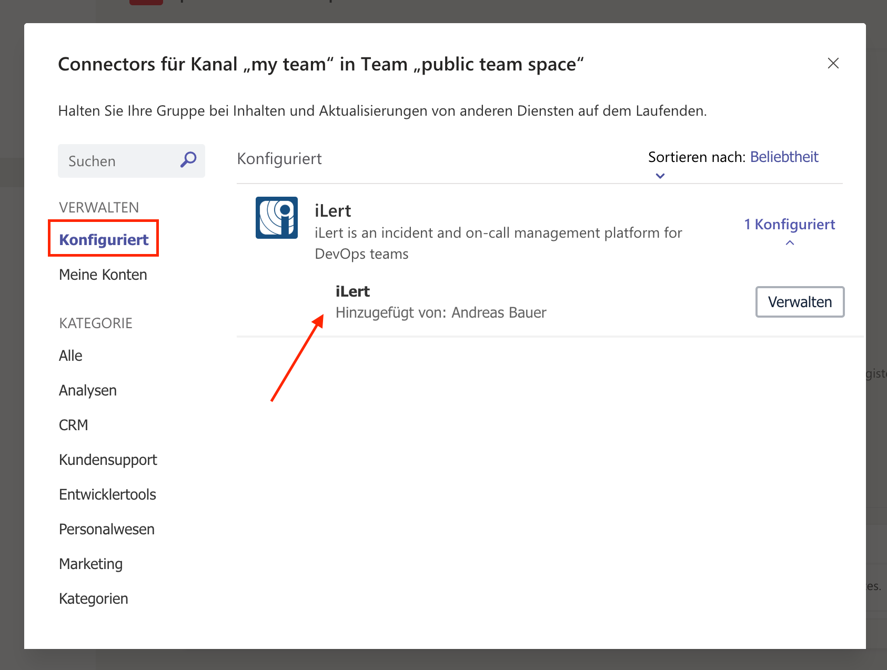
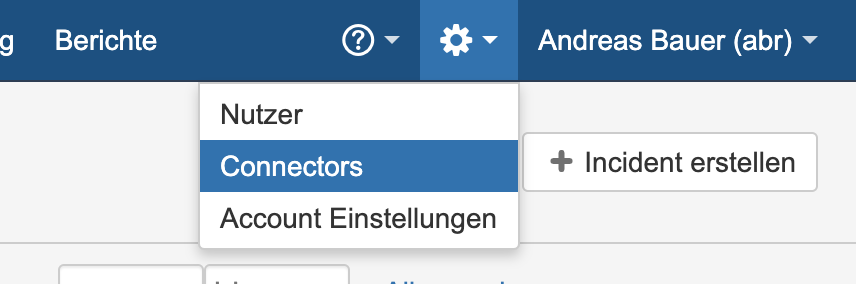
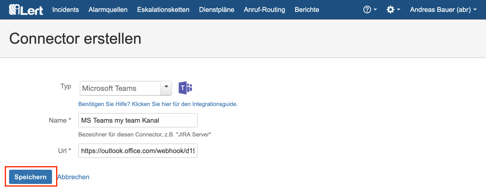
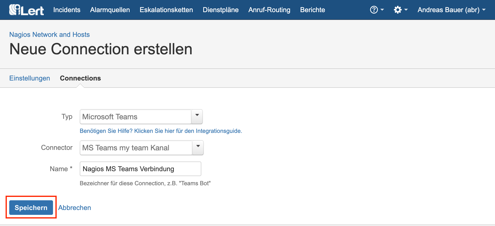
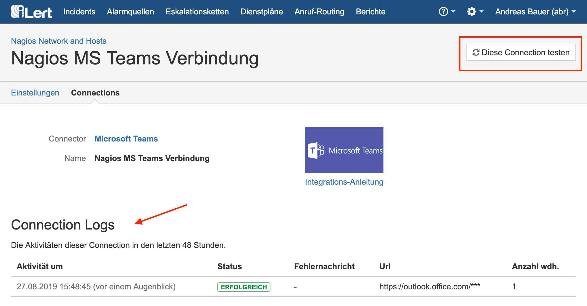

# Microsoft Teams Integration \(legacy\)

## In Microsoft Teams: Add an iLert Connector to a channel 


**Admin permission required**

To set up the integration, you must have admin rights in iLert.


1. Go to the Microsoft Teams Store and install iLert App

2. Select the channel in which you want to publish iLert Incidents and click **Connectors**

3. Type iLert in the search field and click **Configure**

4. Copy the **connector URL** and click **Save**.

5. Verify that the connector has been set up by clicking the **Configured** link. There, their configured connectors are displayed

6. Your connector has now been set up. You will need the URL from step 4 in iLert.

## In iLert: Create the Microsoft Teams Connector and link it to the alert source 

1. ****Click the gear icon → **Connectors**

2. Click **Add Connector**

3. Select **Microsoft Teams** as **Type**. Assign a name for the connector, enter the URL from above and save it.

4. **Go to** the alert sources tab and open the alert source whose incidents you want to publish to Microsoft Teams. Click **Connections → Add New Connection**.

5. Select **Microsoft Teams** as the **type**, select the connector created in step 3, and name it.

6. Finished! You can now test the connection by clicking on the button **Test this connection**. Thereafter, a test message will be posted on the Microsoft Teams channel.

## FAQ 

**Can I link multiple Microsoft Teams Spaces to an iLert account?**

Yes.

**Are updates to an incident published on the Microsoft Teams channel?**

Yes, the following updates to an incident are currently being released:

* **Escalations** : An incident is assigned to another user through an automatic escalation.
* **Manual Assignments** : An incident is manually assigned to someone.
* **Actions** : An incident is accepted or resolved.

**Can I choose which updates to an incident will be published in Microsoft Teams?**

Currently not. If you wish, we look forward to your feedback via chat or e-mail.

