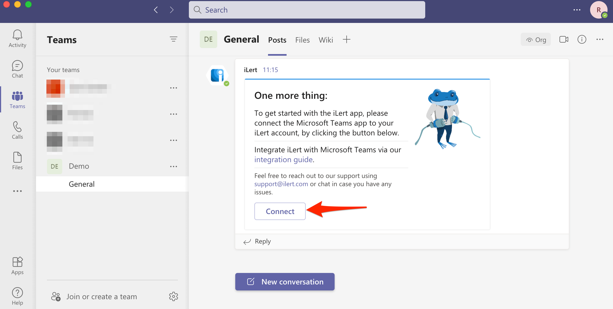

# Microsoft Teams Meeting Integration

[Microsoft Teams](https://www.microsoft.com/en-ww/microsoft-teams/group-chat-software) is the hub for team collaboration in Microsoft 365 that integrates the people, content, and tools your team needs to be more engaged and effective.

## In Microsoft Teams 

### Install the iLert bot application


**Admin permission required**

To install the bot application, you must have admin rights in Microsoft Teams.


1. Open the application in Microsoft Teams: [https://teams.microsoft.com/l/app/8f3b287d-df09-44e2-93b3-35e0dfa90756](https://teams.microsoft.com/l/app/8f3b287d-df09-44e2-93b3-35e0dfa90756)

2. Add the iLert bot to a team

3. Choose a team and channel name and click on the **Set up a bot** button

4. You should have received a welcome message in the previously selected channel, if you do not see the message or you want to reconnect use the `@iLert connect` command  to bring it up again. Click on the **Connect** button in the message, this will take you to iLert's login page to finish your connection.


**Admin permission required**

To set up the integration, you must have admin rights in iLert.


5. Login to the iLert account which you want to connect to Microsoft Teams and iLert will automatically setup the connection for you - _depending on your login state in Microsoft 365 you will have to login to Microsoft again, afterwards you will be automatically taken back to iLert_ and you should see a success message with your newly created connector.

## In iLert 

Now that the initial connection between your Microsoft Teams and iLert accounts has been setup, you may choose alert sources for which you want to configure meeting actions.

### Link the Microsoft Teams Connector to the alert source

1. ****Go to the alert sources tab and open the alert source for which you want to configure the meeting action. Click on the **Alert actions** tab and then on the **Add new alert action** button

2. On the next page choose **Microsoft Teams** as the type, choose the connector created before, name your action**,** choose **Meeting** as Teams Action, choose **Your team**, then choose **Your channel** and click on the **Save** button.

3. Finished! A Microsoft Teams Meeting alert action will now be available on each alert that is created by your alert source. Triggering the action \(use **...** in the top right actions bar\) will add a **Join Meeting Link** to the alert in iLert as well as post a message into your configured Microsoft Teams channel with the meeting's details.

## FAQ 

**Can I link multiple Microsoft Teams Accounts to an iLert account?**

Yes.

**How can I uninstall the iLert App from my Microsoft Teams account?**

1. Login to your Microsoft Teams Account and navigate to your team 
2. Click on the **More options** menu and then on the **Manage team** option
3. Click on the **Apps** tab
4. Find the **iLert** app
5. Click on the **Uninstall** button

