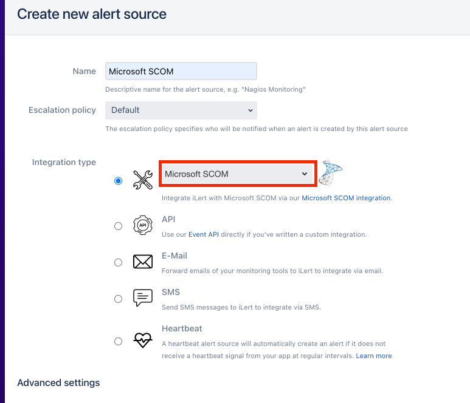
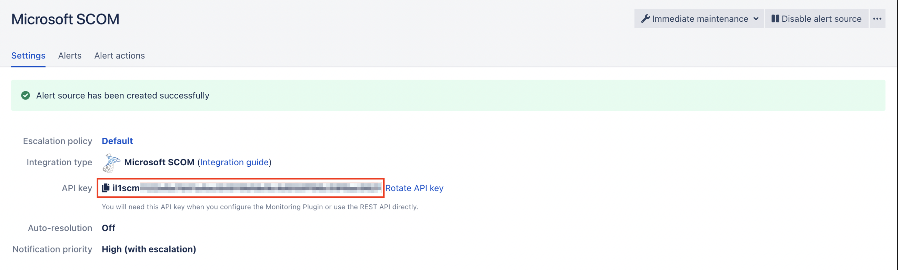

# Microsoft SCOM

## In ilert: Create Microsoft SCOM alert source

1. Go to **Alert sources** and click on the **Create new alert source** button
2. Set a name for your Microsoft SCOM alert source and select an escalation policy
3. In the field Integration type select **Microsoft SCOM** and save
4.

    <figure><figcaption></figcaption></figure>
5. On the next page, an API Key is generated. You will need this API Key below when setting up in Microsoft SCOM
6.

    <figure><figcaption></figcaption></figure>

## In Microsoft SCOM: Add ilert Webhook as Channel

1. Download our script ilert.ps1.\
   Download links:\
   [ilert Microsoft SCOM](https://github.com/iLert/ilert-ms-scom)
2.  Save this script into the following path:

    ```
    C:\scripts\ilert
    ```
3. In Microsoft SCOM Operations Console open the **Administration** view.
4.

    <figure><figcaption></figcaption></figure>
5. Navigate to **Notification**.
6.

    <figure><figcaption></figcaption></figure>
7. Create a new **Command** channel by right clicking on **Channels -> New channel -> Command...**
8.

    <figure><figcaption></figcaption></figure>
9. Enter a channel name and click on **Next**
10.

    <figure><figcaption></figcaption></figure>
11. Enter following into the input fields:\\
12. Enter following into the input fields and click on **Finish**:\\

    Full path of the command file:

    ```
    C:\windows\system32\windowspowershell\v1.0\powershell.exe
    ```

    \
    Command line parameters:\
    _Replace the parameter string "Enter API Key" with your ilert API Key created in_ [_this step_](ms-scom.md#in-ilert-create-microsoft-scom-alert-source)\_\_

    ```powershell
    -F "C:\scripts\ilert\ilert.ps1" -AlertID "$Data[Default='NotPresent']/Context/DataItem/AlertId$" -AlertSourceKey "Enter API Key"
    ```

    \
    Startup folder for the command line:

    ```
    C:\windows\system32\windowspowershell\v1.0\
    ```
13.

    <figure><figcaption></figcaption></figure>
14. Create a new Subscriber by right clicking on **Subscriber -> New subscriber...**
15. .png>)
16. Select a user as subscriber and click on **Next**
17.

    <figure><figcaption></figcaption></figure>
18. Leave the schedule settings on default.
19.

    <figure><figcaption></figcaption></figure>
20. On the next view click on **Add...** to add a new subscriber address
21.

    <figure><figcaption></figcaption></figure>
22. Enter an address name and click on **Next**
23.

    <figure><figcaption></figcaption></figure>
24. Select **Command** as **Channel Type** and **ilert Webhook** as **Command Channel**
25.

    <figure><figcaption></figcaption></figure>
26. Leave the schedule notification settings on **Always send notifications** and click on **Finish**
27. Create a new Subscription by right clicking on **Subscription -> New subscription...**
28.  (3).png>)
29. Set a name and proceed to the next step
30.

    <figure><figcaption></figcaption></figure>
31. Specify a criteria for your subscription(Note: If selecting a condition, please remove the "Notify on all alerts" to prevent multiple identical alert submission). Leave this as "Notify on all alerts" to receive a notification on all alerts.
32.

    <figure><figcaption></figcaption></figure>
33. Add the previously made **Subscriber** to the **Subscription**
34.

    <figure><figcaption></figcaption></figure>
35. Add the previously made **Channel** to the **Subscription**
36.

    <figure><figcaption></figcaption></figure>
37. Finish the setup
38.

    <figure><figcaption></figcaption></figure>

## FAQ

**Will alerts in ilert be resolved automatically?**

Yes, as soon as an alert is being **closed** or marked as **resolved**, the alert in ilert will be resolved automatically.

**Will alerts in ilert be accepted automatically?**

Yes, as soon as an alert is being marked as **acknowledged**, the alert in ilert will be accepted automatically.
