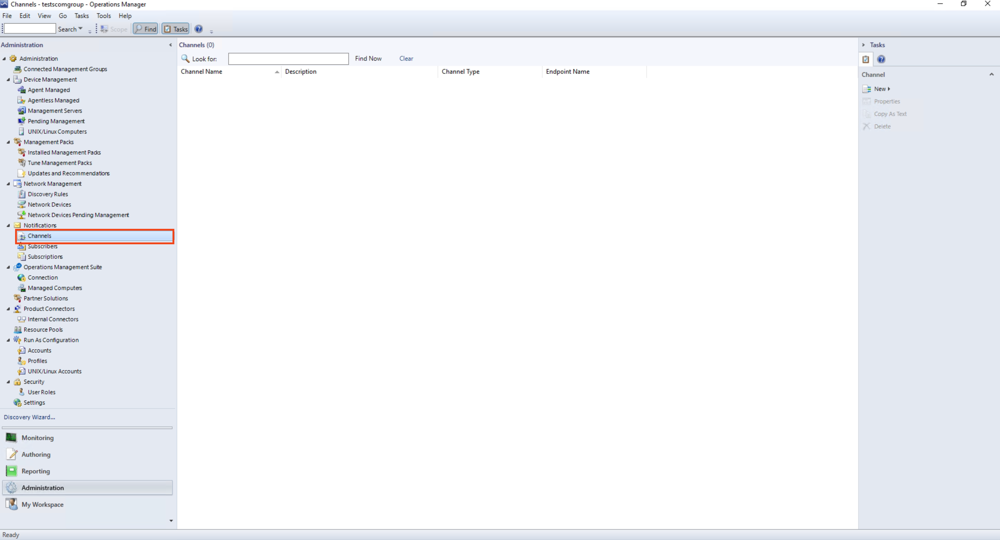

# Microsoft SCOM

## In ilert: Create an Microsoft SCOM alert source

1.  Go to **Alert sources** --> **Alert sources** and click on **Create new alert source**

    <figure><figcaption></figcaption></figure>
2.  Search for **Microsoft SCOM** in the search field, click on the Microsoft SCOM tile and click on **Next**.&#x20;

    <figure><figcaption></figcaption></figure>
3. Give your alert source a name, optionally assign teams and click **Next**.
4.  Select an **escalation policy** by creating a new one or assigning an existing one.

    <figure><figcaption></figcaption></figure>
5.  Select you [Alert grouping](../alerting/alert-sources.md#alert-grouping) preference and click **Continue setup**. You may click **Do not group alerts** for now and change it later.&#x20;

    <figure><figcaption></figcaption></figure>
6. The next page show additional settings such as customer alert templates or notification prioritiy. Click on **Finish setup** for now.
7.  On the final page, an API key and / or webhook URL will be generated that you will need later in this guide.

    <figure><figcaption></figcaption></figure>

## In Microsoft SCOM: Add ilert Webhook as Channel

1. Download our script ilert.ps1.\
   Download links:\
   [ilert Microsoft SCOM](https://github.com/iLert/ilert-ms-scom)
2.  Save this script into the following path:

    ```
    C:\scripts\ilert
    ```
3. In Microsoft SCOM Operations Console open the **Administration** view.

<figure><figcaption></figcaption></figure>

4. Navigate to **Notification**.

<figure><figcaption></figcaption></figure>

5. Create a new **Command** channel by right clicking on **Channels -> New channel -> Command...**

<figure><figcaption></figcaption></figure>

6. Enter a channel name and click on **Next**

<figure><figcaption></figcaption></figure>

7. Enter following into the input fields:\\
8.  Enter following into the input fields and click on **Finish**:\\

    Full path of the command file:

    ```
    C:\windows\system32\windowspowershell\v1.0\powershell.exe
    ```

    \
    Command line parameters:\
    _Replace the parameter string "Enter API Key" with your ilert API Key created in_ [_this step_](ms-scom.md#in-ilert-create-microsoft-scom-alert-source)\_\_

    ```powershell
    -F "C:\scripts\ilert\ilert.ps1" -AlertID "$Data[Default='NotPresent']/Context/DataItem/AlertId$" -AlertSourceKey "Enter API Key"
    ```

    \
    Startup folder for the command line:

    ```
    C:\windows\system32\windowspowershell\v1.0\
    ```

<figure><figcaption></figcaption></figure>

9. Create a new Subscriber by right clicking on **Subscriber -> New subscriber...**.png>)
10. Select a user as subscriber and click on **Next**

<figure><figcaption></figcaption></figure>

12. Leave the schedule settings on default.

<figure><figcaption></figcaption></figure>

13. On the next view click on **Add...** to add a new subscriber address

<figure><figcaption></figcaption></figure>

14. Enter an address name and click on **Next**

<figure><figcaption></figcaption></figure>

15. Select **Command** as **Channel Type** and **ilert Webhook** as **Command Channel**

<figure><figcaption></figcaption></figure>

16. Leave the schedule notification settings on **Always send notifications** and click on **Finish**
17. Create a new Subscription by right clicking on **Subscription -> New subscription...** (3).png>)
18. Set a name and proceed to the next step

<figure><figcaption></figcaption></figure>

19. Specify a criteria for your subscription(Note: If selecting a condition, please remove the "Notify on all alerts" to prevent multiple identical alert submission). Leave this as "Notify on all alerts" to receive a notification on all alerts.

<figure><figcaption></figcaption></figure>

20. &#x20;Add the previously made **Subscriber** to the **Subscription**

<figure><figcaption></figcaption></figure>

21. Add the previously made **Channel** to the **Subscription**

<figure><figcaption></figcaption></figure>

22. &#x20;Finish the setup

<figure><figcaption></figcaption></figure>

## FAQ

**Will alerts in ilert be resolved automatically?**

Yes, as soon as an alert is being **closed** or marked as **resolved**, the alert in ilert will be resolved automatically.

**Will alerts in ilert be accepted automatically?**

Yes, as soon as an alert is being marked as **acknowledged**, the alert in ilert will be accepted automatically.
