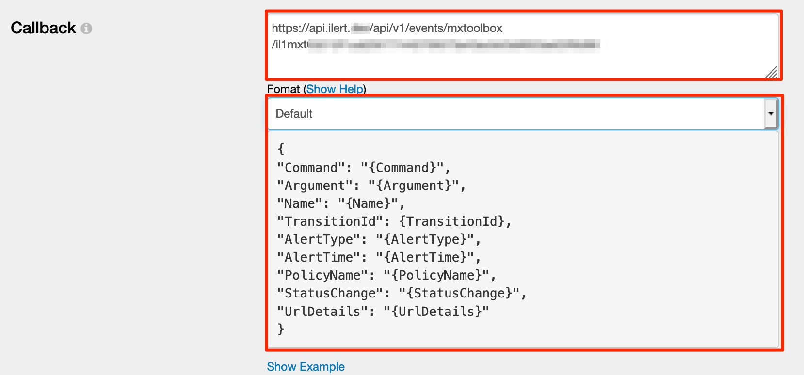

# MXToolBox Integration

## In iLert <a id="in-ilert"></a>

### Create a MXToolBox alert source <a id="create-alert-source"></a>

1. Go to the "Alert sources" tab and click **Create new alert source**


2. Enter a name and select your desired escalation policy. Select "MXToolBox" as the **Integration Type** and click on **Save**.


3. On the next page, a Webhook URL is generated. You will need this URL below when setting up the notification callback in MXToolBox.


## In MXToolBox <a id="in-splunk"></a>

### Create a notification hook <a id="create-action-sequences"></a>

1. Go to MXToolBox, then to **Notifications** and then create a new Notification policy or change the Default notifications policy


2. On the next page,  click on the **Custom** tile



3. Open the notification policy, in the **Callback** section paste the **Webhook URL** that you generated in iLert, in the **Format** section choose **Default.** Make sure that the **Webhook URL** was ****saved and the **payload** matches the following format: ****

```javascript
{
    "Command": "{Command}",
    "Argument": "{Argument}",
    "Name": "{Name}",
    "TransitionId": {TransitionId},
    "AlertType": "{AlertType}",
    "AlertTime": "{AlertTime}",
    "PolicyName": "{PolicyName}",
    "StatusChange": "{StatusChange}",
    "UrlDetails": "{UrlDetails}"
}
```

Finished! Your MXToolBox alerts will now create incidents in iLert.

## FAQ <a id="faq"></a>

**Will incidents in iLert be resolved automatically?**

Yes, as soon as an alert has been completed in MXToolBox, the associated incident in iLert will be resolved automatically.

**Can I connect MXToolBox with multiple alert sources from iLert?**

Yes, simply add more notification policies in MXToolBox.

