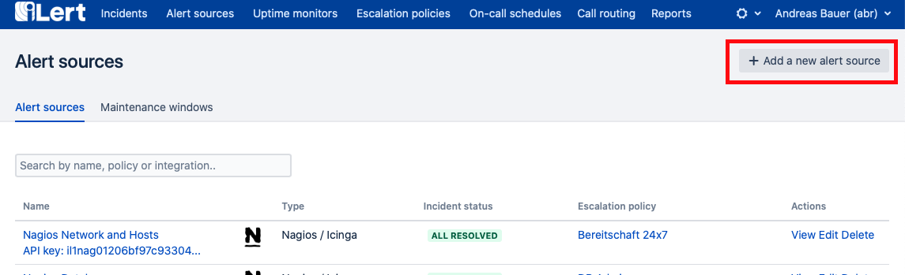
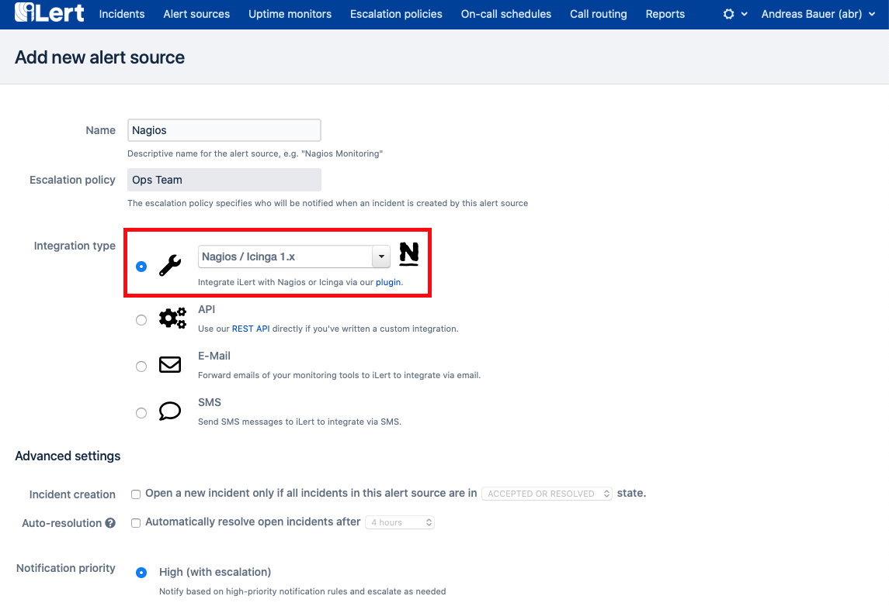
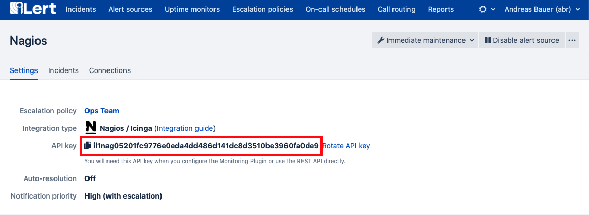

# Nagios Integration

With the ilert Nagios Notification Plugin, you can easily integrate Nagios with ilert and extend your existing Nagios system (and other Nagios forks) with advanced alerting by SMS, phone calls, and push notifications as well as on-call schedules.

## System requirements <a href="#requirements" id="requirements"></a>

* Nagios 2 (or higher)
* Python >= 3.7 (alternatively Python >= 2.7.9, we suggest 2.7.10)


Python 2.x is EOL (end of life) we suggest to use Python >= 3.7


## In ilert: create Nagios alert source <a href="#create-alarm-source" id="create-alarm-source"></a>

1\. Create a new alert source in ilert



2\. From the tool integration menu, select the type Nagios and click save.



3\. An API key is generated. You will need the API key below when setting up the plugin.



## In Nagios: install the notification plugin <a href="#installation-guide" id="installation-guide"></a>

Download the [ilert Nagios plugin](https://github.com/iLert/ilert-nagios) and unzip it:

```
> https://github.com/iLert/ilert-nagios/releases/download/latest/ilert-nagios.zip
> unzip ilert-nagios.zip
```

Put the plugin file `nagios_ilert.py` in the directory `/usr/local/bin`. The file must be executable by both Nagios and the cron daemon:



```
> mv ilert_nagios.py /usr/local/bin > chmod 755 /usr/local/bin/ilert_nagios.py
```



```
> cd python2 
> mv ilert_nagios.py /usr/local/bin > chmod 755 /usr/local/bin/ilert_nagios.py
```



In Nagios, enable the macro [`enable_environment_macros`](http://nagios.sourceforge.net/docs/3\_0/configmain.html#enable\_environment\_macros) (if not already active). Open your Nagios configuration file `nagios.cfg` and set the value to 1:

```
enable_environment_macros=1
```

If you have a larger Nagios installation and don't want to enable the macro `enable_environment_macros`, see the `ilert_nagios.cfg` configuration file for further information on how to this.

Open the plugin configuration file `ilert_nagios.cfg` and enter the API key in the pager field of the contact definition, eg:

```
define contact {
    contact_name                    ilert
    alias                           ilert
    service_notification_period     24x7
    host_notification_period        24x7
    service_notification_options    w,u,c,r
    host_notification_options       d,r
    service_notification_commands   notify-ilert
    host_notification_commands      notify-ilert
    pager                           <YOUR-API-KEY>
}
```

Copy the file into the Nagios configuration directory (varies depending on the Nagios installation).



```
 > cp ilert_nagios.cfg /etc/nagios/conf.d/
```



```
 > cd python2
 > cp ilert_nagios.cfg /etc/nagios/conf.d/
```



Depending on the installation of Nagios, there is a `nagios.cfg` file in which you must integrate the ilert configuration file. The entry in `nagios.cfg` would look like this for this example:

```
 cfg_file=/etc/nagios/conf.d/ilert_nagios.cfg
```

Add the ilert contact to your Nagios contact group. If you are using the Nagios defaults, open the `contacts.cfg` file for the ilert contact:

```
define contactgroup{
    contactgroup_name admins
    alias Nagios Administrators
    members nagiosadmin, ilert
}
```

Edit the crontab file from the nagios user

```
 > crontab -u nagios -e
```

Add the following entry:



```
* * * * * python3 /usr/local/bin/ilert_nagios.py -m send
```



```
* * * * * /usr/local/bin/ilert_nagios.py -m send
```



Via this cron job, events are sent to ilert every minute that failed in the first send attempt (e.g. due to a network error).

Restart Nagios:

```
 > /etc/init.d/nagios restart
```

## FAQ <a href="#faq" id="faq"></a>

**Which Nagios** [**Notification Types**](http://nagios.sourceforge.net/docs/3\_0/notifications.html) **are processed by the plugin?**

The plugin processes the notification types `PROBLEM` , `ACKNOWLEDGEMENT` and `RECOVERY` . The notification types `FLAPPING*` and `DOWNTIME*` are ignored.

**What happens if my internet connection is interrupted? Are the events generated in Nagios lost?**

No, events won't be lost. The plugin stores the events locally in a temporary directory (by default in /tmp/ilert\_nagios) and tries to send them to ilert every minute. This means that as soon as your connection is available again, cached events will be sent to ilert.

**The plugin does not work. What can I do?**

First, please make sure that you have installed the correct Python version by using `$ python --version` or `$ python3 --version` (Python 2.7.9+ or Python 3.7+). Also take a look at the log. The plugin uses the Unix / Linux system log for logging (e.g. under `/var/log/messages` or `/var/log/syslog` ). If you cannot find the error, please contact our support at [support@ilert.com](mailto:support@ilert.com).
