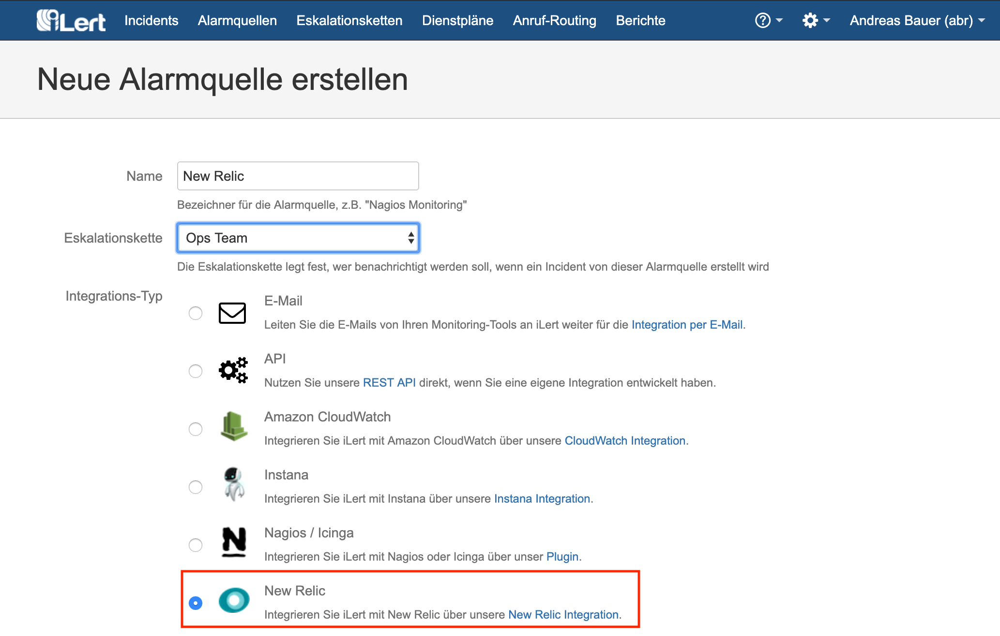
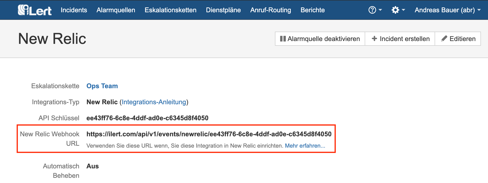
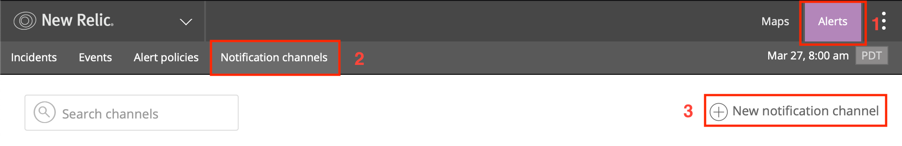

# New Relic Integration

With New Relic Integration, you can easily integrate New Relic Alerts with iLert. So you can easily extend New Relic with SMS, Push and Voice alerts, as well as iLert rosters. Incidents are created in iLert and automatically closed when the problem is resolved. In addition, the incidents in iLert created by New Relic include bounce links to the respective Incident in New Relic.

## In iLert: Create New Relic alert source 

1. **Go to the alert sources tab** and click on the "Create new alert source" button

2. Assign name and select escalation chain

3. Select and save in the field Integration Type **New Relic**.

4. On the next page, a Webhook URL is generated. You will need this URL below when setting up in New Relic.

## In New Relic Alerts: Add Webhook notification channel 

1. Go to the **Alerts → Notification channels** tab and click **New notification channel**.

2. Select **Channel Type** Webhook and insert the generated in iLert field **Base URL**.

3. After you click on **Create channel** , you have the opportunity to test the integration. Click **Send a test notification**.

4. Check if an incident has been created in iLert.

5. After creating the **Notification Channel** in New Relic, add it to one or more **alert policies**. Go to the **Alert policies** tab and click **Add alert policy**.

6. The integration is now set up!

## FAQ 

**Will incidents in iLert be resolved automatically?**

Yes, as soon as an incident is closed in New Relic, the associated incident in iLert is automatically fixed.

**What if an incident is acknowledged in New Relic, is the associated incident also confirmed in iLert?**

Yes.

**Can I link New Relic to multiple alert sources in iLert?**

Yes, create a Notification Channel for each alert source in New Relic.

