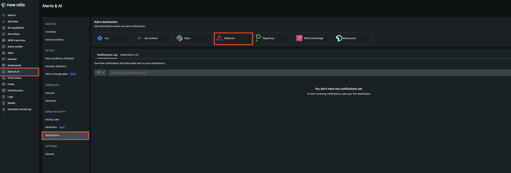
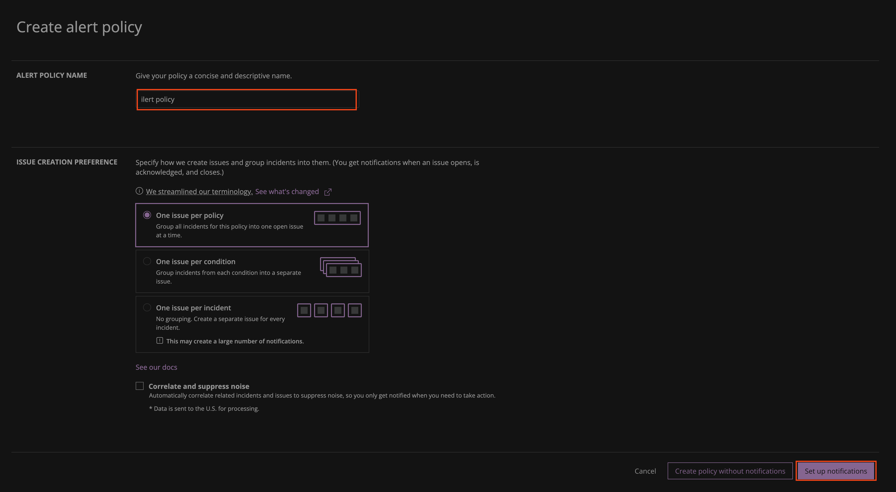
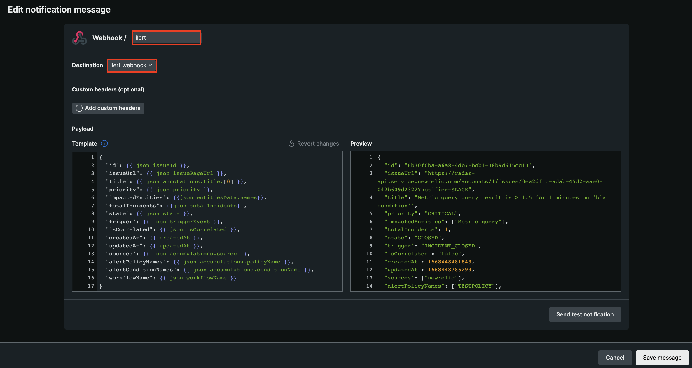
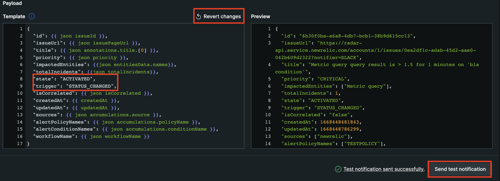
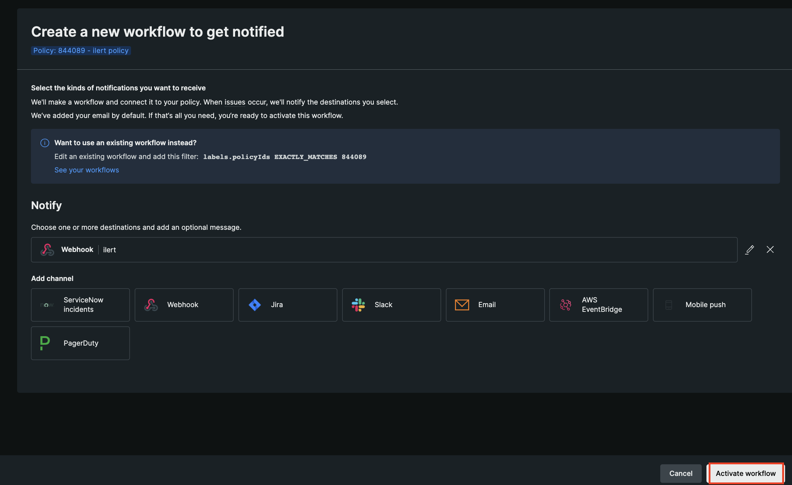

# New Relic Workflow Integration

## In ilert: Create New Relic alert source

1. Go to **Alert sources** and click on the **Create new alert source** button
2. Set a name for your New Relic alert source and select an escalation policy
3. In the field Integration type select **New Relic** and save.
4.

    <figure><figcaption></figcaption></figure>
5. On the next page, a Webhook URL is generated. You will need this URL below when setting up in New Relic.
6.

    <figure><figcaption></figcaption></figure>

## In New Relic: Add ilert as a Destination

1. In the sidebar, go to **Alerts & AI** -> **Destinations** -> **Webhook**
2.

    <figure><figcaption></figcaption></figure>
3. Enter a **Webhook name** and in the field **Endpoint URL** insert the Webhook URL generated in ilert.
4.

    <figure><figcaption></figcaption></figure>
5. On the sidebar go to **Alert conditions (Policies)**
6.

    <figure><figcaption></figcaption></figure>
7. Click on the **New alert policy** button.
8.

    <figure><figcaption></figcaption></figure>
9. Enter an **Alert policy name** and click on the **Set up notifications** button
10.

    <figure><figcaption></figcaption></figure>
11. On the next step click on **Webhook**

    <figure><figcaption></figcaption></figure>
12. Enter a channel name and choose the previous created destination in the **Destination** field.&#x20;
13.

    <figure><figcaption></figcaption></figure>
14. To test this channel, we need to change the values of both keys: `state` and `trigger` to "ACTIVATED" and "STATE\_CHANGED". This prevents the testing of an already closed alert. Click on **Send test notification**. After testing, click on **Revert changes** and save the message.
15.

    <figure><figcaption></figcaption></figure>
16. On the next page click on **Activate workflow**, to save and activate the workflow.
17.

    <figure><figcaption></figcaption></figure>

## FAQ

**Will alerts in ilert be resolved automatically?**

Yes, as soon as an issue has been closed in New Relic, the associated alert in ilert will be resolved automatically.

**Will alerts in ilert be accepted automatically?**

Yes, as soon as an issue has been acknowledged, the associated alert in ilert will be accepted automatically.

**Can I use customised tags for my alerts?**

Yes, customised tags will appear in the alert details tab.

