# Telegram Integration

[Telegram](https://telegram.org/) is a cloud-based instant messaging app that allows users to send messages, photos, videos, and files to individuals or groups. It is known for its emphasis on privacy and security, offering end-to-end encryption for secret chats.


To use our Telegram outbound integration, a valid phone number contact in the notification settings in ilert is required. Simply add a phone number by following [our notification settings guide](https://docs.ilert.com/alerting/notification-settings#add-notification-contacts-and-activate-supported-channels).


## In ilert: Activate Telegram in the notification settings 

1. Click on the **avatar icon -> Notification settings**.

<figure>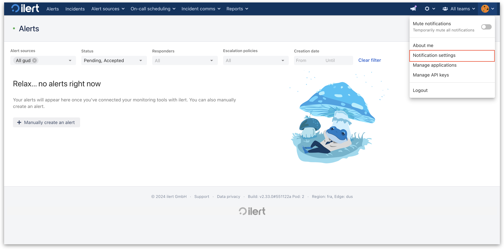<figcaption></figcaption></figure>

2. In **Phone number contacts,** click on **Activate** next to Telegram.

<figure>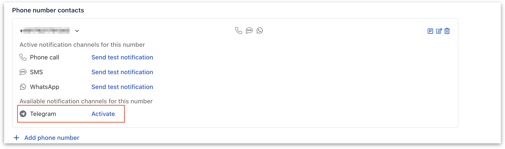<figcaption></figcaption></figure>

3. Copy the code that was generated in the pop-up or click on **Verify**.

<figure>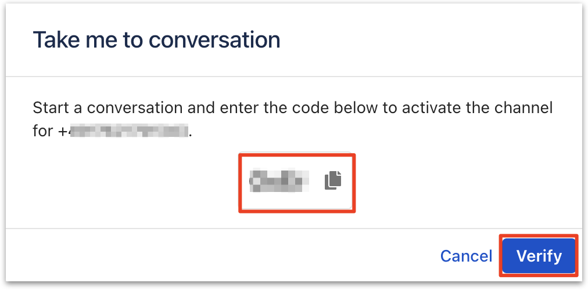<figcaption></figcaption></figure>

4. Now click on **Send Message**.

<figure>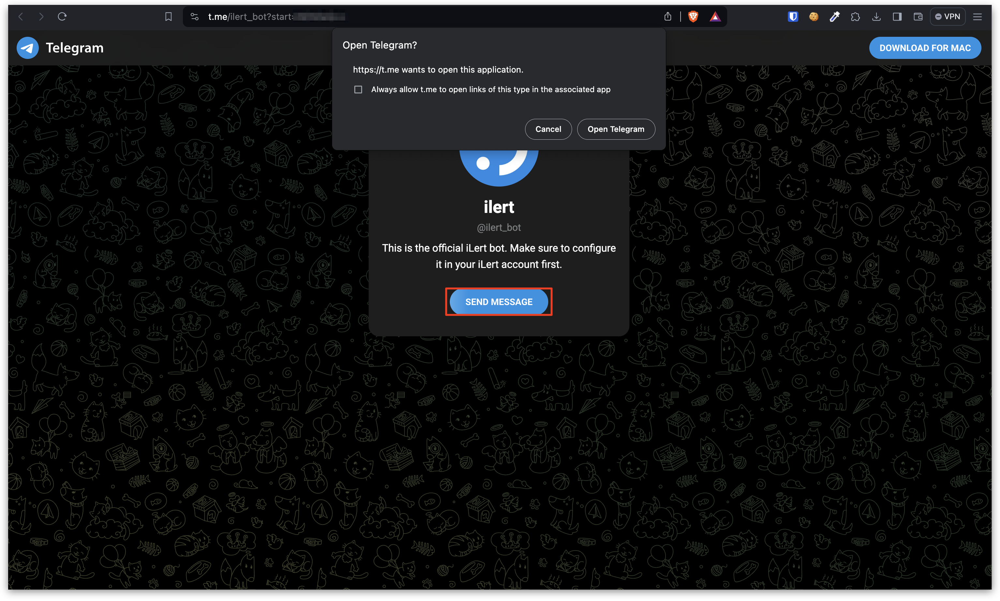<figcaption></figcaption></figure>

5. You will then be verified.
6. Send a test notification to test your connection by clicking on **Send test notification.**

<figure><figcaption></figcaption></figure>

## Optional: Activate the ilert connection in Telegram manually 

To manually activate your Telegram connection, follow these steps.

1. Search for '@ilert\_bot' and open a new chat.

<figure>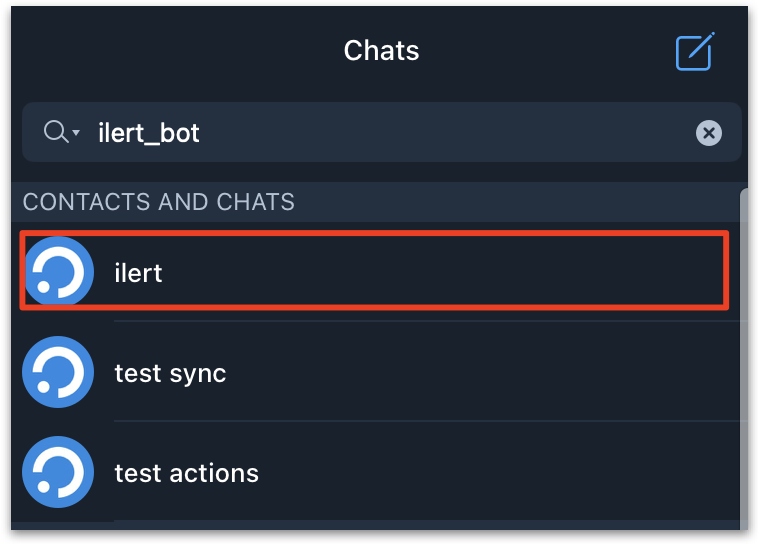<figcaption></figcaption></figure>

2. Enter the previously generated verification code into the Chat.

<figure>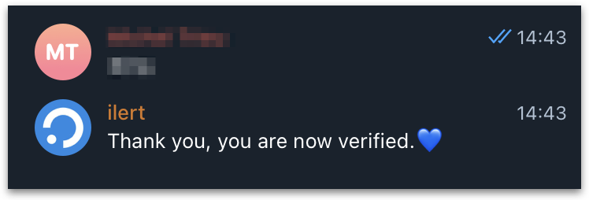<figcaption></figcaption></figure>

## In Telegram: ilert alert action in Telegram groups 

1. Add our '@ilert\_actions\_bot' into a group of choice.
2. If the '@ilert\_actions\_bot' got invited successfully, you will receive a message with a code starting with a dash("-"). Copy this code and proceed to the [next step](telegram.md#alarm-sources-3).

<figure>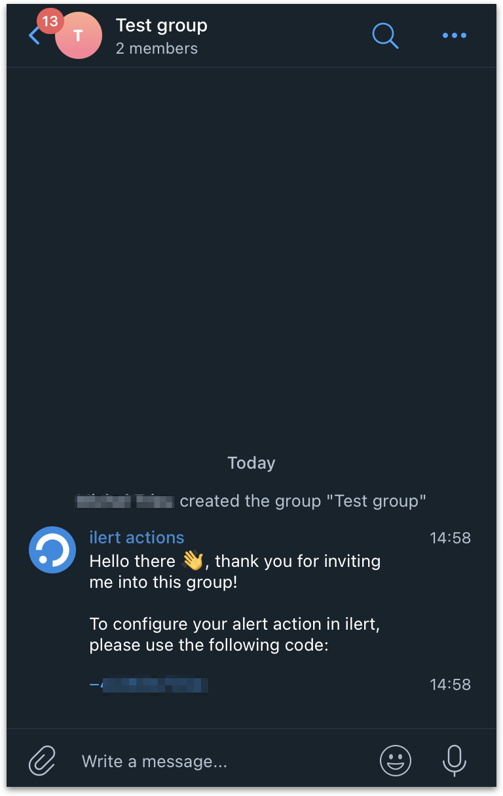<figcaption></figcaption></figure>

## In ilert: Create a new Telegram alert action 

1. Click on **Alert sources -> Alert actions**.

<figure>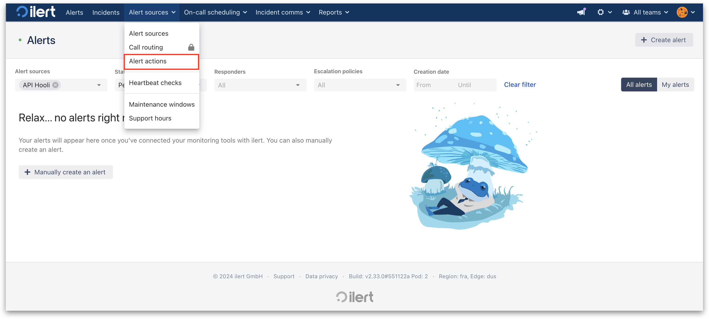<figcaption></figcaption></figure>

2. Now click on **Create new alert action**.

<figure>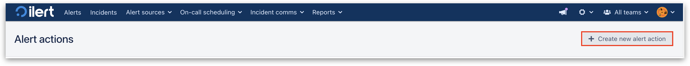<figcaption></figcaption></figure>

3. Search for **Telegram** in the alert actions wizard and select our Telegram integration.

<figure>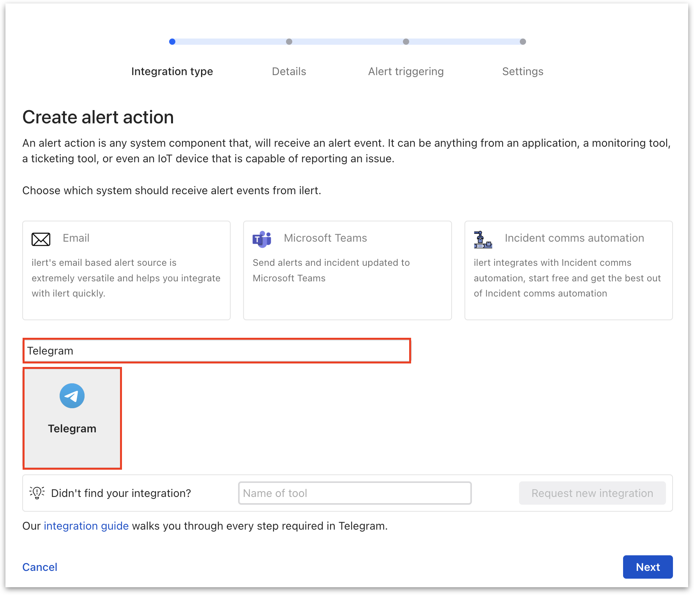<figcaption></figcaption></figure>

4. Enter a **Name** and proceed to the next step.

<figure>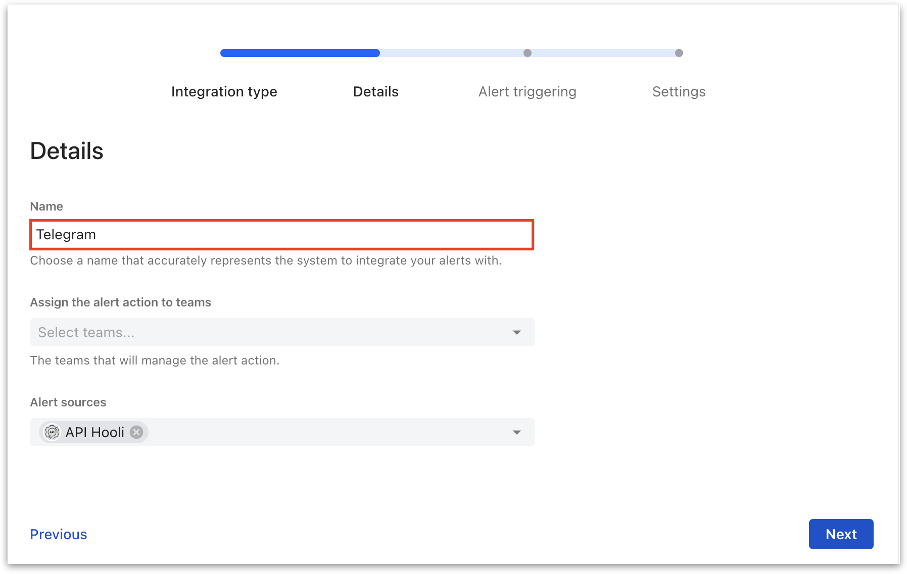<figcaption></figcaption></figure>

5. Choose some alert event filters for your alert action and click on **Next**.

<figure>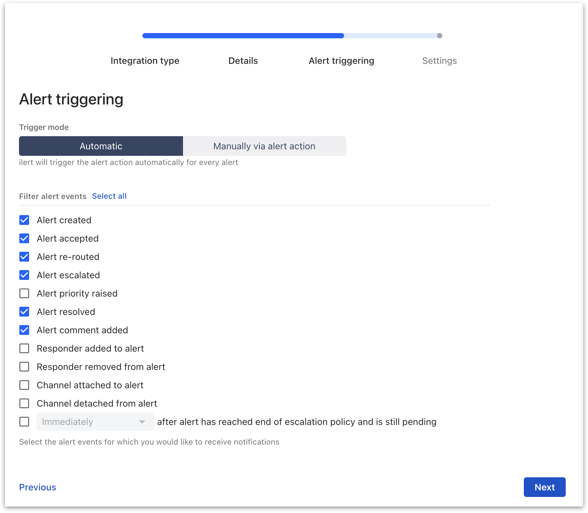<figcaption></figcaption></figure>

6. Now enter the **code** from [this step](telegram.md#alarm-sources-3) that you have received from our ''@ilert\_actions\_bot" in your Telegram group and click on **Done** to finish the setup.

<figure>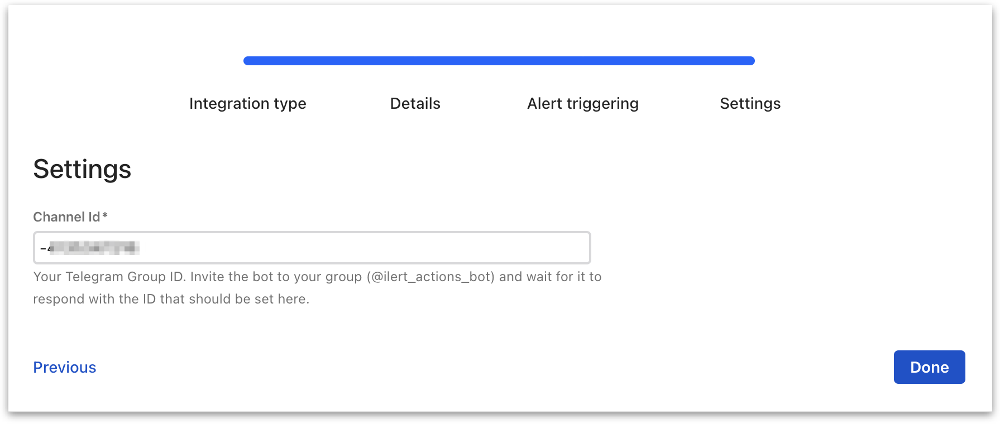<figcaption></figcaption></figure>
