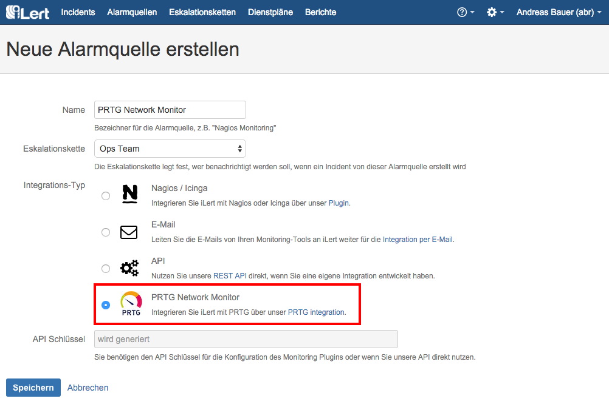
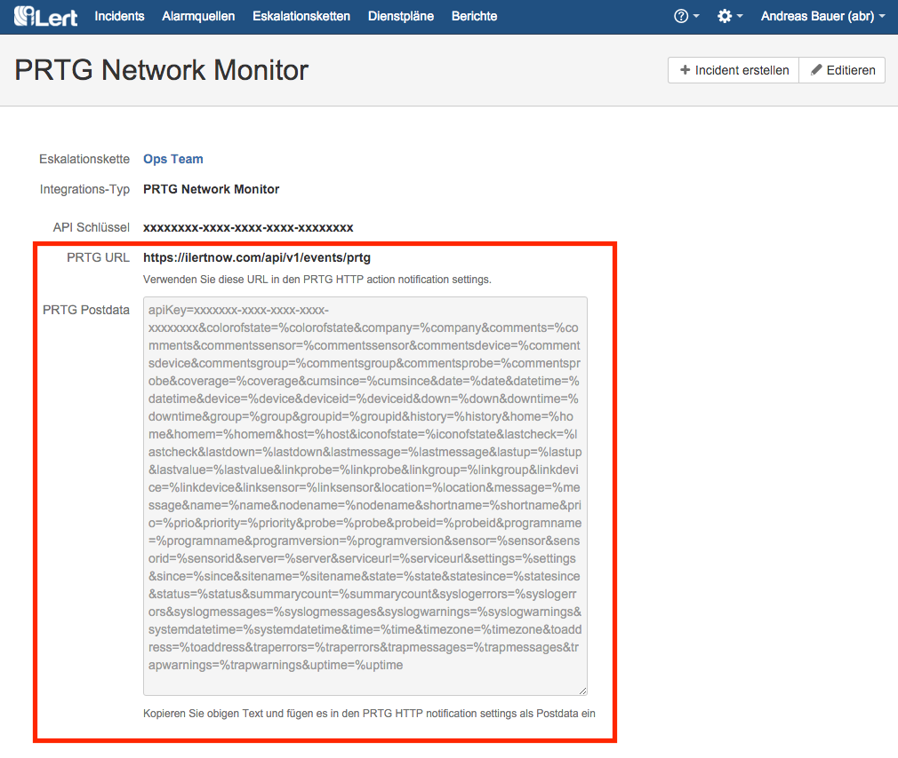

# PRTG Network Monitor Integration

With PRTG integration, you can easily integrate PRTG with iLert. You can easily extend your existing PRTG system with SMS, push and voice notifications as well as rosters from iLert.

## In iLert: Create PRTG alert source 

1. Switch to the tab "alert sources" and click on the button "Create new alert source"

2. Assign name and select escalation chain

3. In the Integration Type field, select "PRTG Network Monitor"

4. Save

5. The "PRTG URL" and "PRTG Postdata" fields displayed on the next page are required in PRTG

## In PRTG: Create new notification 

1. Switch to the notification settings

2. Add a new notification

3. As notification method select "Execute HTTP ACTION"

4. Transfer the "URL" and "Postdata" fields from the alert source set up in iLert. The API key is included in Postdata.

5. Save

6. Next we will use the newly created iLert notification method in PRTG. To do this, switch to the root group in the device overview and select the "Notifications" tab.

7. Create the following status triggers. **Note**: We recommend the option "repeat this every 5 minutes" in case your internet connection goes down.

## FAQ 

**Will incidents in iLert be resolved automatically?**

Yes, as soon as the condition of a sensor in PRTG is OK again, the associated incident is resolved in iLert.

**What if an alert is confirmed in PRTG, is the associated incident also confirmed in iLert?**

No, in PRTG it is unfortunately not possible to send notifications for confirmations.

**What if my internet connection is interrupted? Are the events generated in PRTG lost?**

No, events will not be lost if you enable the "repeat every x minutes" option in PRTG \(see above\). In addition, we recommend that you monitor your Internet connection with an external monitoring service \(e.g. using iLert's uptime monitoring\). You can send these alerts to iLert again.

**Can I link PRTG to multiple alert sources in iLert?**

Yes, create multiple iLert notifications in PRTG. You can then associate them with objects in the PRTG object hierarchy.

**The integration does not work. How do I find the mistake?**

If you can not find the error, please contact our support at [support@ilert.com](support@ilert.com).

