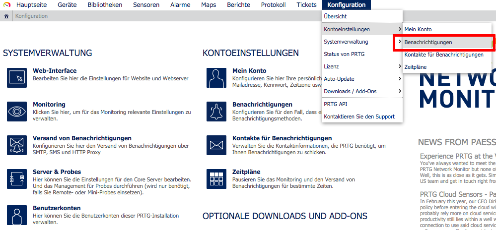
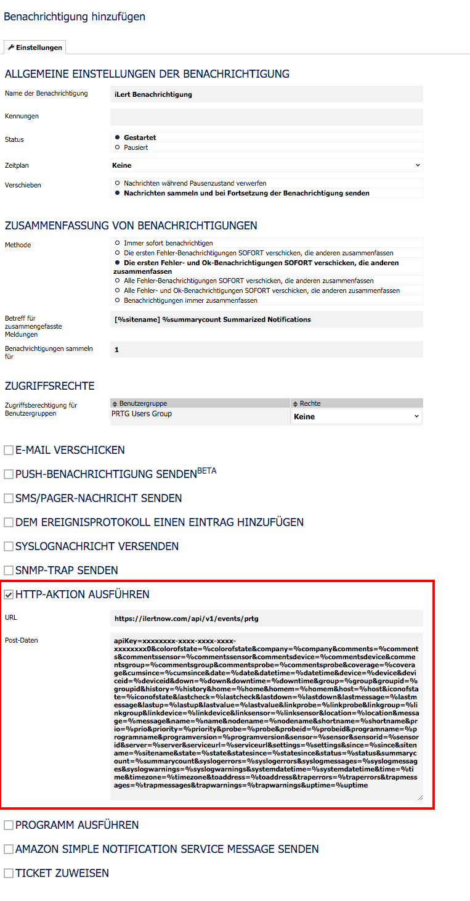
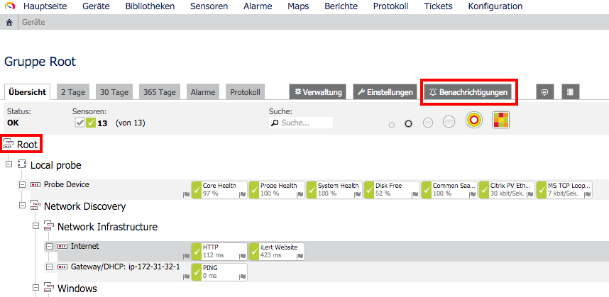
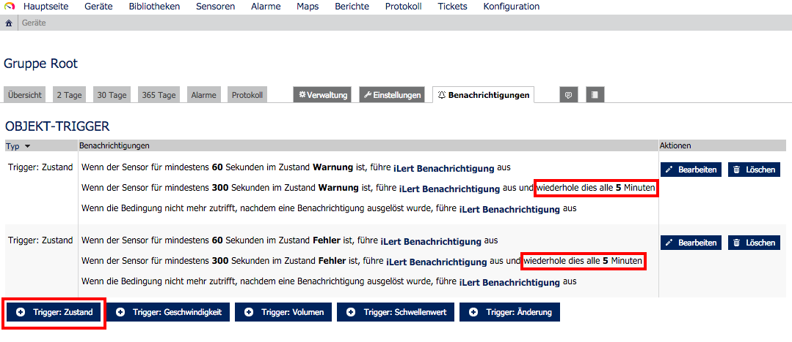

# PRTG Network Monitor Integration

With PRTG integration, you can easily integrate PRTG with iLert and extend your existing PRTG monitoring with SMS, push and voice notifications as well as on-call schedules from iLert.

## In iLert: Create PRTG alert source 

1. Go to **Alert sources** and click on **Add a new alert source**
2. Enter a name for your alert source (e.g. "PRTG") and select your desired escalation policy.
3. In the Integration Type field, select **PRTG Network Monitor** and click on Save

1. On the next page,  **PRTG URL** and **PRTG Postdata** fields will be displayed.  You will need those two fields in the PRTG setup.

## In PRTG: Create new notification 

1. Got to notification settings

1. Add a new notification
2. As notification method select **Execute HTTP ACTION**
3. Copy the **URL** and **Postdata** fields from the iLert alert source. The API key is included in Postdata.

1. Click on **Save**
2. Next we will use the newly created iLert notification method in PRTG. To do this, switch to the root group in the device overview and select the "Notifications" tab.

1. Create the following status triggers. **Note**: We recommend the option "repeat this every 5 minutes" in case your internet connection goes down.

## FAQ 

**Will alerts in iLert be resolved automatically?**

Yes, as soon as the condition of a sensor in PRTG is OK again, the associated alert is resolved in iLert.

**What if an alert is acknowledged in PRTG, is the associated alert also acknowledged in iLert?**

No, in PRTG it is unfortunately not possible to send notifications for acknowledgements.

**What if my internet connection is interrupted? Are the events generated in PRTG lost?**

No, events will not be lost if you enable the "repeat every x minutes" option in PRTG (see above). In addition, we recommend that you monitor your Internet connection with an external monitoring service (e.g. using iLert's uptime monitoring). You can send these alerts to iLert again.

**Can I link PRTG to multiple alert sources in iLert?**

Yes, create multiple iLert notifications in PRTG. You can then associate them with objects in the PRTG object hierarchy.

**The integration does not work. How do I find the mistake?**

If you can not find the error, please contact our support at [support@ilert.com](https://github.com/iLert/docs/tree/dfe03283a452516a115a55f8c20942698e279d7b/integrations/support@ilert.com).
