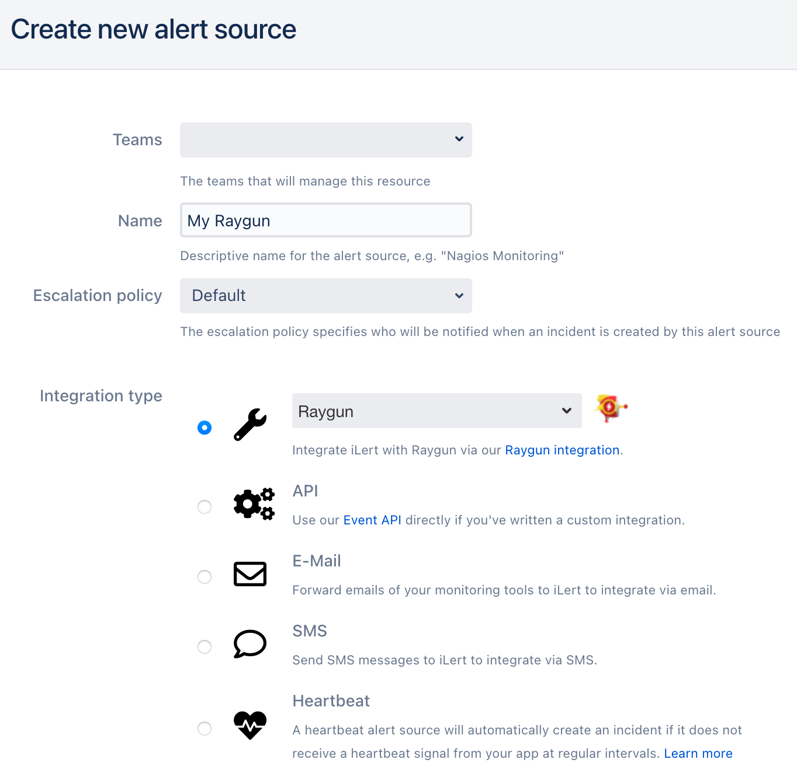
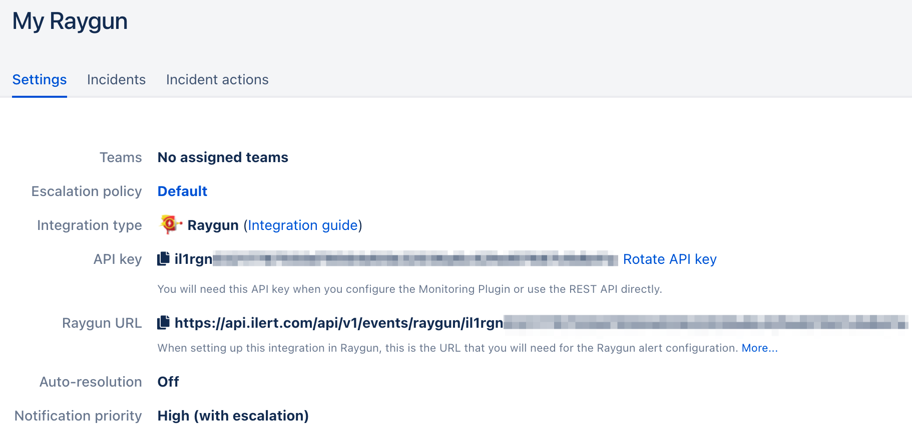
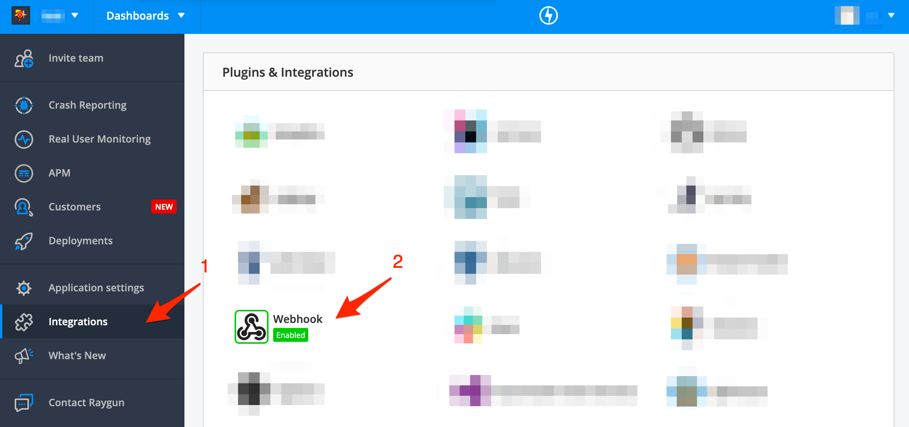
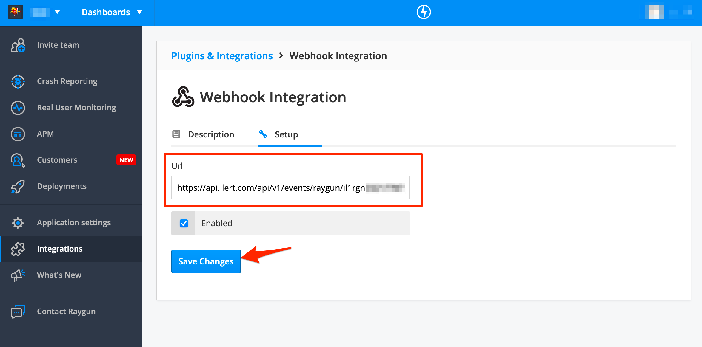

# Raygun Integration

[Raygun](https://raygun.com/) is a cloud-based platform that provides error, crash, and performance monitoring for your web and mobile applications.

## In iLert 

### Create a Raygun alert source 

1. Go to the "Alert sources" tab and click **Create new alert source**

2. Enter a name and select your desired escalation policy. Select "Raygun" as the **Integration Type** and click on **Save**.

3. On the next page, a Webhook URL is generated. You will need this URL below when setting up the webhook integration in Raygun.

## In Raygun 

### Create a notification hook 

1. Go to Raygun, then to **Integrations** and click on the **Webhook** tile

2. On the next page,  paste the **Webhook URL** that you generated in iLert and lick on the **Save** button

Finished! Your Raygun crash reports will now create incidents in iLert.

## FAQ 

**Will incidents in iLert be resolved automatically?**

Yes, as soon as an alert has been completed in Raygun, the associated incident in iLert will be resolved automatically.

**Can I connect Raygun with multiple alert sources from iLert?**

No

