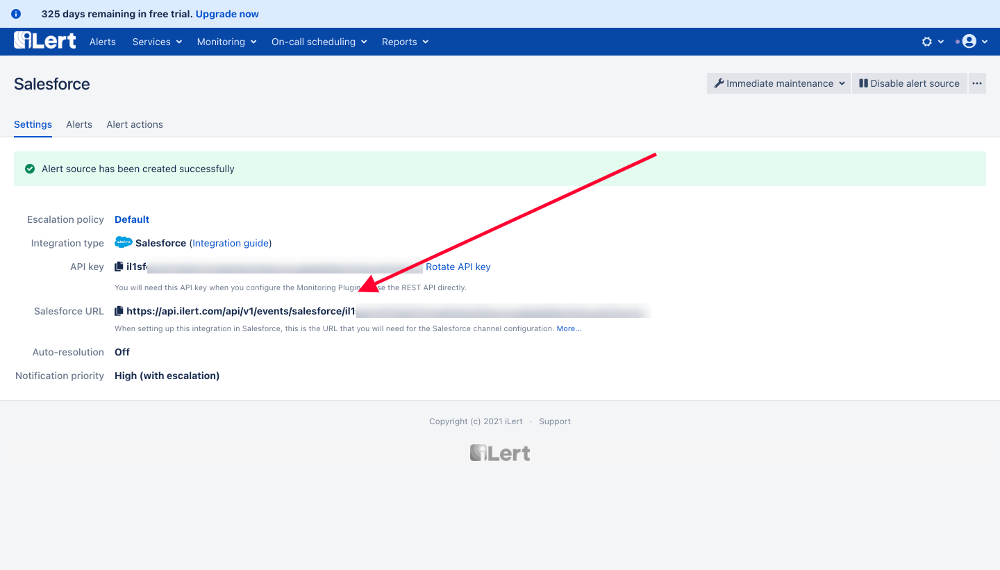

# Salesforce Integration

## In iLert

1. Go to the "**Alert sources**" tab and click "**Create new alert source**"

.png>)

1.  Enter a name and select your desired escalation policy.  &#x20;

    Select "**Salesforce**" as the **Integration Type** and click **Save**.


1. On the next page, an **Salesforce URL** is generated. You will need the URL and the API Keys for the configuration from Salesforce side.



## In Salesforce

_This Documentation is based on the new Salesforce Lightning, new UI from Salesforce_

Navigate to Developer Console by clicking the **Settings** icon and then click the **Developer Console**.


In Developer Console page select **File** -> **New** -> **Apex Class** and copy the following and save it as **`ilertClass.apxc`**, then click Save.

```java
global class ilertClass {

    @future(callout=true)
    WebService static void xRESTCall(String endpoint, String payload){
        HttpRequest req = new HttpRequest();
        req.setEndpoint(endpoint);
        req.setMethod('POST');
        req.setBody(payload);
        req.setHeader( 'Content-Type', 'application/json' );
        req.setHeader( 'Accept', 'application/json' );
        Http http = new Http();
        HTTPResponse res = http.send(req);
        System.debug(' Response: ' + res.getBody());
    }

    global static string getPayloadStringByHandlingNull(String value){
        return value==null?null:'"'+value.replaceAll('[^a-zA-Z0-9\\s]', '').replaceAll('\\s+', ' ')+'"';
    }

    global static string getPayloadStringByHandlingNull(DateTime value){
        return value==null?null:'"'+value+'"';
    }

    global static string getPayloadStringByHandlingNull(Decimal value){
        return value==null?null:'"'+value+'"';
    }

    global static string getPayloadStringByHandlingNull(Boolean value){
        return value==null?null:'"'+value+'"';
    }
  }
```

Create a trigger by clicking **File** -> **New** -> **Apex Trigger** and copy the following and save it as **`ilertTrigger.apxt`**. Please make sure that the `API_KEY` and the `URL` is replaced based on the relevant `API_KEY` and `URL` that were received from iLert side.

```java
trigger ilertCaseTrigger on Case (after insert, after update) {
    
    string endpoint = 'URL';
    string apiKey = 'API_KEY';
    Case obj = Trigger.new[0];
    
    System.debug('ilertCaseTrigger Fired');

    string caseNumber = obj.CaseNumber;
    string subject = obj.Subject;
    string description = obj.Description;
    
    string eventType = 'ALERT';

    if (obj.IsClosed) {
        eventType = 'RESOLVE';
    }

   string payload= '{'+       
        '\"eventType\" :' + ilertClass.getPayloadStringByHandlingNull(eventType)+ ',' +
        '\"apiKey\" :' + ilertClass.getPayloadStringByHandlingNull(apiKey)+ ',' +
        '\"incidentKey\" :' + ilertClass.getPayloadStringByHandlingNull(caseNumber)+ ',' +
        '\"summary\" :' + ilertClass.getPayloadStringByHandlingNull(subject)+ ',' +
        '\"details\" :' + ilertClass.getPayloadStringByHandlingNull(description) +
    '}';
    
    System.debug('Payload: ' + payload);

    ilertClass.xRESTCall(endpoint, payload);
}
```

In order to send to iLert, the domain needs to be allowlisted, back to the Salesforce page and select Setup from settings and go to **Setup** -> **Security** -> **Remote Site** Settings page.


Add a new remote site name it "iLert" and then paste the URL copied **`https://api.ilert.com`** to the "Remote Site URL" field and Save.

To test this, simply create a **Case** in Salesforce.

## FAQ

1. How to Debug in case something is not working?\
   \
   In order to Debug this, you need to add `System.debug()` either on the trigger or the class. To view this just navigate to **Gear Icon -> Setup -> Environment -> Logs -> Debug Logs**\
   ****
2. I don't see my logs, why?\
   \
   Make sure that the **Expiration Date** settings in the Debug Logs settings are set in the future, just edit it if it was done in the past, and create Case again.


&#x20;
