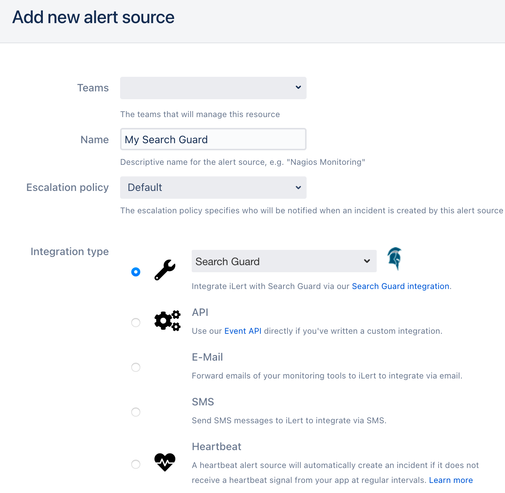
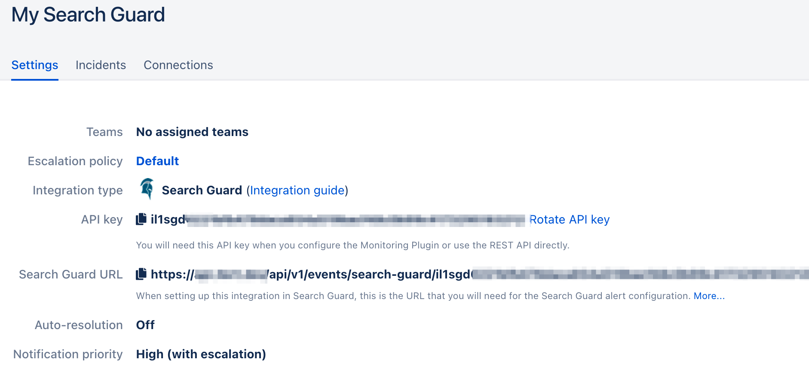
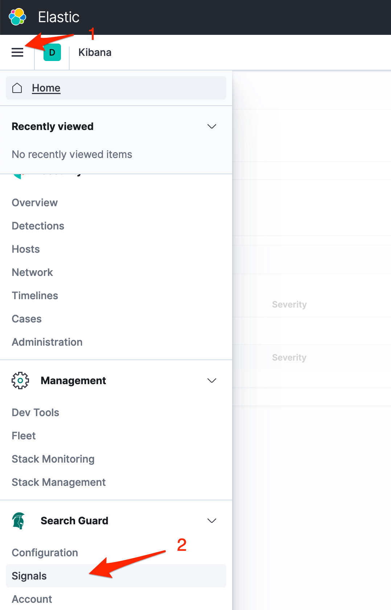
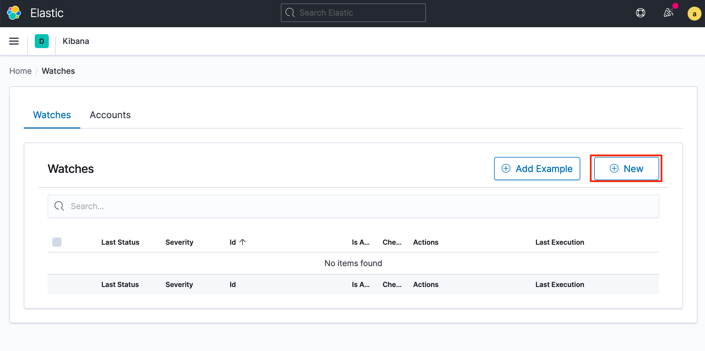
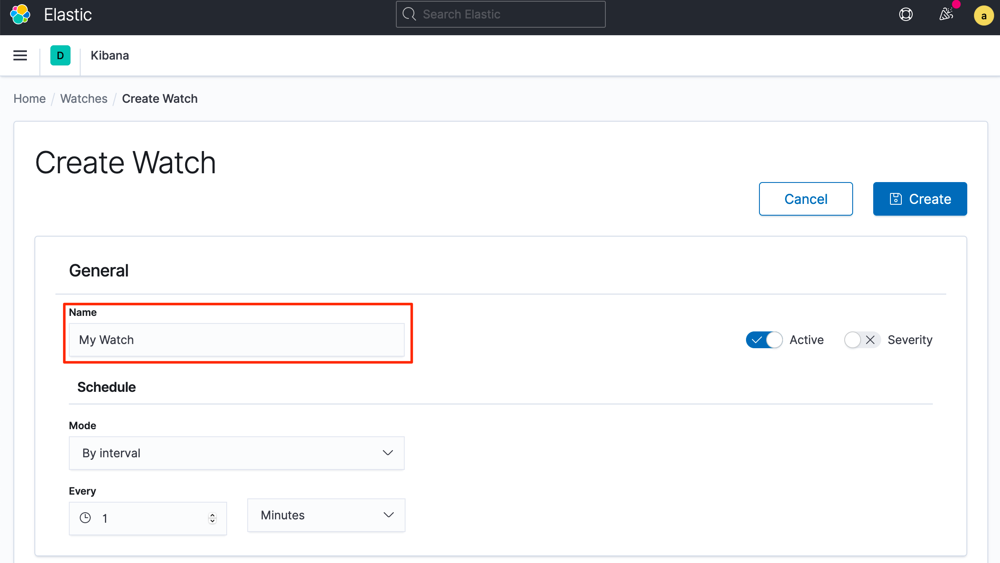
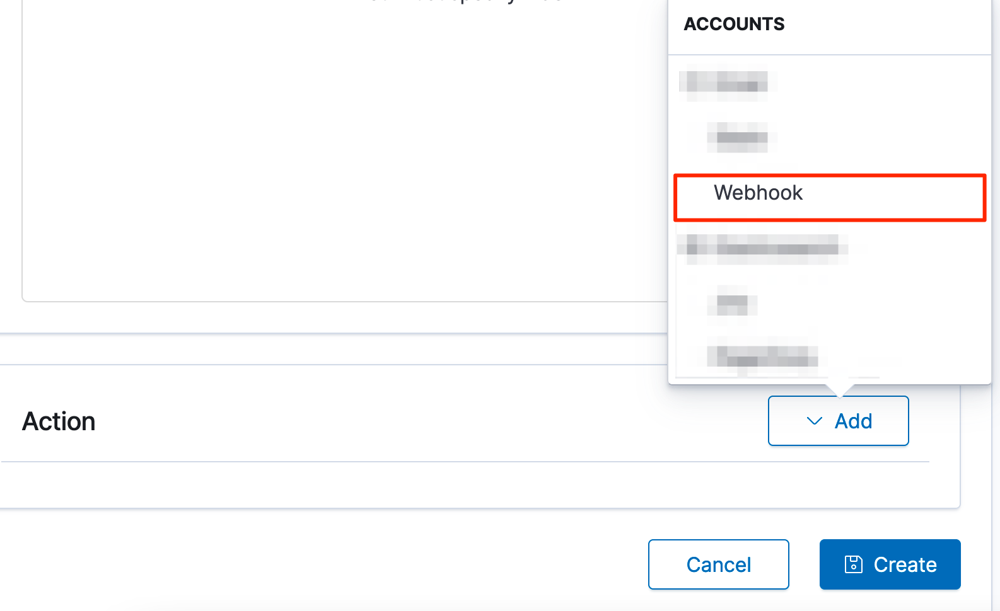
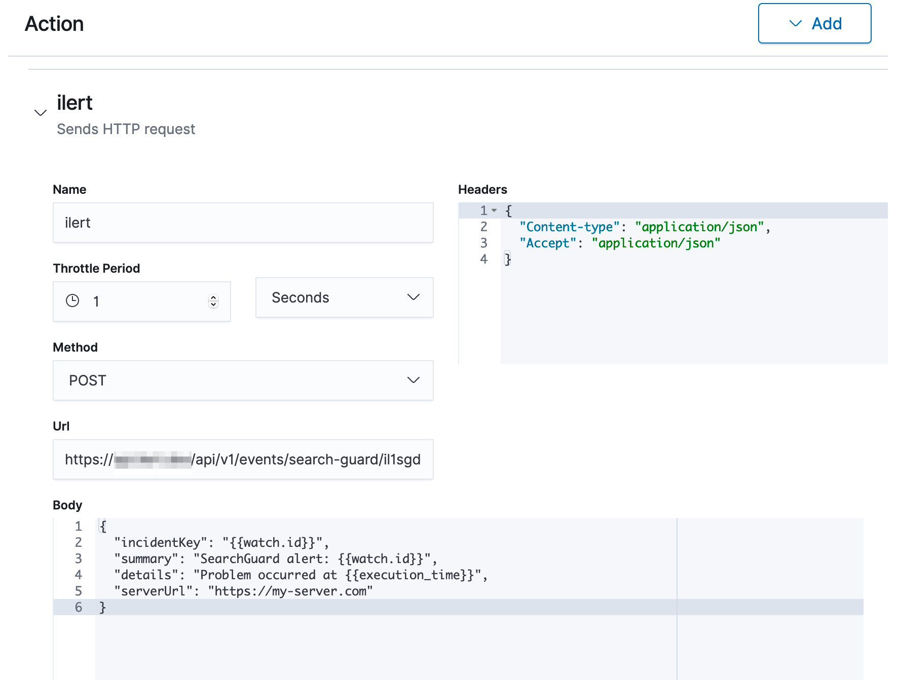

# Search Guard Integration

## In iLert <a id="in-ilert"></a>

### Create a Search Guard alert source <a id="create-alert-source"></a>

1. Go to the **Alert sources** tab and click on **Create new alert source**
2. Enter a name and select your desired escalation policy. Select "Search Guard" as the **Integration Type** and click on **Save**.



1. On the next page a **Search Guard URL** is generated. You will need this URL below when setting up the webhook action in Search Guard.



## In Search Guard <a id="in-topdesk"></a>

### Create watch <a id="create-action-sequences"></a>

1. Go to Search Guard to open the main menu and choose **Search Guard -&gt; Signals**



1. On the next page click on the **New** button to create a new watch



1. On the next view name the watch e.g. **My Watch** scroll down and configure the watch to your liking.



1. Scroll down to **Actions** and add the **Webhook** action



1. Name the action e.g. **iLert**, paste the **Webhook URL** that you generated in iLert, change headers as required and paste the following **json** as body template

```text
{
  "incidentKey": "{{watch.id}}",
  "summary": "SearchGuard alert: {{watch.id}}",
  "details": "Problem occurred at {{execution_time}}",
  "serverUrl": "https://my-server.com"
}
```



1. Click on **Create** to save the watch.  

   Finished! Your Elastic Search Guard alerts will now create alerts in iLert.

## FAQ <a id="faq"></a>

**Will alerts in iLert be resolved automatically?**

No, unfortunately Search Guard watch\(es\) will not fire resolve events for alerts.

**Can I connect Search Guard with multiple alert sources from iLert?**

Yes, simply create more watches in Search Guard.

