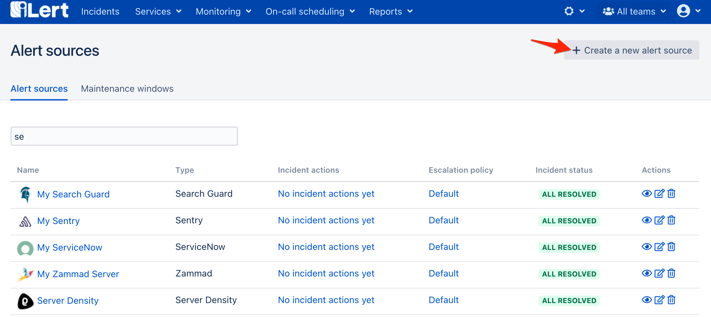

# Sematext Integration

## In iLert <a id="in-ilert"></a>

### Create a Sematext alert source <a id="create-alert-source"></a>

1. Go to the "Alert sources" tab and click **Create new alert source**



2. Enter a name and select your desired escalation policy. Select "Sematext" as the **Integration Type** and click on **Save**.


3. On the next page, a Webhook URL is generated. You will need this URL below when setting up the notification hook in Sematext.


## In Sematext <a id="in-splunk"></a>

### Create a notification hook <a id="create-action-sequences"></a>

1. Go to Sematext, then to **Alerts -&gt; Notification Hooks** and then on the **New Notification Hook** button


2. On the next page,  click on the **Custom** tile


3. On the next modal page, name the hook e.g. iLert, paste the **Webhook URL** that you generated in iLert, in the **Send data as** section choose **Json**, in the **HTTP method** section choose **POST**, in the **Parameters** section choose the following payload, then click on the **Save Notification Hook** button


```javascript
{
    "backToNormal": "$backToNormal",
    "ruleType": "$ruleType",
    "description": "$description",
    "title": "$title",
    "applicationId": "$applicationId",
    "url": "$url",
    "createTimestamp": "$createTimestamp"
}
```

4. Edit your alert rule to send notification to iLert


Finished! Your Sematext alerts will now create incidents in iLert.

## FAQ <a id="faq"></a>

**Will incidents in iLert be resolved automatically?**

Yes, as soon as an alert has been completed in Sematext, the associated incident in iLert will be resolved automatically.

**Can I connect Sematext with multiple alert sources from iLert?**

Yes, simply add more notification hooks in Sematext.

