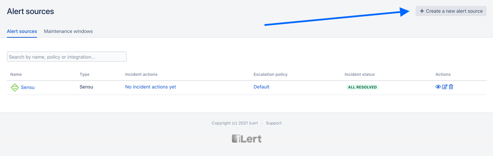
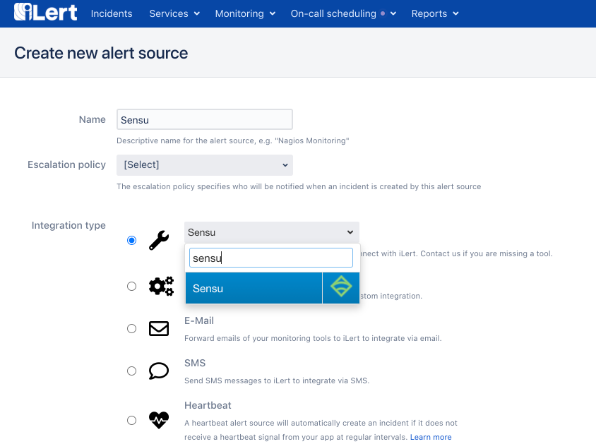
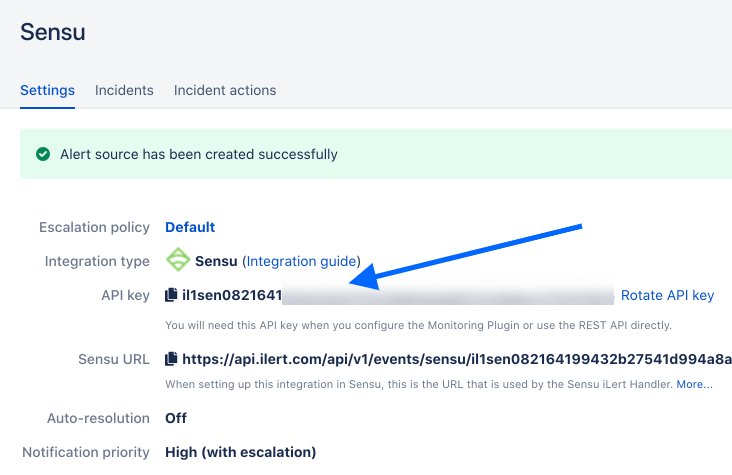

# Sensu Integration

[Sensu](https://sensu.io/) is a tool that functions as an observability Pipeline that delivers monitoring as code on any cloud.

## In iLert

1. Go to the "Alert sources" tab and click "Create new alert source"



2. Enter a name and select your desired escalation policy. Select "Sensu" as the **Integration Type** and click **Save**.



3. On the next page, a API key is generated. You will need the API Key when setting up the handler in Sensu.



## In Sensu

1. Add Sensu iLert Handler

```text
sensuctl asset add iLert/sensu-ilert
```

2. Make sure that the asset was added to your Sensu backend. Run:

```text
sensuctl asset info iLert/sensu-ilert
```

3. In the following command, replace &lt;ilert\_key&gt; with your iLert API key. Then run the updated command:

```text
sensuctl handler create ilert \
--type pipe \
--runtime-assets iLert/sensu-ilert \
--command "sensu-ilert -t <ilert_key>"
```

4. Make sure that your handler was added by retrieving the complete handler definition in YAML or JSON format:

```text
sensuctl handler info ilert --format yaml
```

5. Trigger an event. You can try with **file\_exists** check and iLert handler workflow in place, you can remove a file to cause Sensu to send a non-OK event. You can refer to the next section.

## Triggering an event

### Add system subscription to entity

1. Find your entity name:

```text
sensuctl entity list
```

 2. The `ID` in the response is the name of your entity and replace `<entity_name>` with the name of your entity in the `sensuctl` command below. Then run the command to add the `system` subscription to your entity:

```text
sensuctl entity update <entity_name>
```

* For `Entity Class`, press enter.
* For `Subscriptions`, type `system` and press enter.

3. Confirm both `sensu-backend` and `sensu-agent` are running. You can use `docker ps` if you are running both from docker.

### Add the `file_exists` check <a id="add-the-file_exists-check"></a>

1.. Before you can add the check, you need to add the Nagios Foundation asset to your Sensu configuration:

```text
sensuctl asset add ncr-devops-platform/nagiosfoundationCopy
```

2. To confirm that the asset was added to your Sensu backend, run:

```text
sensuctl asset info ncr-devops-platform/nagiosfoundationCopy
```

3. The check command includes the path for the file that the check will look for on your system, `/tmp/my-file.txt`. For this guide, you’ll add `/tmp/my-file.txt` as a temporary file:

```text
touch /tmp/my-file.txt
```

4. You should see `=== ncr-devops-platform/nagiosfoundation` followed by a list of available builds for the asset. Now that you’ve added the Nagios Foundation dynamic runtime asset, you can add its `file_exists` check to your Sensu backend. Use sensuctl to add the check:

```text
sensuctl check create file_exists \
--command "check_file_exists --pattern /tmp/my-file.txt" \
--subscriptions system \
--handlers ilert \
--interval 10 \
--runtime-assets ncr-devops-platform/nagiosfoundationCopy
```

5. To confirm that the check was added to your Sensu backend and view the check definition in YAML or JSON format,

```text
sensuctl check info file_exists --format yaml
```

### Trigger `file_exists` check <a id="trigger-an-event"></a>

1. Remove the file `/tmp/my-file.txt`:

```text
rm /tmp/my-file.txtCopy
```

2, This will make sure the file is **not** there for Sensu to find the next time the `file_exists` check runs. After about 10 seconds, Sensu will detect that `my-file.txt` is missing and reflect that in an event. To view the event with `sensuctl`, run:

```text
sensuctl event listCopy
```

3. The response should show that the file removal resulted in a CRITICAL \(2\) event:

```text
     Entity         Check                                      Output                                   Status   Silenced             Timestamp                             UUID                  
 ────────────── ───────────── ──────────────────────────────────────────────────────────────────────── ──────── ────────── ─────────────────────────────── ────────────────────────────────────── 
  host01         file_exists   CheckFileExists CRITICAL - 0 files matched pattern /tmp/my-file.txt           2   false      2021-03-15 19:28:21 +0000 UTC   1b4266ae-7200-4728-a0n4-2f50f7a56613Copy
```

4. Open the Sensu web UI to see the events the `file_exists` check is generating. Visit http://127.0.0.1:3000, and log in as the admin user \(created during initialization when you installed the Sensu backend\). The failing check’s events will be listed on the Events page.

5. The Incident should be created on the Sensu Alert Source on the iLert's side as well

6. To complete your workflow, restore the file that you removed so Sensu sends a resolution to iLert:

```text
touch /tmp/my-file.txt
```

