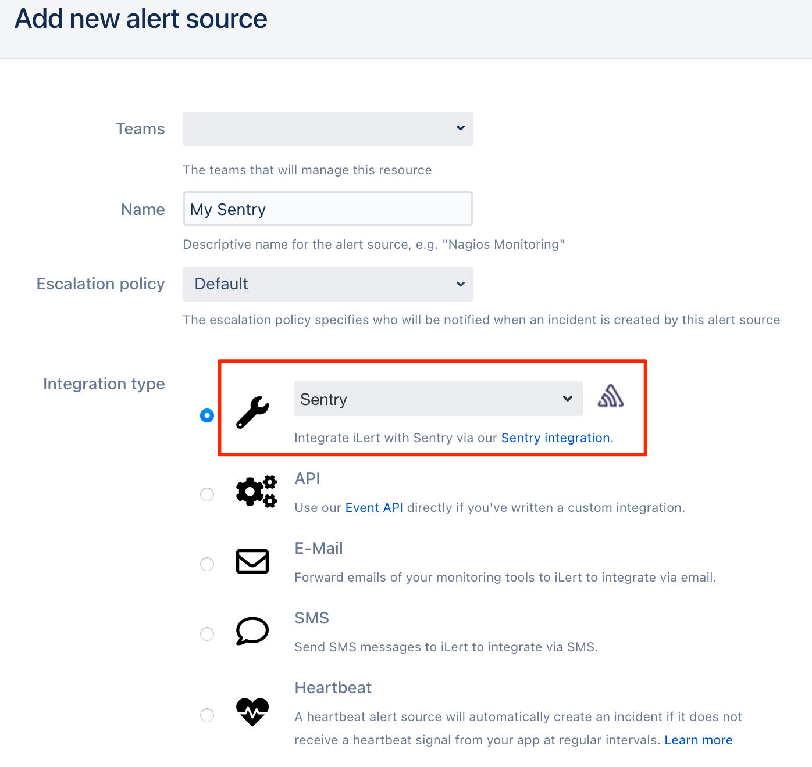
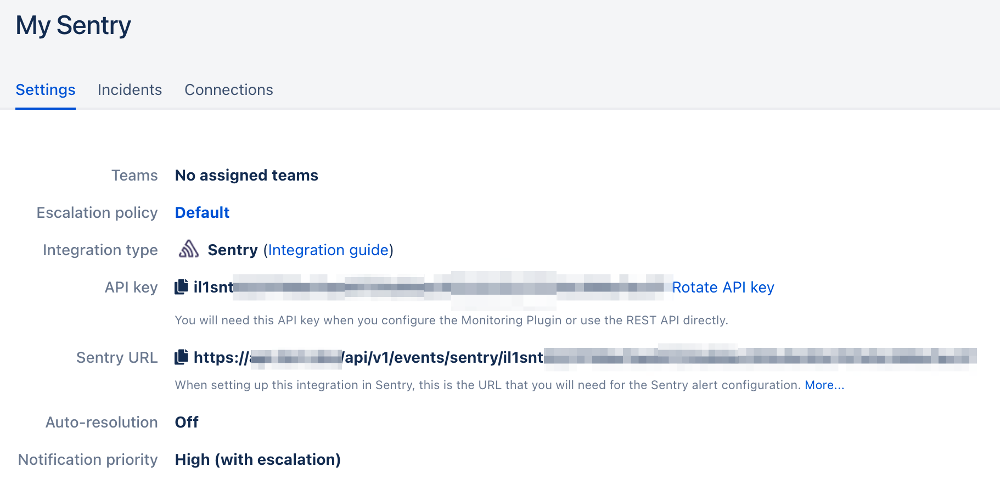
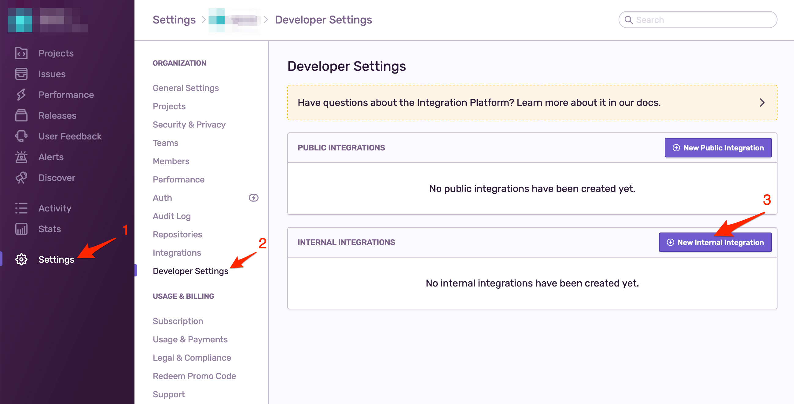
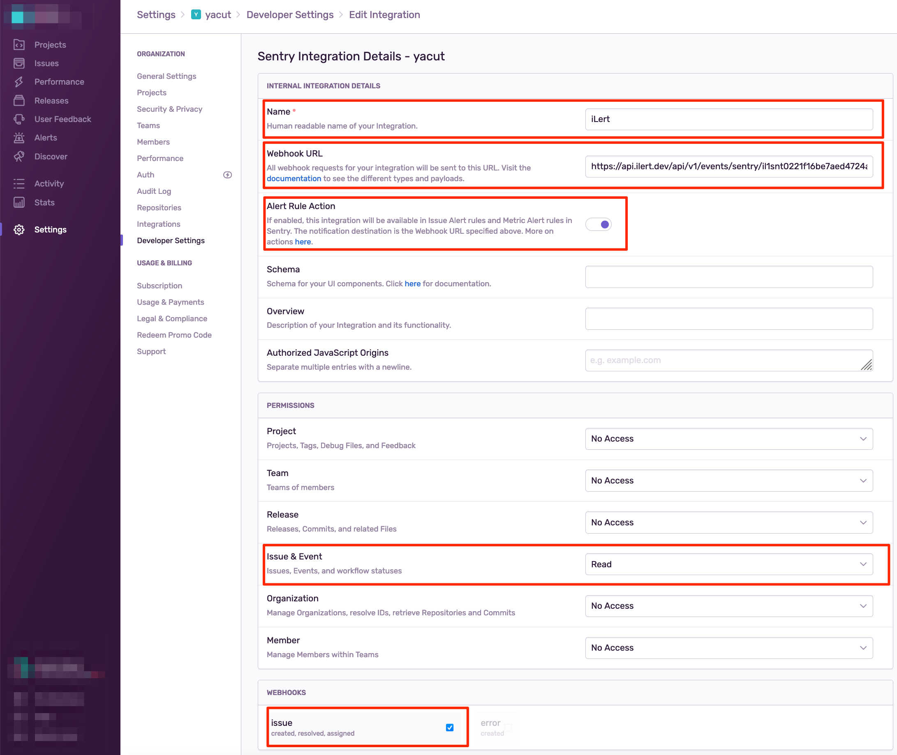
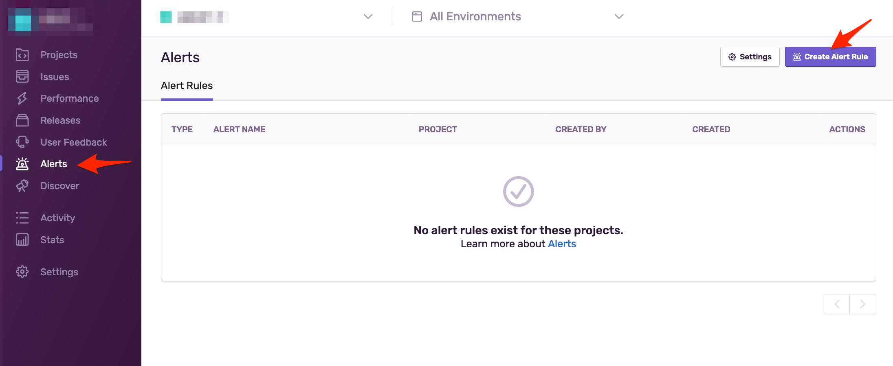
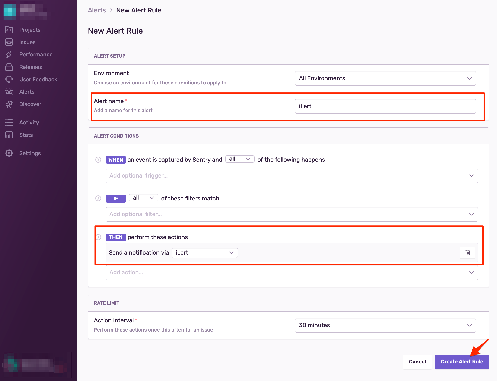

# Sentry Integration

Sentry's platform helps developers diagnose, fix, and optimize the performance of their code.

## In iLert 

### Create a Sentry alert source 

1. Go to the "Alert sources" tab and click **Create new alert source**

2. Enter a name and select your desired escalation policy. Select "Sentry" as the **Integration Type** and click on **Save**.

3. On the next page, a Webhook URL is generated. You will need this URL below when setting up the hook in Sentry.

## In Sentry 

### Create a search 

1. Go to Sentry and then to **Settings -&gt; Developer Settings**, then click on the **New Internal Integration**

2. On the next page,  **name** the integration e.g. iLert, paste the **Webhook URL** that you generated in iLert, enable **Alert Rule Action** option, give the read access to **Issue & Event** and in the **Webhooks** section choose **Issue** option, then click on **Save**

3. Go to **Alerts** and click on **Create Alert Rule**

4. On the next page,  **name** the alert rule e.g. iLert, in the **Then perform these actions** section choose **Send a notification via an  integration** and choose iLert, then click on **Create Alert Rule** button

Finished! Your Sentry alerts will now create incidents in iLert.

## FAQ 

**Will incidents in iLert be resolved automatically?**

Yes, as soon as an alert has been resolved or ignored in Sentry, the associated incident in iLert will be resolved automatically.

**Can I connect Sentry with multiple alert sources from iLert?**

Yes, simply add more alert rules in Sentry.

