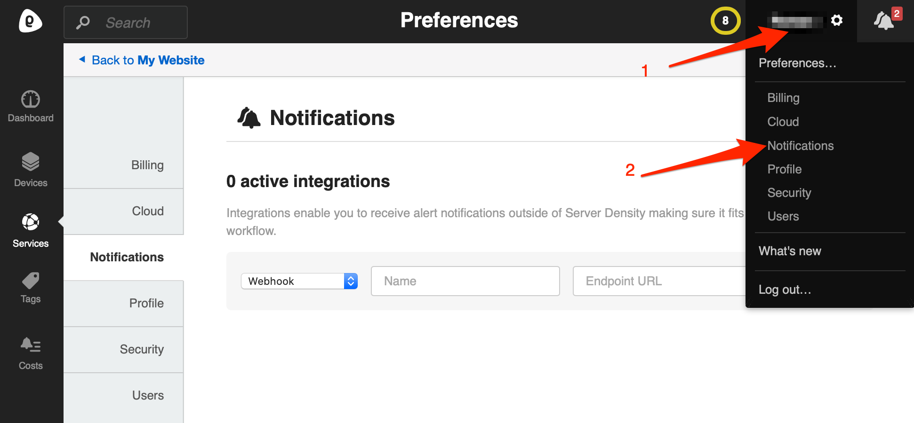
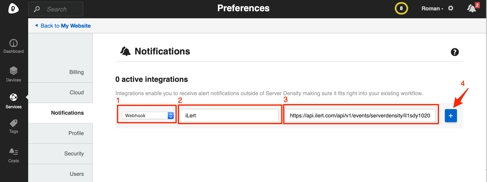
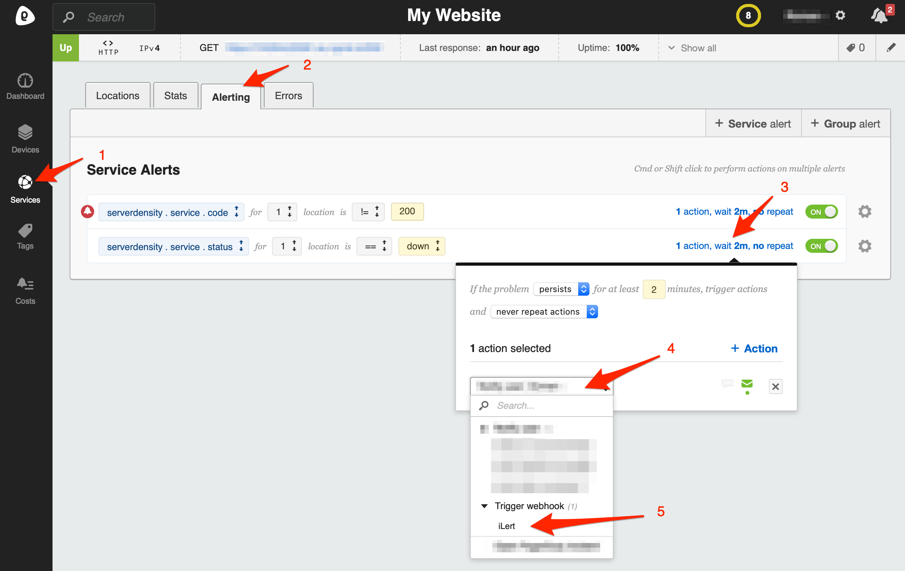

# Server Density

With the iLert Server Density integration you can create alerts in iLert based on Server Density notifications.

## In iLert 

### Create a Server Density alert source 

1. Go to the "Alert sources" tab and click **Create new alert source**

2. Enter a name and select your desired escalation policy. Select "Server Density" as the **Integration Type** and click on **Save**.

3. On the next page, a Webhook URL is generated. You will need this URL below when setting up the Webhook in Server Density.

## In Server Density 

### Create notification channel 

1. Go to Server Density and then to **Settings.** Click on **Notifications** to add a new notification channel for iLert

2. In section **Type** choose **Webhook**. 

3. In the **Name** section, enter a name eg. `iLert`

4. In the section **URL** field, paste the **Webhook URL** that you generated in iLert

4. In the **Channel Name** section, enter a name eg. `iLert`

5. Click on **+** \(plus\) button

### Configure an alert for a service or device 

1. Go to **Services** or **Devices** and choose the one that interests you**.** Click on the **Alerting tab**

2. Create an alert or use an existing one

3. Click on the **alert action** that interests you

4. Choose "iLert" under **Trigger webhook** group

## FAQ 

**Will alerts in iLert be resolved automatically?**

Yes

**Will alerts in iLert be accepted automatically?**

No, unfortunately Server Density's notification is not compatible with iLert's accepted event.

**Can I connect Server Density with multiple alert sources from iLert?**

Yes, simply create more notification channels in Server Density.

