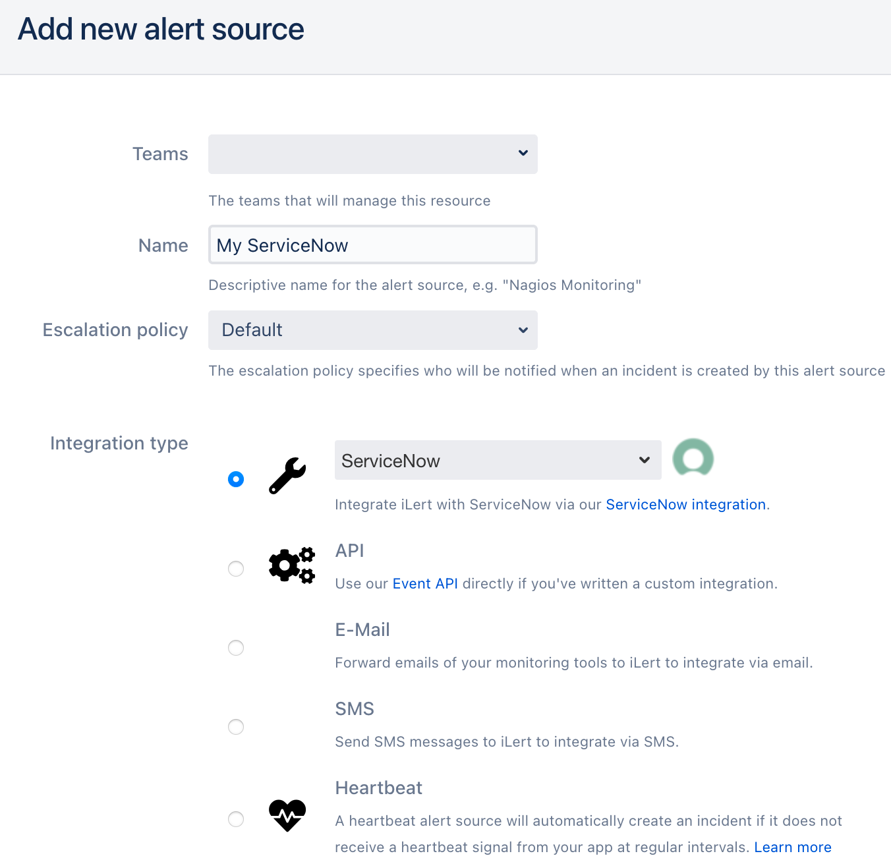
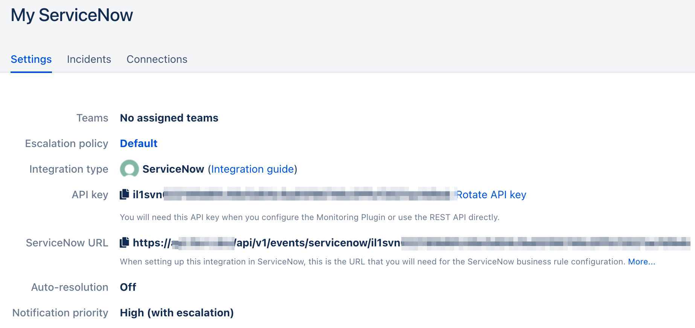
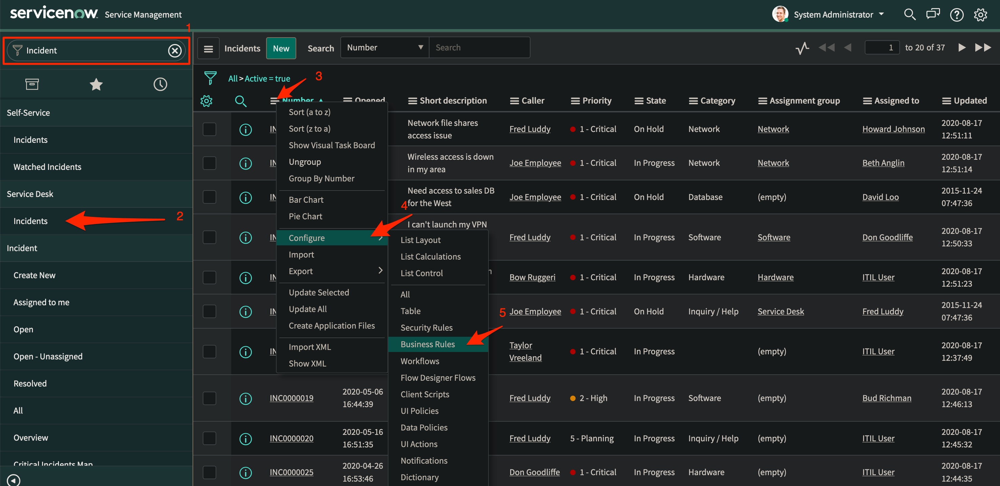
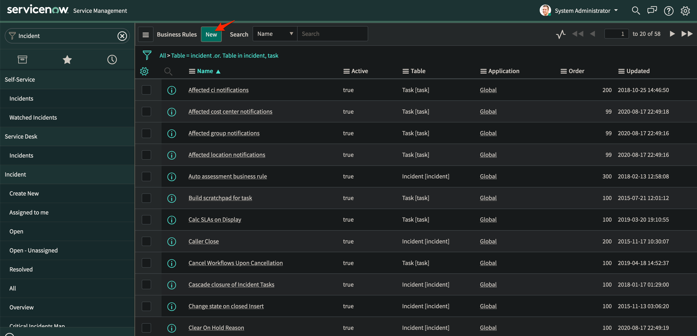
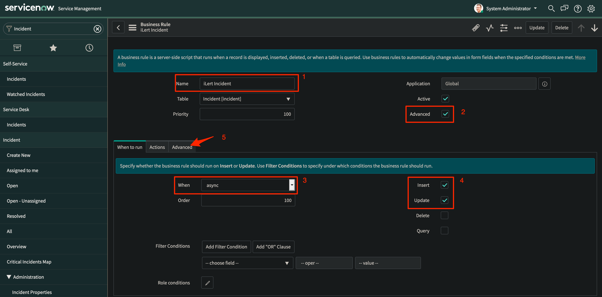
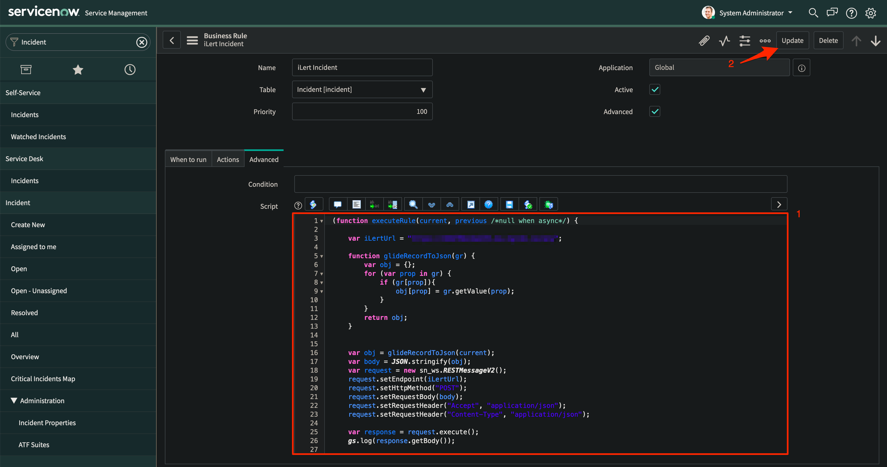

# ServiceNow Inbound Integration

With the iLert ServiceNow integration, you can create incidents in iLert based on ServiceNow incidents.

## In iLert <a id="in-ilert"></a>

### Create a ServiceNow alert source <a id="create-alert-source"></a>

1. Go to the "Alert sources" tab and click **Create new alert source**

2. Enter a name and select your desired escalation policy. Select "ServiceNow" as the **Integration Type** and click on **Save**.



3. On the next page, a **ServiceNow URL** is generated. You will need this URL below when setting up the hook in ServiceNow.



## In ServiceNow <a id="in-topdesk"></a>

### Create business rule <a id="create-action-sequences"></a>

1. Go to ServiceNow, search for **Incidents**, ****then open the header menu and choose **Configure -&gt; Business Rules**



2. In the **Business Rules** view click on **New** to create a new business rule



3. Name the business rule e.g. **iLert Incidents**, choose **Advanced** option, in the **When to run** section choose **async** then choose **Insert** and **Update** options



4. Go to Advanced tab and paste the following code into the script section:

```text
(function executeRule(current, previous /*null when async*/) {

	var iLertUrl = "<your alert source URL here>";
	
	
	function glideRecordToJson(gr) {
		var obj = {};
		for (var prop in gr) {
			if (gr[prop]){
				obj[prop] = gr.getValue(prop);
			}
		}
		return obj;
	}

	var obj = glideRecordToJson(current);
	obj.server_url = gs.getProperty("glide.servlet.uri");
	var body = JSON.stringify(obj);
	var request = new sn_ws.RESTMessageV2();
	request.setEndpoint(iLertUrl);
	request.setHttpMethod("POST");
	request.setRequestBody(body);
	request.setRequestHeader("Accept", "application/json");
	request.setRequestHeader("Content-Type", "application/json");
	
	var response = request.execute();
	gs.log(response.getBody());
	

})(current, previous);
```

5. Click on **Submit** or **Update** to save the business rule



## ServiceNow Incident Lifecycle <a id="faq"></a>

<table>
  <thead>
    <tr>
      <th style="text-align:left">When I create an ServiceNow ticket with status...</th>
      <th style="text-align:left">...then an iLert Incident...</th>
    </tr>
  </thead>
  <tbody>
    <tr>
      <td style="text-align:left"><b>New</b>
      </td>
      <td style="text-align:left">is created</td>
    </tr>
    <tr>
      <td style="text-align:left"><b>In Progress </b>or <b>Complete</b> or <b>Closed</b>
      </td>
      <td style="text-align:left">
        <p>will not be created and a</p>
        <p>400 (bad request) error occurs</p>
      </td>
    </tr>
  </tbody>
</table>


<table>
  <thead>
    <tr>
      <th style="text-align:left">When I update an ServiceNow ticket with status...</th>
      <th style="text-align:left">...and the<b> </b>iLert incident...</th>
      <th style="text-align:left">...then the/an iLert Incident...</th>
    </tr>
  </thead>
  <tbody>
    <tr>
      <td style="text-align:left"><b>New</b>
      </td>
      <td style="text-align:left">does not exist</td>
      <td style="text-align:left">is created</td>
    </tr>
    <tr>
      <td style="text-align:left"><b>In Progress </b>or <b>Complete</b> or <b>Closed</b>
      </td>
      <td style="text-align:left">does not exist</td>
      <td style="text-align:left">
        <p>will not be created and a</p>
        <p>400 (bad request) error occurs</p>
      </td>
    </tr>
    <tr>
      <td style="text-align:left"><b>New</b>
      </td>
      <td style="text-align:left">exists</td>
      <td style="text-align:left">doesn&apos;t change</td>
    </tr>
    <tr>
      <td style="text-align:left"><b>Complete</b> or <b>Closed</b>
      </td>
      <td style="text-align:left">exists</td>
      <td style="text-align:left">change status to <b>Resolved</b> if not already resolved</td>
    </tr>
    <tr>
      <td style="text-align:left"><b>In Progress</b>
      </td>
      <td style="text-align:left">exists</td>
      <td style="text-align:left">change status to <b>Accepted</b> if not already accepted</td>
    </tr>
  </tbody>
</table>

## FAQ <a id="faq"></a>

**Will incidents in iLert be resolved automatically?**

Yes

**Can I connect ServiceNow with multiple alert sources from iLert?**

Yes, simply create more business rules in ServiceNow.

