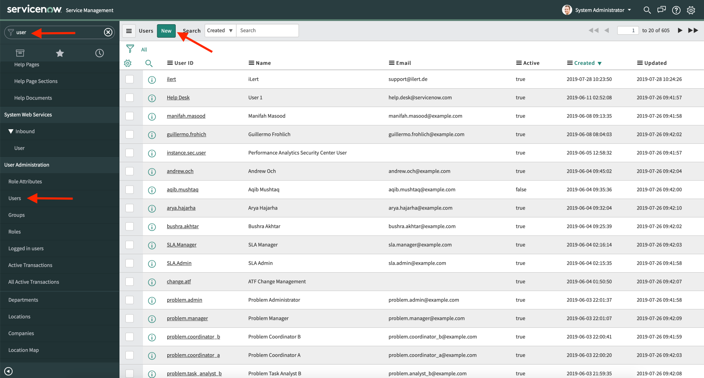
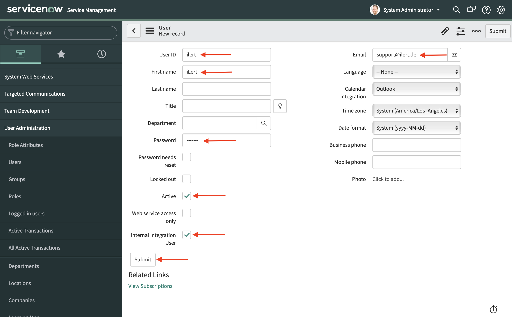
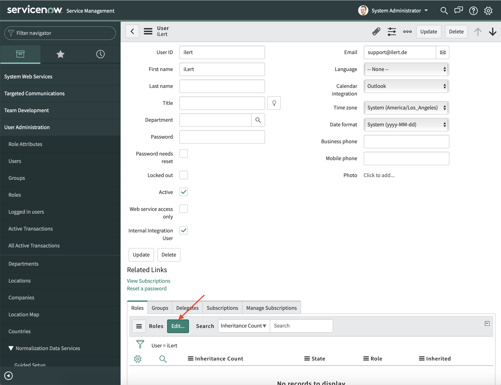
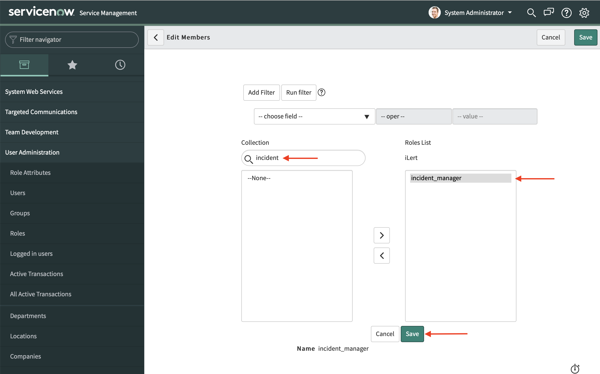

# ServiceNow Outbound Integration

[ServiceNow](http://www.servicenow.com) is a platform-as-a-service (PaaS) provider of enterprise Service Management (SM) software.

## In iLert: Create ServiceNow Connector and link to alert source 

1. Click the gear icon → **Connectors**

 (1).png>)

1. Click **Create Connector**

.png>)

1. Select **ServiceNow** as **type** and fill out all fields.

.png>)

1. Switch to the **alert sources** tab and open the alert source whose alerts you want to publish in ServiceNow. Click on **Alert actions → Create alert action**

.png>)

1. Select **ServiceNow** as the **type**, select the connector created in step 3, fill in all fields.

.png>)

1. Finished! You can now test the connection by clicking the **Test this connection** button. A test issue is then published in ServiceNow.

.png>)

## In ServiceNow: Create iLert user 

1. Go to the **User Administration** area

1. Live an internal iLert user and click **Submit**

1. Call up the iLert user page and click the **Edit** button in the **Roles** tab.

1. Select the **incident_manager** role and click **Save** .

## FAQ 

**Are updates to an alert published in the ServiceNow Alert?**

Yes, the status of the iLert Alert is shown in the title of the JIRA ticket, eg `RESOLVED` Host compute.infra is `DOWN`.

**Can I choose which updates to an alert are published in ServiceNow?**

Currently not. If you wish, we look forward to your feedback via chat or email.
