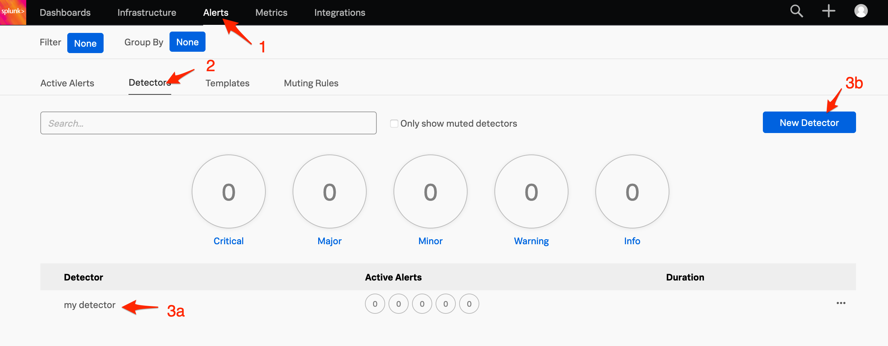
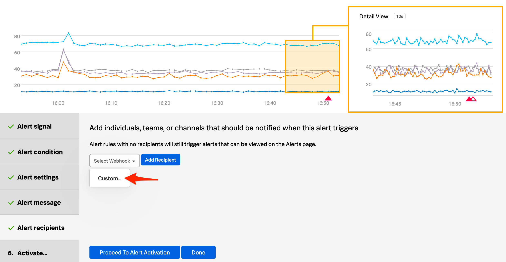

# SignalFx Integration

SignalFx enables real-time cloud monitoring and observability for infrastructure, microservices, and applications by collecting and analyzing metrics and traces across every component in your cloud environment. Built on a massively-scalable streaming architecture, SignalFx applies advanced analytics and data science-directed troubleshooting to let operators find the root cause of issues in seconds.

## In iLert 

### Create a SignalFx alert source 

1. Go to the "Alert sources" tab and click **Create new alert source**

2. Enter a name and select your desired escalation policy. Select "SignalFx" as the **Integration Type** and click on **Save**.

3. On the next page, a Webhook URL is generated. You will need this URL below when setting up the hook in SignalFx.

## In SignalFx 

### Create a search 

1. Go to SignalFx and then to **Alerts.** Create a detector or edit an existing detector for triggering alerts.

2. Choose the rule that you would like to apply, then click **Edit.** In the **Alert recipients** section, click **Add Recipient,** select **Webhook -&gt; Custom...**

3. On the modal window paste the **Webhook URL** that you generated in iLert and click on **Update**

Finished! Your SignalFx alerts will now create alerts in iLert.

## FAQ 

**Will alerts in iLert be resolved automatically?**

Yes, as soon as an alert with "ok" has been resolved in SignalFx, the associated alert in iLert will be resolved automatically.

**Can I connect SignalFx with multiple alert sources from iLert?**

Yes, simply add more recipients in SignalFx alert rule.

**Can I connect single alert source with multiple SignalFx detectors?**

Yes, simply use the alert source URL in the recipients setting for each SignalFx detector.

**Can I create a webhook template for the recipient setting so I don't have to copy the alert source URL every time for each detector?**

Yes, use the webhook integration template in the **Data Setup -&gt; Integrations -&gt; Webhook page**

