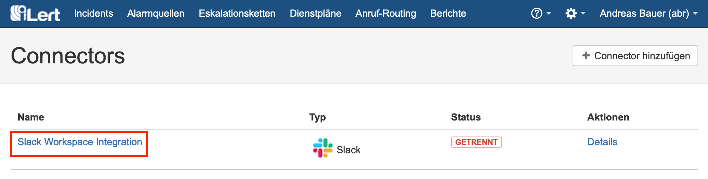
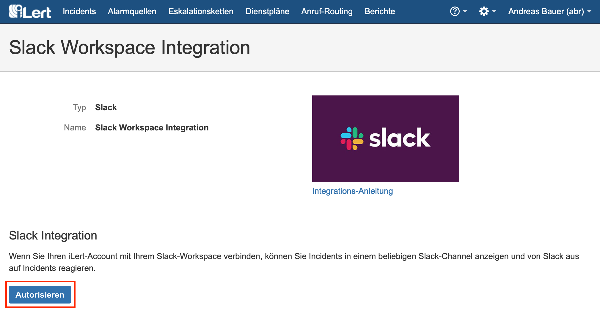
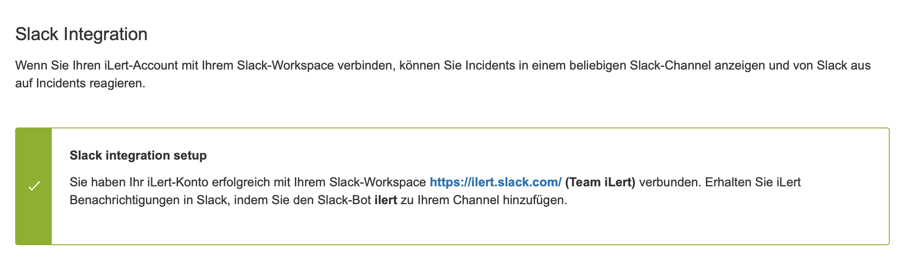
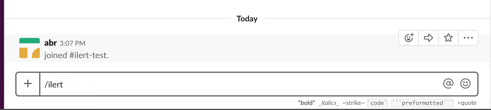
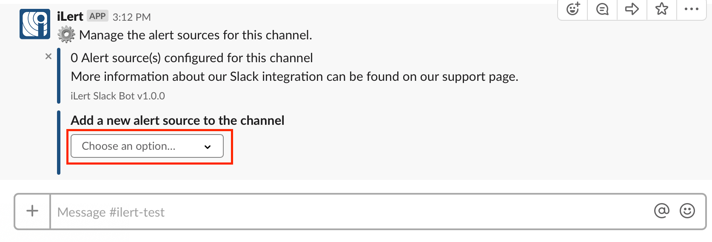
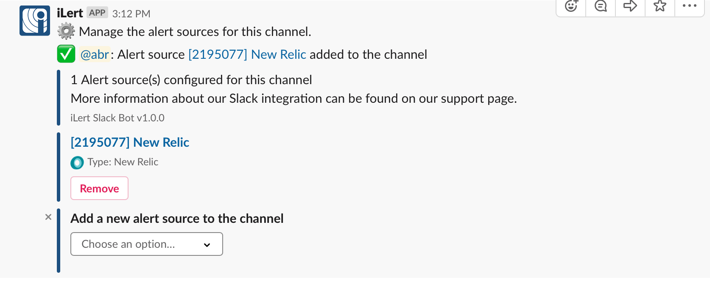
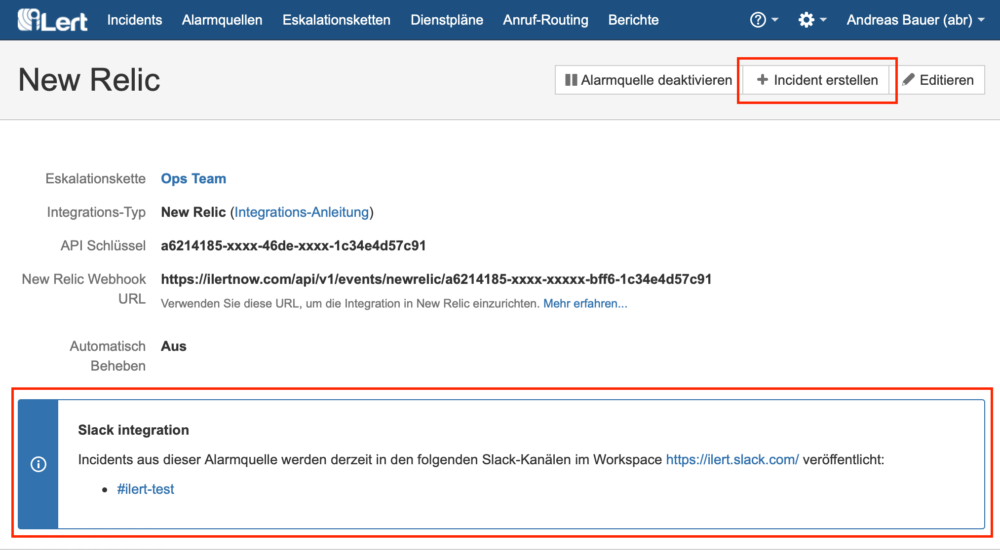
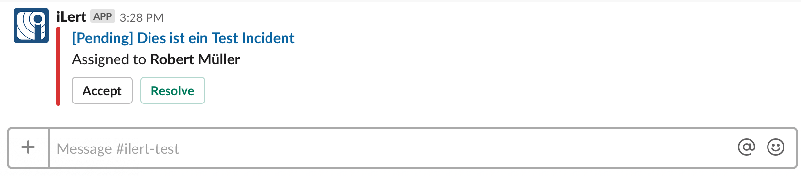

# Slack Integration

Slack is a popular instant messaging service for team communication and collaboration. With the Slack integration you receive messages about incidents in Slack channels and can accept and fix incidents within Slack.

## In iLert: Authorize with a Slack Workspace 

**Admin authorization required** To set up the integration, you must have admin rights in iLert.

1. Click the gear icon → **Connectors**

2. Click on **Slack Workspace Integration**

3. Click **Authorize**

4. You will be forwarded to Slack. If you are not already logged in to Slack, please log in and **allow iLert access to your Slack workspace**.

5. You will be redirected to iLert. When you see a success message, you're done setting up. You can now add alert sources to a channel in Slack.

## In Slack: Add alert sources to Slack channels 

1. Open Slack and go to a channel to publish iLert incidents. Enter the  `/ilert` press Enter:

2. A configuration menu appears in which you can add alert sources to the channel.

3. Select one or more alert sources from this list

4. You have now linked an alert source to a Slack Channel.

5. Create a test incident in the alert source in iLert. To do this, click on the link of the alert source in Slack \(New Relic in the example above\).

6. A notice now appears on the overview page of the alert source that incidents from this alert source will be published in Slack.

7. Click on **Create Incident** and create test incident.

8. A message is now published in the configured channel with the incident information. You can accept the incident within Slack or mark it as fixed.

## FAQ 

**Can I link multiple Slack Workspaces to one iLert account?**

No, only one Slack workspace can be linked to an iLert account.

**Are updates to an incident published in Slack?**

Yes, the following updates for an incident are currently being published:

* **Escalations** : An incident is automatically assigned to another user.
* **Manual assignments** : An incident is assigned to someone manually.
* **Actions** : An incident is accepted or corrected.

**Can I choose which updates to an incident are published in Slack?**

Yes.

**Can I manage alert sources from private teams using the `/ilert` Slash command?**

No, alert sources of private teams can only  be added via the iLert web interface, in the alert source's **Incident actions** configuration tab.

**Why am I not seeing all of my Slack channels in the Connections UI?**

This could be due to missing permission for private channels. Please try to invite the iLert Slack Bot into the desired \(missing\) channels and refresh the page.

