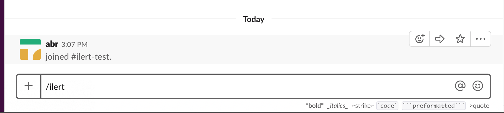
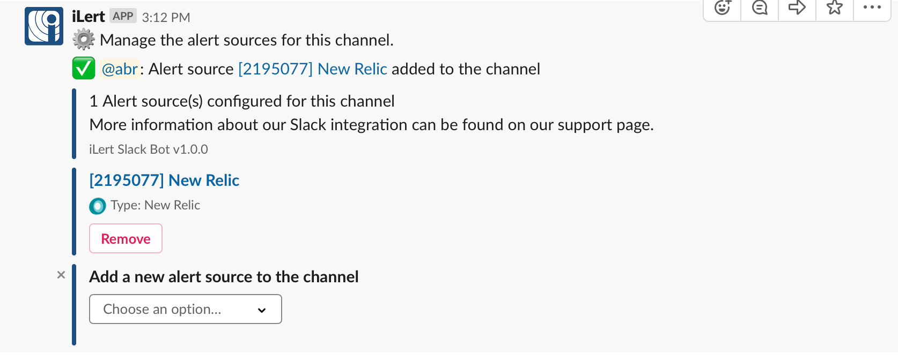

# Slack Integration

### [I want to receive alerts in Slack](./#in\_ilert)

### [I want to create alerts in ilert from Slack](create-alerts-in-slack.md)

###

Slack is a popular instant messaging service for team communication and collaboration. With the Slack integration you receive messages about alerts in Slack channels and can accept and resolve alerts within Slack.

## In ilert 

### Authorizing a Slack Workspace 

**Admin role** level is required to set up the integration in ilert.

1\. Click on the gear icon ⚙ → **Connectors**

.png>)

2\. Click on the **Slack Workspace Integration**

.png>)

1. Click on the **Authorize** button

.png>)

1. You will be forwarded to Slack. If you are not already logged in to Slack, please log in and **allow ilert to access your Slack workspace**.
2. You will be redirected to ilert. When you see a success message, you're done setting up. You can now add alert sources to a channel in Slack.

### Re-authorizing your Slack Workspace 

You **may** need to re-authorize the bot for your Slack workspace in case new features of the bot require additional permissions e.g. alert actions or automatic user mapping.

Click on the gear icon ⚙ → **Connectors**, then click on the **Slack Workspace Integration** and on the **"Re-authorize Slack"** button

.png>)

## In Slack 

### Add alert sources to Slack channels 

1. Open Slack and go to a channel to publish ilert alerts. Enter`/ilert` and press Enter:

1. A configuration menu appears in which you can add alert sources to the channel.

1. Select one or more alert sources from this list

1. You have now linked an alert source to a Slack Channel.
2. Create a test alert in the alert source in ilert. To do this, click on the link of the alert source in Slack _(New Relic in the example above)_.
3. A notice appears on the overview page of the alert source actions that alerts from this alert source will be published in Slack.

.png>)

1. Click on **Create Alert** (...) and create a test alert.
2. A message is now published in the configured channel with the alert information. You can accept the alert within Slack or resolve it.

## FAQ 

**Can I link multiple Slack Workspaces to one ilert account?**

No, only one Slack Workspace can be linked to an ilert account.

**Are updates to an alert published in Slack?**

Yes, the following updates for an alert are currently being published:

* **Escalations** : An alert is automatically assigned to another user.
* **Manual assignments** : An alert is assigned to someone manually.
* **Actions** : An alert is accepted or corrected.

**Can I choose which updates to an alert are published in Slack?**

Yes.

**Can I manage alert sources from private teams using the `/ilert` slash command?**

No, alert sources of private teams can only be added via ilert's web interface, in the alert source's **Alert actions** configuration tab.

**Why am I not seeing all of my Slack channels in the Connections UI?**

This could be due to missing permission for private channels. Please try to invite the ilert Slack Bot into the desired (missing) channels and refresh the page.
