# SolarWinds Integration

With the iLert SolarWinds Integration you can easily integrate SolarWinds Orion products (eg [NPM](https://www.solarwinds.com/network-performance-monitor) and [SAM](https://www.solarwinds.com/server-application-monitor)) into iLert. The integration extends SolarWinds with SMS, push and voice notification as well as on-call schedules from iLert. Alerts are created in iLert and automatically resolved. Furthermore, alerts in iLert that were created by SolarWinds contain links to the respective alerts in SolarWinds.

## In iLert: create alert source <a href="#create-alarm-source" id="create-alarm-source"></a>

1. Go to **Alert sources** and click on the **Add a new alert source** button
2. Enter a name for your alert source (e.g. SolarWinds) and select an escalation policy.
3. In the **integration type** field, chose **SolarWinds**.

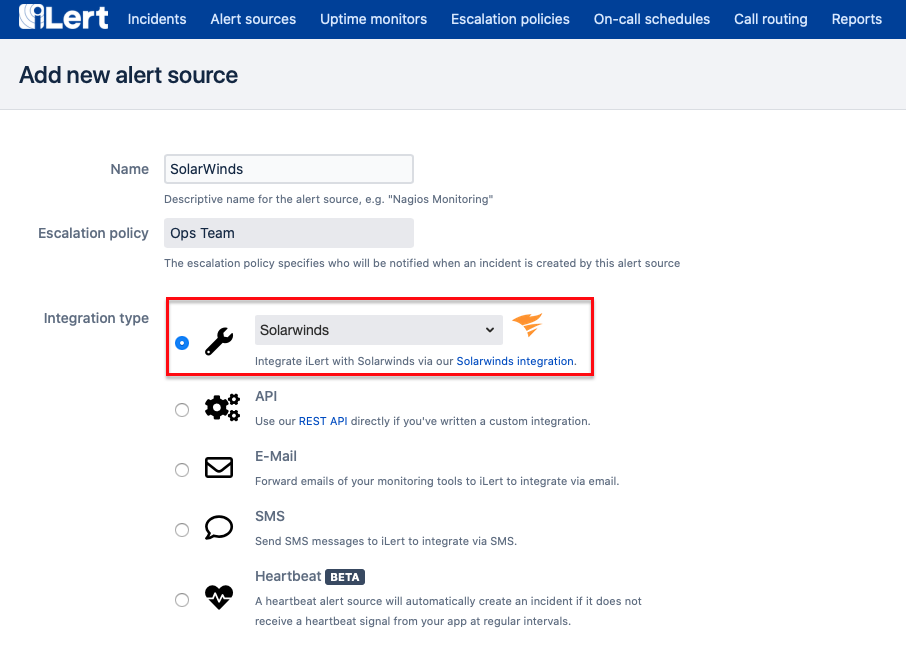

1. A URL is generated on the next page. You will need this URL in the next section when setting up the integration in SolarWinds

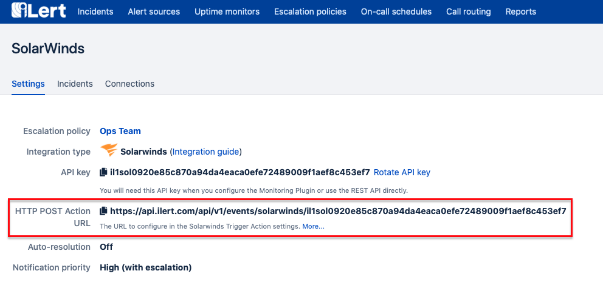

## In SolarWinds: create alert definition <a href="#alert-definition" id="alert-definition"></a>

1. Go to the **Settings → All Settings** tab and click **Manage Alerts**

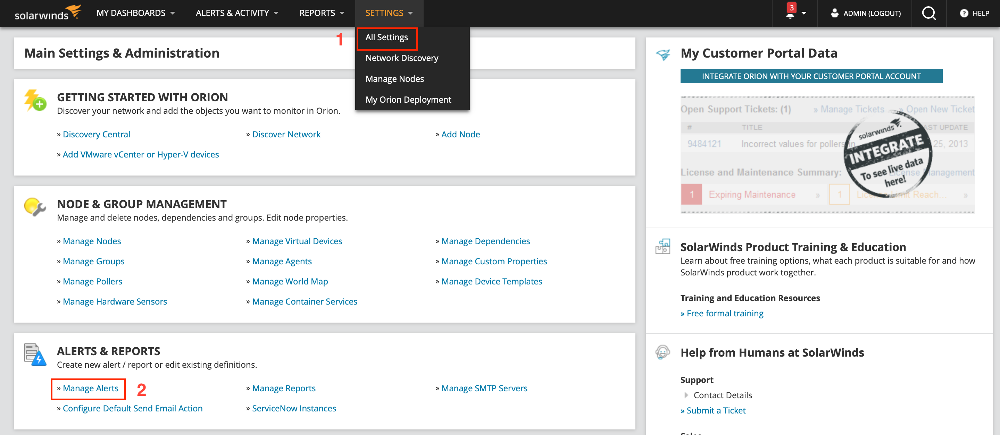

1. Click on **ADD NEW ALERT**

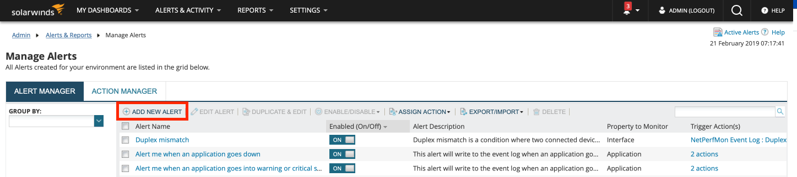

1. Fill out the **Alert Properties** according to your requirements and click on **NEXT**

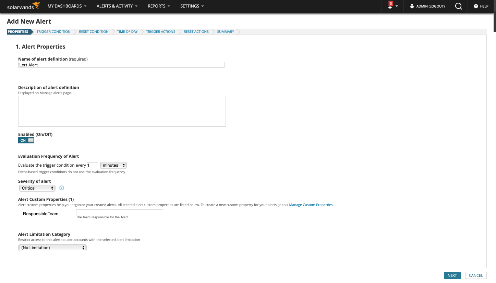

1. Define the **trigger condition** on the next page and click on **NEXT**. The **trigger condition** defines the conditions under which you want to be alerted via iLert. You can use the full flexibility of SolarWinds here. In this example we define the following condition: Immediate alarm for all **nodes** that are not in the status **up**.

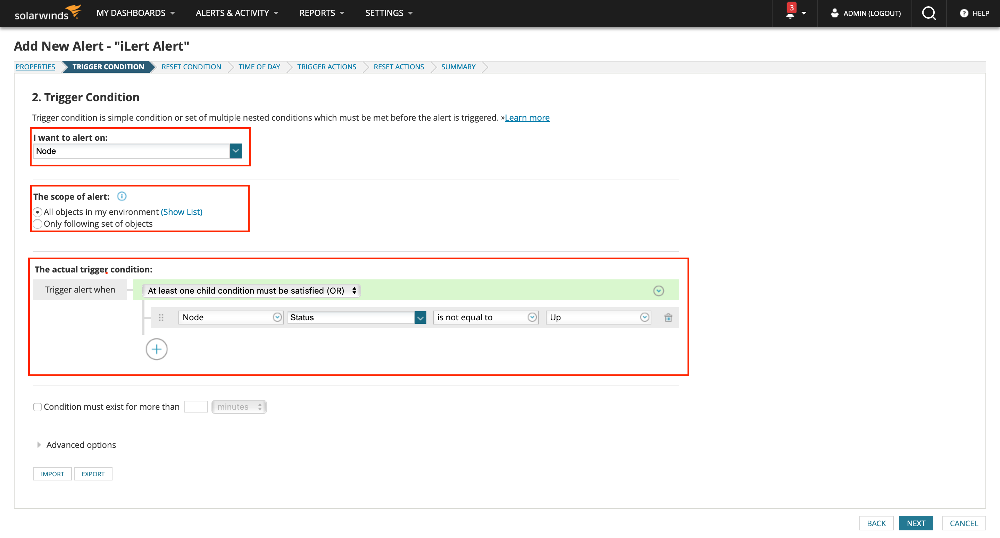

1. Define **reset condition** and click on **NEXT**. As soon as the **reset condition** occurs, the associated alert is resolved in iLert.

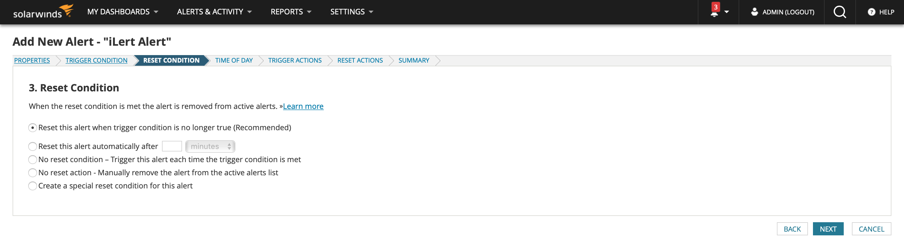

1. Select **Time of Day** according to your requirements and click on **NEXT**.

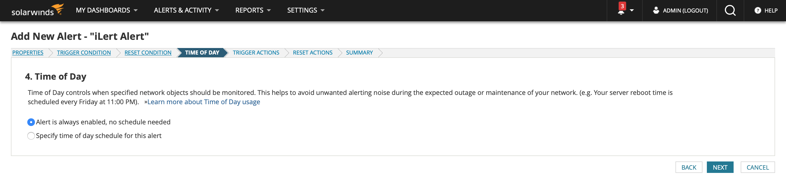

1. **TRIGGER ACTIONS**: Click **Add Action** and select **Send a GET or POST Request to a Web Server** to add **trigger action**.

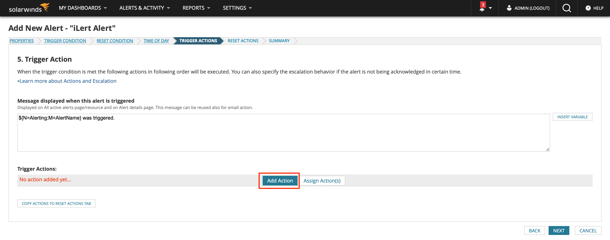


1. Enter the `HTTP POST` Action URL generated in iLert in the **URL** field and select Use **HTTP / S POST** . Enter the following in the **Body to POST** field:

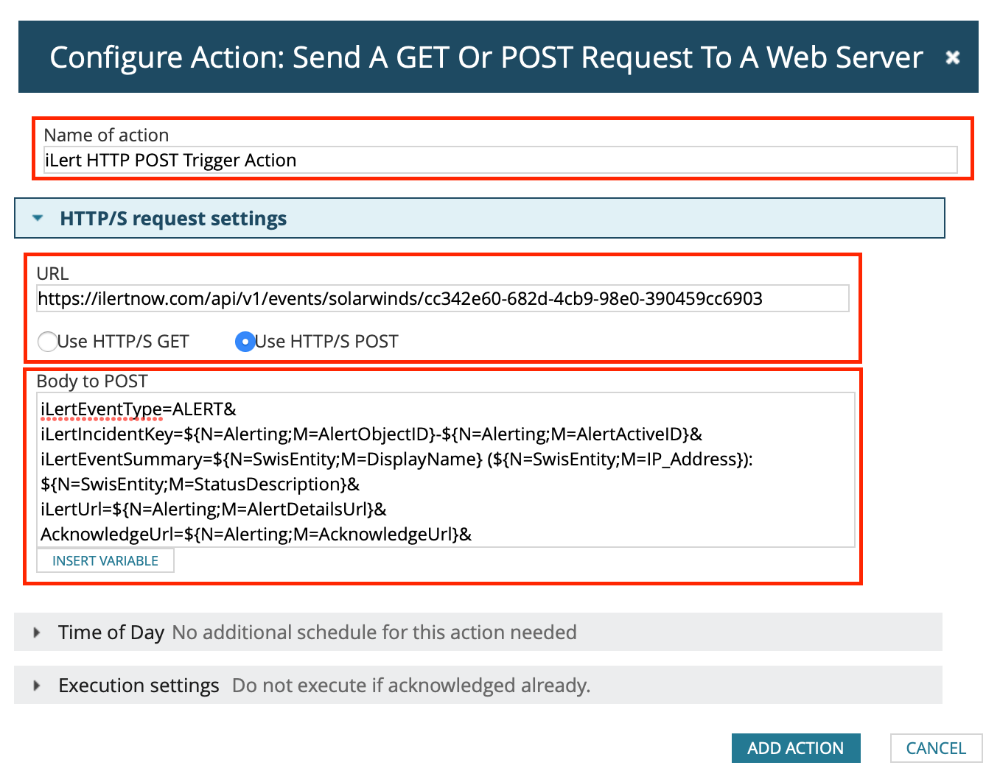

```
iLertEventType=ALERT&
iLertIncidentKey=${N=Alerting;M=AlertObjectID}-${N=Alerting;M=AlertActiveID}&
iLertEventSummary=${N=SwisEntity;M=DisplayName} (${N=SwisEntity;M=IP_Address}): ${N=SwisEntity;M=StatusDescription}&
iLertUrl=${N=Alerting;M=AlertDetailsUrl}&
AcknowledgeUrl=${N=Alerting;M=AcknowledgeUrl}&
AlertName=${N=Alerting;M=AlertName}&
AlertActiveID=${N=Alerting;M=AlertActiveID}&
AlertObjectID=${N=Alerting;M=AlertObjectID}&
ObjectType=${N=Alerting;M=ObjectType}&
Severity=${N=Alerting;M=Severity}
```

1. **Optional**: Activate the **Repeat this action action every X minutes until the alert is acknowledged** option in the **execution settings**. This is for safety, if an alert could not be sent to iLert (e.g. due to a network problem).

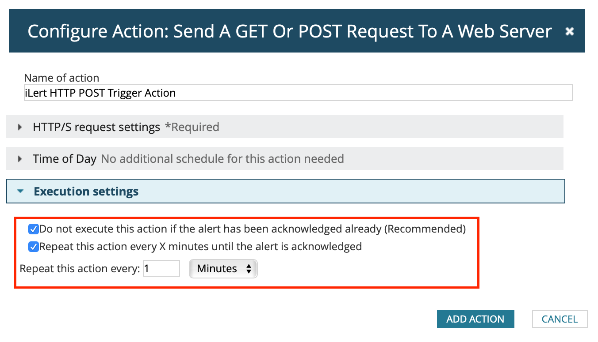

1. On **ADD ACTION** and then click **NEXT**.
2. **RESET ACTIONS**: Click **Add Action** and select **Send a GET or POST Request to a Web Server** to add **Reset Action**. Enter the `HTTP POST` Action URL generated in iLert in the **URL** field and select Use **HTTP / S POST** . Enter the following in the **Body to POST** field :

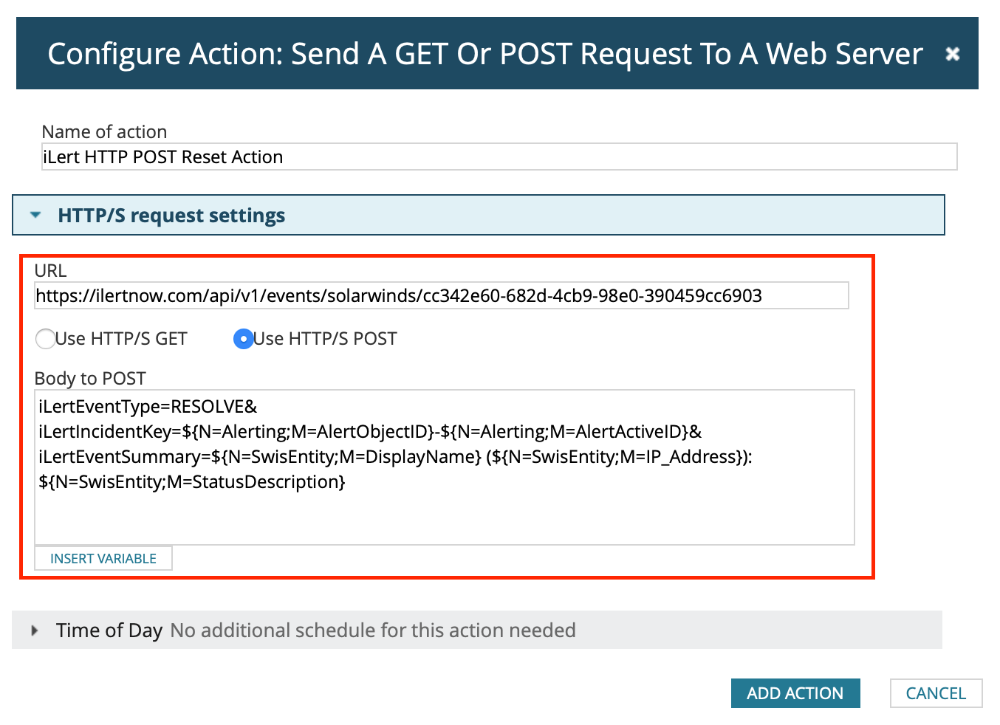

```
iLertEventType=RESOLVE&
iLertIncidentKey=${N=Alerting;M=AlertObjectID}-${N=Alerting;M=AlertActiveID}&
iLertEventSummary=${N=SwisEntity;M=DisplayName} (${N=SwisEntity;M=IP_Address}): ${N=SwisEntity;M=StatusDescription}
```

1. On **ADD ACTION** and then click **NEXT**.
2. Click **SUBMIT** on the **SUMMARY** page.

## FAQ <a href="#faq" id="faq"></a>

**Are alerts automatically resolved in iLert?**

Yes, as soon as the **reset condition** for an alert has occurred in SolarWinds, the associated alert in iLert is resolved.

**What if an alert is acknowledged in SolarWinds, is the associated alert also acknowledged in iLert?**

No, in SolarWinds it is unfortunately not possible to perform an action after an **acknowledge**.

**Can I link SolarWinds to multiple alert sources in iLert?**

Yes, create several alert definitions in SolarWinds and store the corresponding URL of the alert source from iLert in the HTTP URL.

**What if my internet connection is lost? Are the alerts generated in SolarWinds lost?**

No, no alerts are lost if you have activated the option **Repeat this action action every X minutes until the alert is acknowledged** in SolarWinds (see above). We also recommend that you monitor your Internet connection with an external monitoring service, such as iLert's [Uptime monitoring](https://www.ilert.com/product/uptime-monitoring/).

**Can I change the content of the alert in iLert (e.g. the summary)?**

Yes, you can configure this in the definition of the trigger action. In the HTTP Post Body, several variables in the format `variable1=value1&variable2=value2&variable3=value3...` are sent to iLert. To change the summary text of the alert, change the definition of the variable `iLertEventSummary` . All other variables that you add below `iLertEventSummary` inserted in the description of the alert.

**The integration doesn't work. How do I find the issue?**

If you do not find the error, please contact our support at [support@ilert.com](mailto:support@ilert.com).
