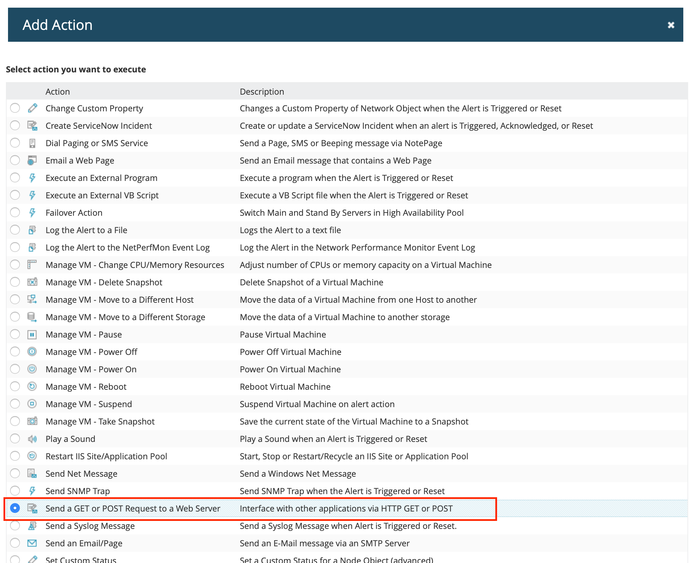

# SolarWinds Integration

With SolarWinds Integration you can easily integrate SolarWinds Orion products \(eg [NPM](https://www.solarwinds.com/network-performance-monitor) and [SAM](https://www.solarwinds.com/server-application-monitor)\) into iLert. In this way, you can easily expand SolarWinds with SMS, push and voice notification as well as duty rosters from iLert. Incidents are created in iLert and automatically closed again as soon as the problem has been resolved. Furthermore, the incidents in iLert that were created by SolarWinds contain jump links to the respective alerts in SolarWinds.

## In iLert: Create alert source <a id="create-alarm-source"></a>

1. Switch to the "alert sources" tab and click the "Create new alert source" button

2. Assign name and select escalation chain

3. Select and save "SolarWinds" in the Integration type field.


4. A URL is generated on the next page. You will need this URL below when setting up SolarWinds


## In SolarWinds: Create alert definition <a id="alert-definition"></a>

1. Switch to the **Settings → All Settings** tab and click **Manage Alerts**


2. Click on **ADD NEW ALERT**


3. Fill out the **Alert Properties** according to your requirements and click on **NEXT**


4. Define the **trigger condition** on the next page and click on **NEXT**. The **trigger condition** defines the conditions under which you want to be alerted via iLert. You can use the full flexibility of SolarWinds here. In this example we define the following condition: Immediate alarm for all **nodes** that are not in the status **up**.


5. Define **reset condition** and click on **NEXT**. As soon as the **reset condition** occurs, the associated incident is eliminated in iLert.


6. Select **Time of Day** according to your requirements and click on **NEXT**.


7. **TRIGGER ACTIONS**: Click **Add Action** and select **Send a GET or POST Request to a Web Server** to add **trigger action**.




8. Enter the `HTTP POST` Action URL generated in iLert in the **URL** field and select Use **HTTP / S POST** . Enter the following in the **Body to POST** field:

```text
iLertEventType = ALERT &
iLertIncidentKey = $ {N = Alerting M = AlertObjectID} - $ {N = Alerting M = AlertActiveID} &
iLertEventSummary = $ {N = SwisEntity; M = DisplayName} ($ {N = SwisEntity; M = IP_Address}): $ {N = SwisEntity; M = StatusDescription} &
iLertUrl = $ {N = Alerting M = AlertDetailsUrl} &
AcknowledgeUrl = $ {N = Alerting M = AcknowledgeUrl} &
Alert Name = $ {N = Alerting M = Alert Name} &
AlertActiveID = $ {N = Alerting M = AlertActiveID} &
AlertObjectID = $ {N = Alerting M = AlertObjectID} &
Object Type = $ {N = Alerting M = Object Type} &
Severity = $ {N = Alerting M = Severity}
```


9. **Optional**: Activate the **Repeat this action action every X minutes until the alert is acknowledged** option in the **execution settings**. This is for security, if an alert could not be sent to iLert \(e.g. due to a network problem\).


10. On **ADD ACTION** and  then click **NEXT**.

11. **RESET ACTIONS**:  Click **Add Action** and select **Send a GET or POST Request to a Web Server** to add **Reset Action**. Enter the `HTTP POST` Action URL generated in iLert in the **URL** field and select Use **HTTP / S POST** . Enter the following in the **Body to POST** field :

```text
iLertEventType = RESOLVE &
iLertIncidentKey = $ {N = Alerting M = AlertObjectID} - $ {N = Alerting M = AlertActiveID} &
iLertEventSummary = $ {N = SwisEntity; M = DisplayName} ($ {N = SwisEntity; M = IP_Address}): $ {N = SwisEntity; M = StatusDescription}
```


12. On **ADD ACTION** and then click **NEXT**.

13. Click **SUBMIT** on the **SUMMARY** page.

## FAQ <a id="faq"></a>

**Are incidents automatically resolved in iLert?**

Yes, as soon as the **reset condition** for an alert has occurred in SolarWinds, the associated incident in iLert is fixed.

**What if an alert is confirmed in SolarWinds, is the associated incident also confirmed in iLert?**

No, in SolarWinds it is unfortunately not possible to perform an action after an **acknowledge**.

**Can I link SolarWinds to multiple alert sources in iLert?**

Yes, create several alert definitions in SolarWinds and store the corresponding URL of the alert source from iLert in the HTTP URL.

**What if my internet connection is lost? Are the alerts generated in SolarWinds lost?**

No, no alerts are lost if you have activated the option **Repeat this action action every X minutes until the alert is acknowledged** in SolarWinds \(see above\). We also recommend that you monitor your Internet connection with an external monitoring service \(such as Pingdom\). You can then send these alerts to iLert.

**Can I change the content of the incident in iLert \(e.g. the summary\)?**

Yes, you can influence this in the definition of the trigger action. In the HTTP Post Body, several variables in the format `variable1=value1&variable2=value2&variable3=value3...` to iLert. To change the summary text of the incident, change the definition of the variable `iLertEventSummary` . All other variables that you add below `iLertEventSummary` of here are inserted in the description of the incident.

**The integration doesn't work. How do I find the mistake?**

If you do not find the error, please contact our support at [support@ilert.com](mailto:support@ilert.com).

