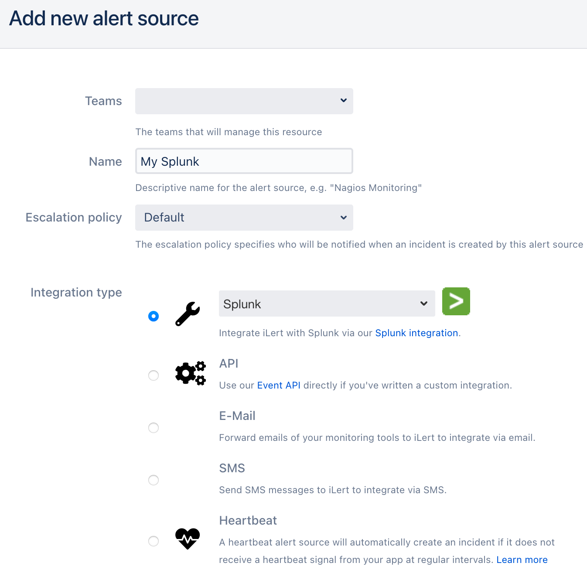
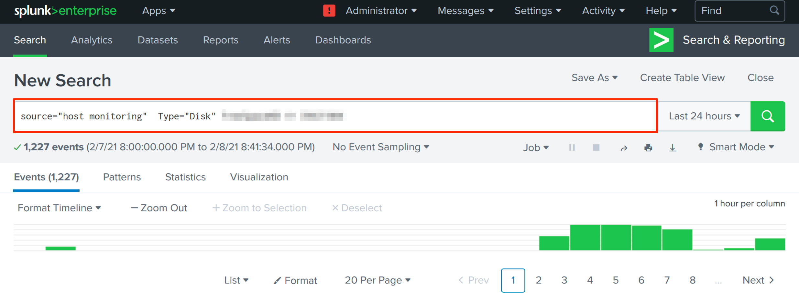
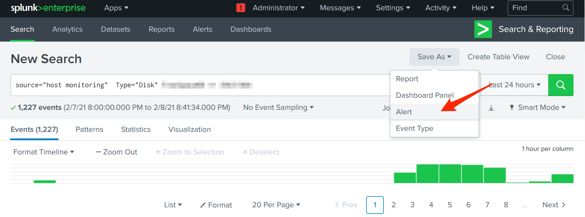
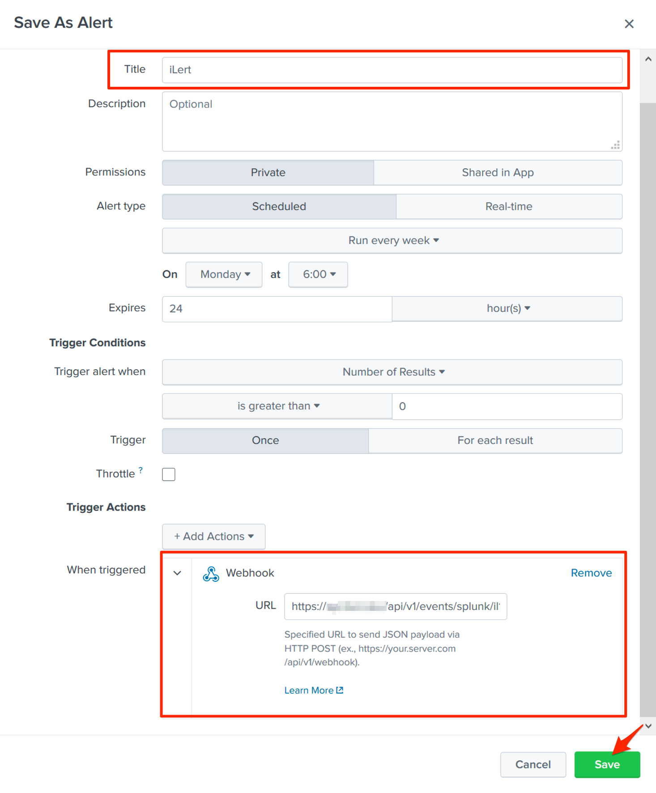

# Splunk Integration

With the iLert Splunk integration, you can create incidents in iLert based on Splunk alert.

## In iLert 

### Create a Splunk alert source 

1. Go to the "Alert sources" tab and click **Create new alert source**

2. Enter a name and select your desired escalation policy. Select "Splunk" as the **Integration Type** and click on **Save**.

3. On the next page, a Webhook URL is generated. You will need this URL below when setting up the hook in Splunk.

## In Splunk 

### Create action sequences 

1. Go to Splunk and then to **Search & Reporting.** Create a search for which you’d like to create an alert.

2. Click on **Save As** and then on **Alert** to add an alert

3. On the modal window, name the alert e.g. **iLert,** choose **Webhook** in the **When triggered** section**,** paste the **Webhook URL** that you generated in iLert and click on **Save**

## FAQ 

**Will incidents in iLert be resolved automatically?**

No, unfortunately Splunk event is not compatible with iLert resolve event.

**Can I connect Splunk with multiple alert sources from iLert?**

Yes, simply create more alerts in Splunk.

