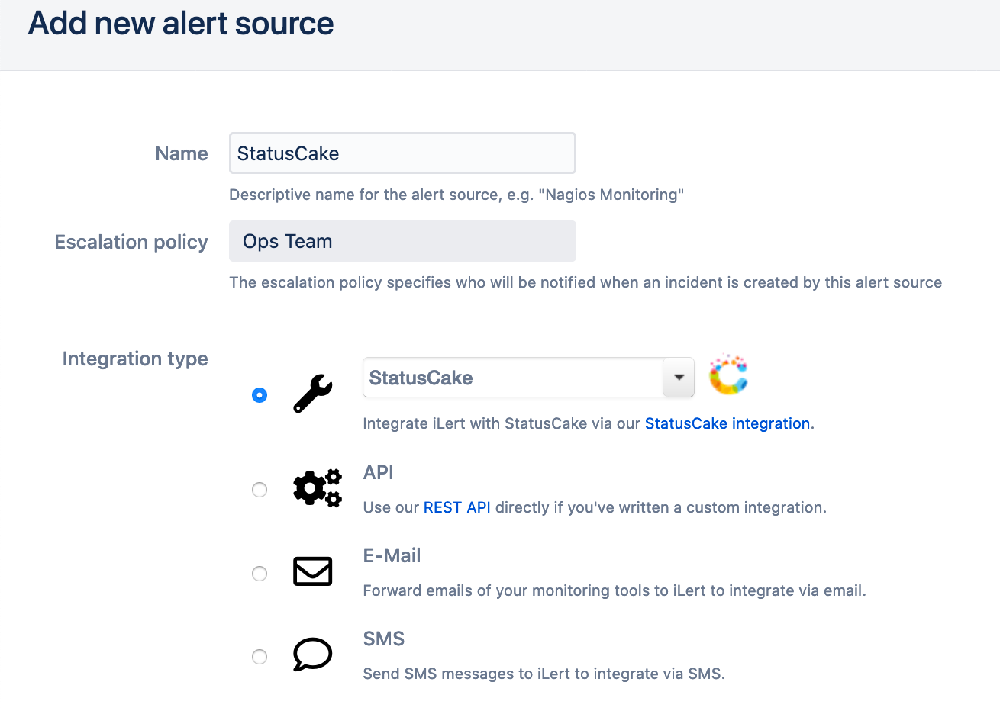
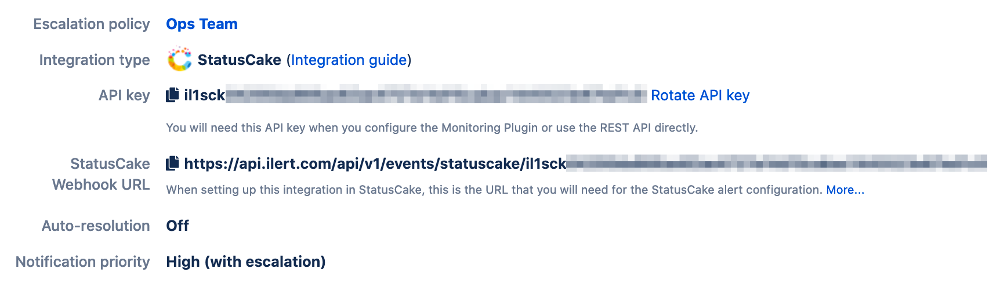

# StatusCake Integration

With the iLert StatusCake integration, you can create incidents in iLert based on alerts from StatusCake.

## In iLert: Create a StatusCake alert source 

1. Go to the "Alert sources" tab and click "Create new alert source"

2. Enter a name and select your desired escalation policy. Select "StatusCake" as the **Integration Type** and click **Save**.

3. On the next page, a Webhook URL is generated. You will need this URL below when setting up the hook in StatusCake.

## In StatusCake 

### Create a Contact Group

1. Go to StatusCake and then to **Alerting** and click on **New Contact Group** to add a new contact group \(`https://app.statuscake.com/ContactGroup.php`\)

2. In the **Group Name** section, enter a name eg. iLert

3. In the **Repeat Alert** section, move the slider to the left so that it says **No Repeat Alerts**

4. In the **Webhook URL** section, paste the **Webhook URL** that you generated in iLert

5. In the **Webhook Method** section, choose **POST**

6. Optional: Send a test alert through the **Test** button

7. Click **Save Now**

## FAQ 

**Will incidents in iLert be resolved automatically?**

Yes, as soon as the StatusCake alert is closed, the incident in iLert will be resolved automatically.

**Can I connect StatusCake with multiple alert sources from iLert?**

Yes, simply create more Contact Groups in StatusCake.

**Can I customize the incident messages?**

No.

