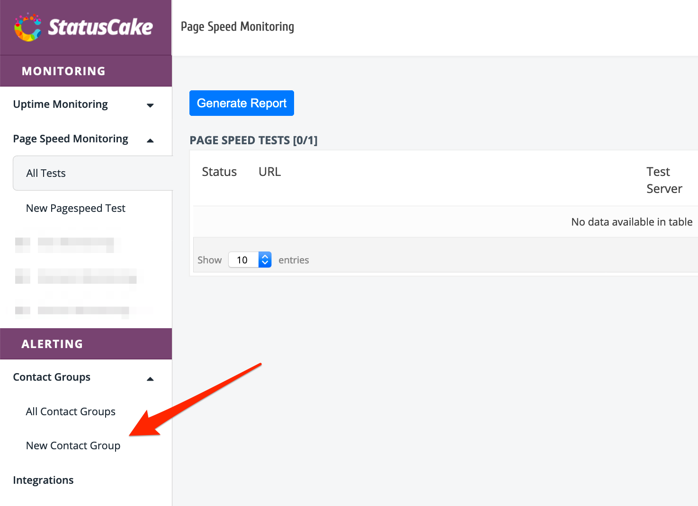
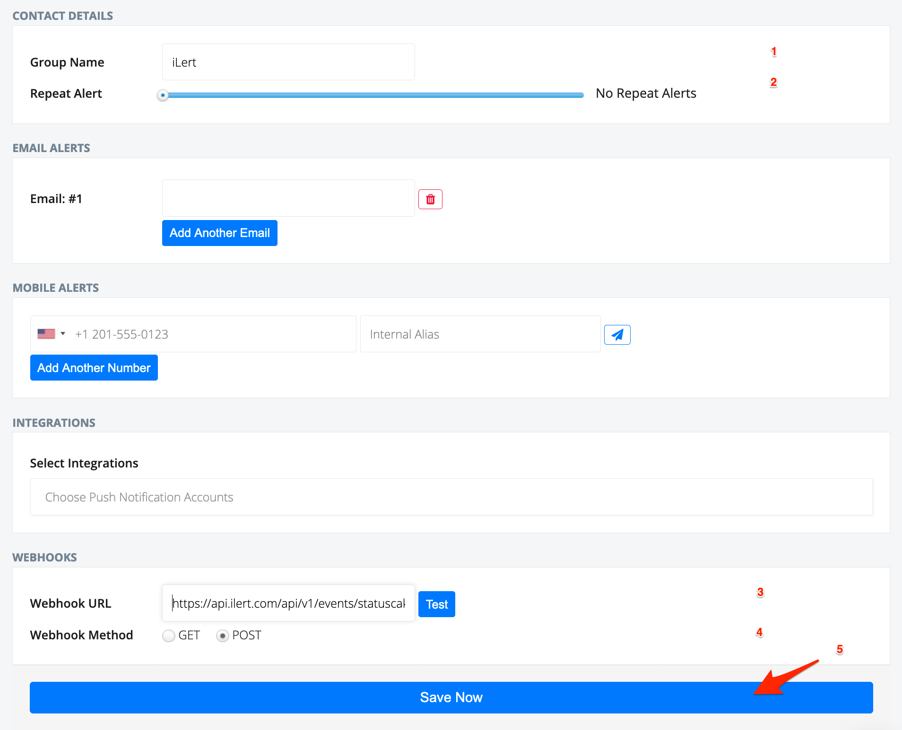
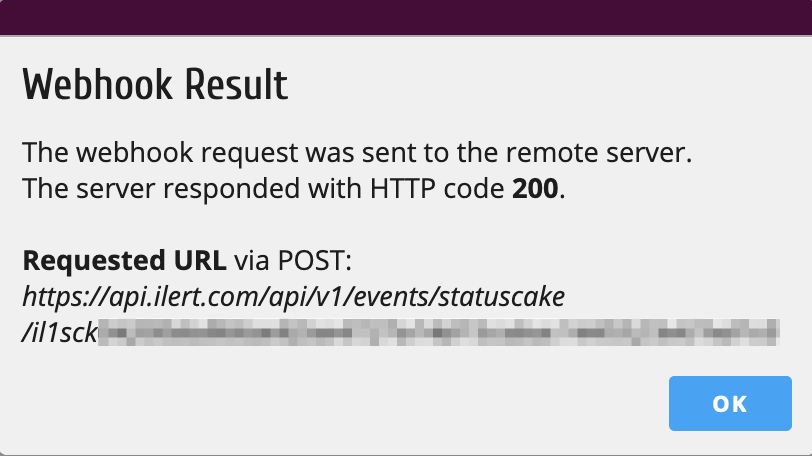

# StatusCake Integration

With the ilert StatusCake integration, you can create alerts in ilert based on alerts from StatusCake.

## In ilert: Create a StatusCake alert source 

1.  Go to **Alert sources** --> **Alert sources** and click on **Create new alert source**

    <figure><figcaption></figcaption></figure>
2.  Search for **StatusCake** in the search field, click on the StatusCake tile and click on **Next**.&#x20;

    <figure><figcaption></figcaption></figure>
3. Give your alert source a name, optionally assign teams and click **Next**.
4.  Select an **escalation policy** by creating a new one or assigning an existing one.

    <figure><figcaption></figcaption></figure>
5.  Select you [Alert grouping](../alerting/alert-sources.md#alert-grouping) preference and click **Continue setup**. You may click **Do not group alerts** for now and change it later.&#x20;

    <figure><figcaption></figcaption></figure>
6. The next page show additional settings such as customer alert templates or notification prioritiy. Click on **Finish setup** for now.
7.  On the final page, an API key and / or webhook URL will be generated that you will need later in this guide.

    <figure><figcaption></figcaption></figure>

## In StatusCake 

### Create a Contact Group

1. Go to StatusCake and then to **Alerting** and click on **New Contact Group** to add a new contact group (`https://app.statuscake.com/ContactGroup.php`)

2. In the **Group Name** section, enter a name eg. ilert
3. In the **Repeat Alert** section, move the slider to the left so that it says **No Repeat Alerts**
4. In the **Webhook URL** section, paste the **Webhook URL** that you generated in ilert
5. In the **Webhook Method** section, choose **POST**
6. Optional: Send a test alert through the **Test** button

7. Click **Save Now**

## FAQ 

**Will alerts in ilert be resolved automatically?**

Yes, as soon as the StatusCake alert is closed, the alert in ilert will be resolved automatically.

**Can I connect StatusCake with multiple alert sources from ilert?**

Yes, simply create more Contact Groups in StatusCake.

**Can I customize the alert messages?**

No.
