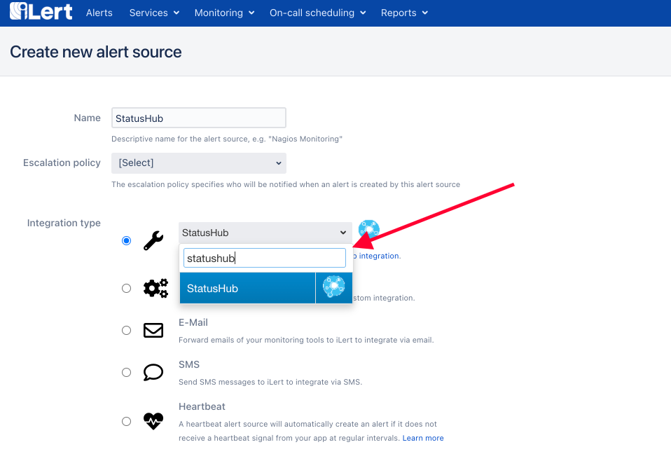

# StatusHub Integration

## In iLert

* Go to the "**Alert sources**" tab and click "**Create new alert source**"

.png>)

* Enter a name and select your desired escalation policy.  &#x20;
* Select "StatusHub" as the **Integration Type** and click **Save**.

* On the next page, an **StatusHub URL** is generated. You will need the URL for the webhook configuration

.png>)

## In Statushub

* Navigate to StatusHub Dashboard or go to your StatusHub Page (If you navigate to StatusHub Page, skip to step 2)

* On your StatusHub Page, click on **Subscribe** on the top right

* Click **Webhook** on the Subscribe Page

* Use the **StatusHub URL** that you generated in iLert and paste it in the URL field, and make sure the Content Type is **JSON**

* On the Customization you can leave it as it is and click **Save**

* To trigger the Incident in iLert, just create an Incident from StatusHub Dashboard

* The Incident will be created in iLert automatically upon creating an Incident in StatusHub
