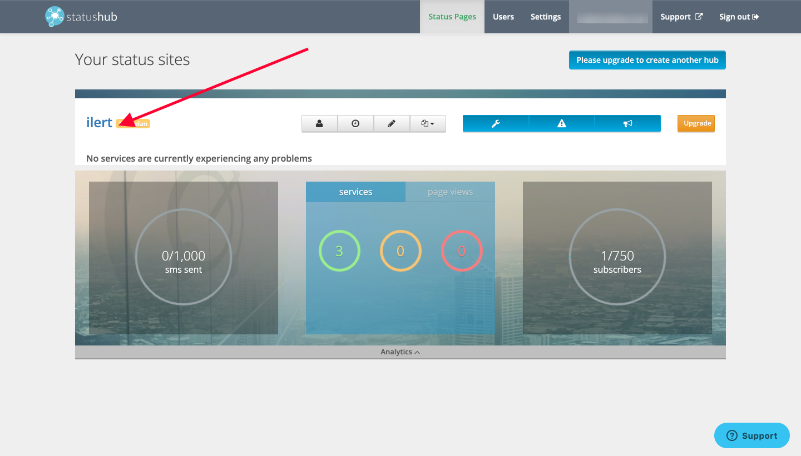
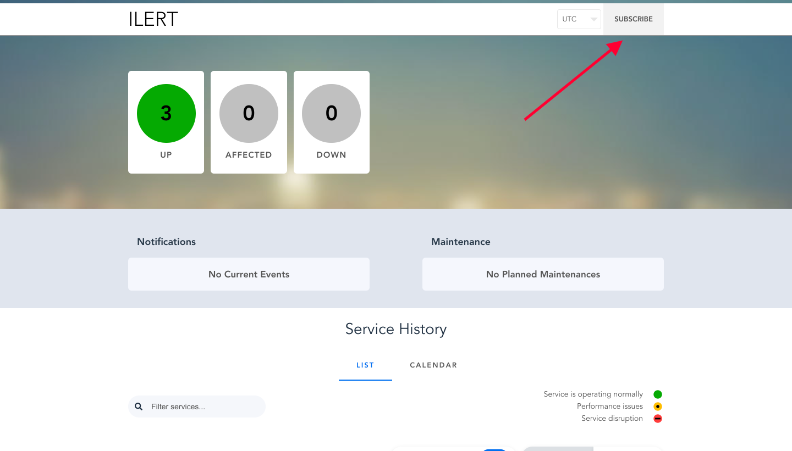
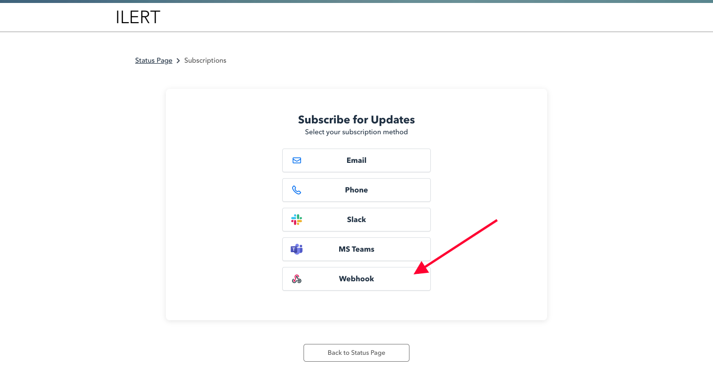
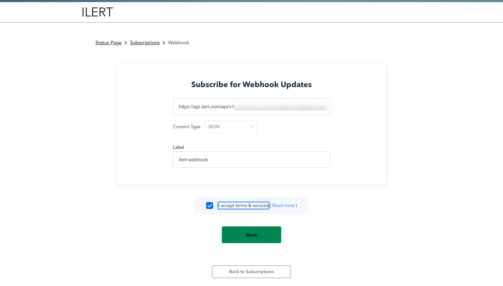
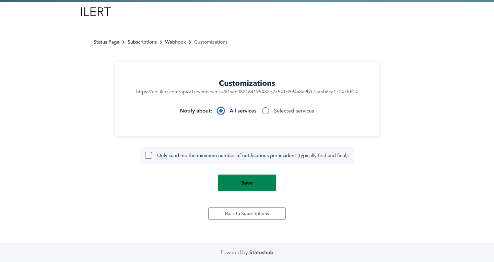
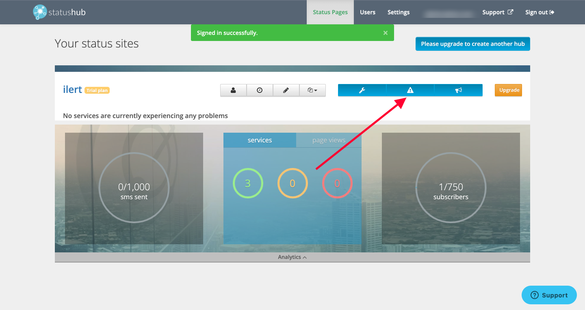

# StatusHub Integration

## In ilert: Create StatusHub alert source

1.  Go to **Alert sources** --> **Alert sources** and click on **Create new alert source**

    <figure><figcaption></figcaption></figure>
2.  Search for **StatusHub** in the search field, click on the StatusHub tile and click on **Next**.&#x20;

    <figure><figcaption></figcaption></figure>
3. Give your alert source a name, optionally assign teams and click **Next**.
4.  Select an **escalation policy** by creating a new one or assigning an existing one.

    <figure><figcaption></figcaption></figure>
5.  Select you [Alert grouping](../alerting/alert-sources.md#alert-grouping) preference and click **Continue setup**. You may click **Do not group alerts** for now and change it later.&#x20;

    <figure><figcaption></figcaption></figure>
6. The next page show additional settings such as customer alert templates or notification prioritiy. Click on **Finish setup** for now.
7.  On the final page, an API key and / or webhook URL will be generated that you will need later in this guide.

    <figure><figcaption></figcaption></figure>

## In Statushub

1. Navigate to StatusHub Dashboard or go to your StatusHub Page (If you navigate to StatusHub Page, skip to step 2)

2. On your StatusHub Page, click on **Subscribe** on the top right

3. Click **Webhook** on the Subscribe Page

4. Use the **StatusHub URL** that you generated in ilert and paste it in the URL field, and make sure the Content Type is **JSON**

5. On the Customization you can leave it as it is and click **Save**

6. To trigger the Incident in ilert, just create an Incident from StatusHub Dashboard

7. The Incident will be created in ilert automatically upon creating an Incident in StatusHub
