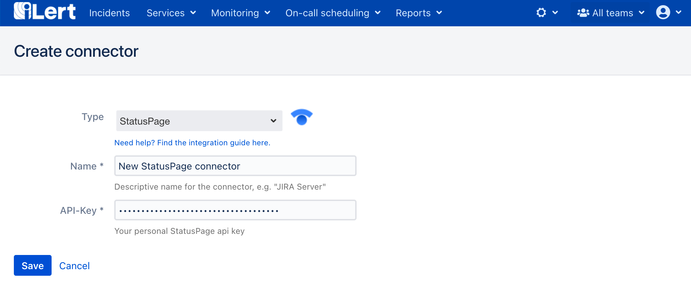

# StatusPage Integration

## In StatusPage 

### Create an API key

1. Go to your StatusPage, click on the **Profile** tile and then on the **API info** button

2. On the next page click on the **Create key**

3. On the modal window, name the key e.g. iLert and click on the **Confirm** button

4. On the next page, a API key is generated. You will need this key and the page id below when setting up the connector in iLert.

## In iLert 

### Create the Statuspage Connector and link it to the alert source

1. ****Click the gear icon and then click on the **Connectors** link

2. Click the **Add Connector** button

3. On the next page, choose **StatusPage** as type, name the connector, paste the **API Key** that you generated in StatusPage and click on the **Save** button.

4. Go to the alert sources tab and open the alert source whose incidents you want to create StatusPage Incidents. Click on the **Incident actions** tab and then on the **Add new incident action** button

6. On the next page choose **StatusPage** as the type, choose the connector created in step 3, name it, choose **Trigger mode,** paste the **Page Id** and click on the **Save** button.

7. Finished! Now an StatusPage incident will be created for each incident in automatic trigger mode or via manual incident action.

## StatusPage Incident Lifecycle

| When an iLert incident ... event occurs  | ...and the ****StatusPage incident... | ...then the/an StatusPage incident... |
| :--- | :--- | :--- |
| **Created, re-assigned, escalated, priority raised** | does not exist | is created with status **identified** |
| **Accepted** | does not exist | is created with status **in\_progress** |
| **Resolved** | does not exist | is created with status **resolved** |
| **Comment added** | does not exist | is created with status **identified** |
| **Re-assigned, escalated, priority raised** | exists | doesn't change |
| **Accepted** | exists | change status to **in\_progress** |
| **Resolved** | exists | change status to **resolved** |
| **Comment added** | exists | change body to comment content |

## FAQ 

**Can I link multiple StatusPage Accounts to an iLert account?**

Yes.

