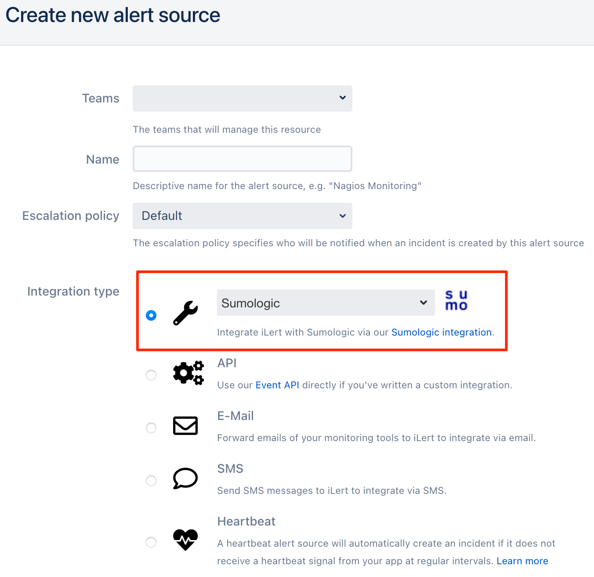
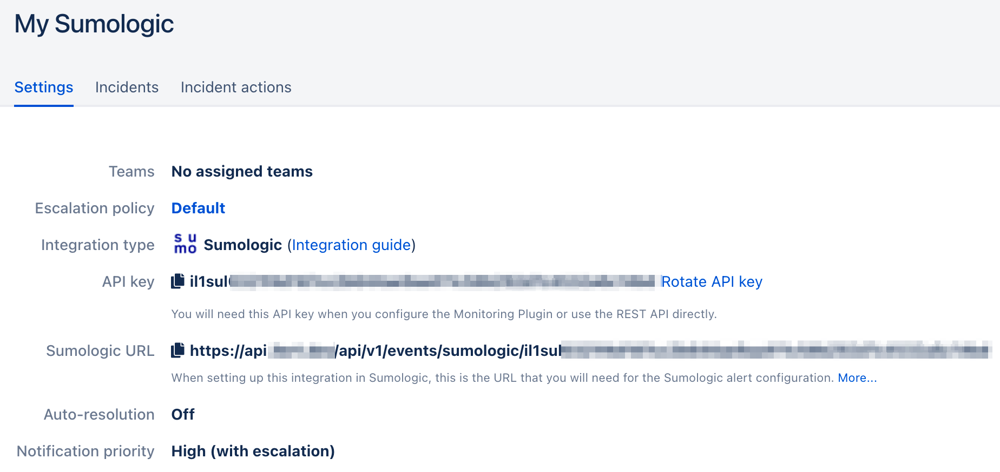
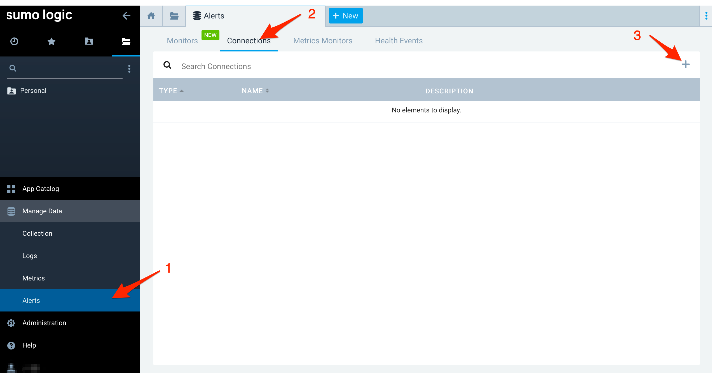
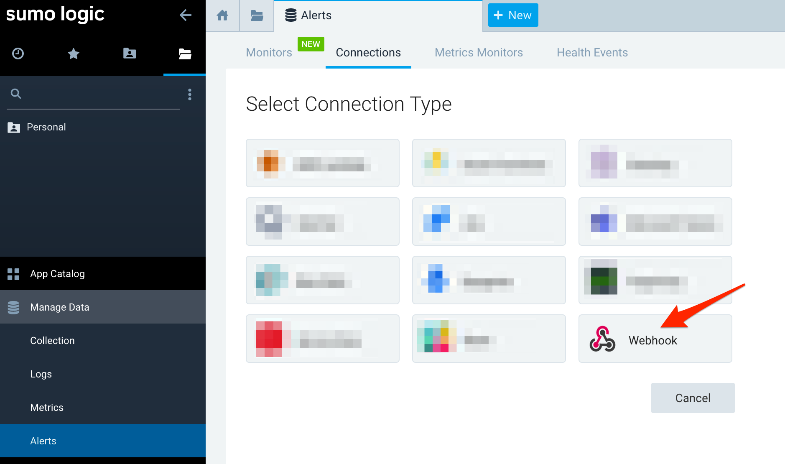
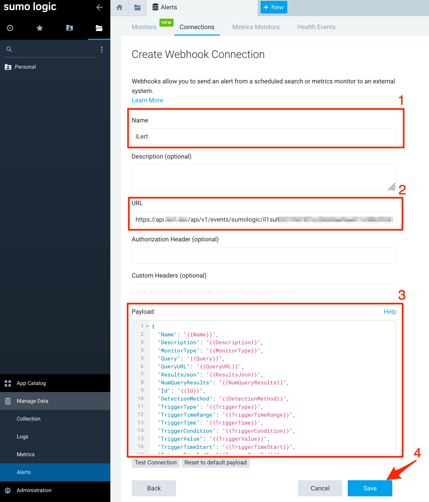

# Sumologic Integration

## In iLert <a id="in-ilert"></a>

### Create a Sumologic alert source <a id="create-alert-source"></a>

1. Go to the "Alert sources" tab and click **Create new alert source**


2. Enter a name and select your desired escalation policy. Select "Sumologic" as the **Integration Type** and click on **Save**.



3. On the next page, a Webhook URL is generated. You will need this URL below when setting up the connection in Sumologic.



## In Sumologic <a id="in-splunk"></a>

### Create a notification setting <a id="create-action-sequences"></a>

1. Go to Sumologic, then to **Manage Data -&gt; Alerts**, click on the **Connections** tab and then on the **Add \(+\)** button



2. On the next page,  click on the **Webhook** tile



3. On the next page, name the connection e.g. iLert, paste the **Webhook URL** that you generated in iLert, in the **Payload** section following payload object, then click on the **Save** button



```javascript
{
  "Name": "{{Name}}",
  "Description": "{{Description}}",
  "MonitorType": "{{MonitorType}}",
  "Query": "{{Query}}",
  "QueryURL": "{{QueryURL}}",
  "ResultsJson": "{{ResultsJson}}",
  "NumQueryResults": "{{NumQueryResults}}",
  "Id": "{{Id}}",
  "DetectionMethod": "{{DetectionMethod}}",
  "TriggerType": "{{TriggerType}}",
  "TriggerTimeRange": "{{TriggerTimeRange}}",
  "TriggerTime": "{{TriggerTime}}",
  "TriggerCondition": "{{TriggerCondition}}",
  "TriggerValue": "{{TriggerValue}}",
  "TriggerTimeStart": "{{TriggerTimeStart}}",
  "TriggerTimeEnd": "{{TriggerTimeEnd}}",
  "SourceURL": "{{SourceURL}}",
  "SearchName": "{{SearchName}}"
}
```

Finished! Your Sumologic alerts will now create alerts in iLert.

## FAQ <a id="faq"></a>

**Will alerts in iLert be resolved automatically?**

No, unfortunately Sumologic's notification is not compatible with iLert's resolve event.

**Can I connect Sumologic with multiple alert sources from iLert?**

Yes, simply add more connections in Sumologic.

