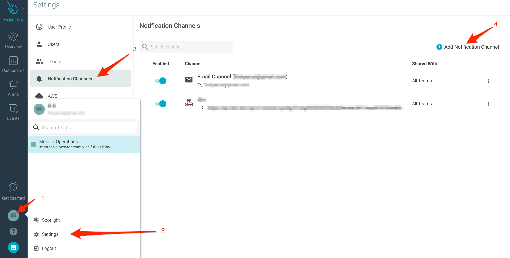

# Sysdig Inbound Integration

With the iLert Sysdig integration you can create incidents in iLert based on Sysdig event.

## In iLert 

### Create a Sysdig alert source 

1. Go to the "Alert sources" tab and click **Create new alert source**

2. Enter a name and select your desired escalation policy. Select "Sysdig" as the **Integration Type** and click on **Save**.

3. On the next page, a Webhook URL is generated. You will need this URL below when setting up the Webhook in Sysdig.

## In Sysdig 

### Create notification channel 

1. Go to Sysdig and then to **Settings.** Click on **Notification Channels** and then on **Add Notification Channel** to add a new notification channel for iLert

2. On the popup, choose **WebHook**

3. On the next page, in the section **URL** field, paste the **Webhook URL** that you generated in iLert

4. In the **Channel Name** section, enter a name eg. `iLert`

5. Make sure that **Enabled** and **Notify when Resolved** options are enabled

12. Click on **Save**

## FAQ 

**Will incidents in iLert be resolved automatically?**

Yes

**Will incidents in iLert be accepted automatically?**

No, unfortunately Sysdig accepted event is not compatible with iLert accepted event.

**Can I connect Sysdig with multiple alert sources from iLert?**

Yes, simply create more notification channels in Sysdig.

