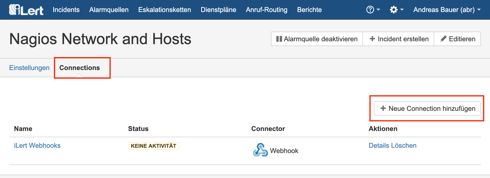

# Sysdig Outbound Integration

## In Sysdig 

### Copy API token 

2. Go to **Settings**, then to **User Profile.** Write down your API Token. You will need it later in iLert.

## In iLert 

### Create a Sysdig Connector and Link to alert source 

1. Click on the gear icon and then on **Connectors** button

2. Click on **Add Connector**

3. Select **Sysdig** as **type** and fill in all fields. Enter a name, the API Token that you copied [in the last step]().

4. Go to the alert sources tab and open the alert source whose incidents you want to publish in Sysdig. Click on **Connections** and then on **Add New Connection**.

5. Select **Sysdig** as the **type**, select the connector created in step 3, fill in all fields. In the **Label** field, specify the connector name.

6. Optional: You can define tags and event filter. More information aber it you can find here: [https://docs.sysdig.com/en/events.html](https://docs.sysdig.com/en/events.html)

7. Finished! You can now test the connection by clicking on the button **Test this connection**. Then a test ticket will be published in Sysdig.

## FAQ 

**Are updates to an incident published in the Sysdig Ticket?**

Yes, the state of the iLert Incident is reflected in the brief description of the Sysdig event, eg \[RESOLVED\] Host compute.infra is DOWN.

